# gorm 框架原理&源码解析


## 0 前言

本篇将和大家探讨 go 语言中最流行的 orm 框架 ——gorm 的底层实现原理.

在这之前，让我们首先回顾一下 go 语言 sql 系列往期内容：

- Golang sql 标准库源码解析
- Golang mysql 驱动源码解析
- gorm 框架使用教程

个人在这里**比较建议大家优先完成前几篇内容的学习**，打好充分的基础后再开启本篇的学习.

那么步入正题，本篇分享内容的目录大纲如下所示：

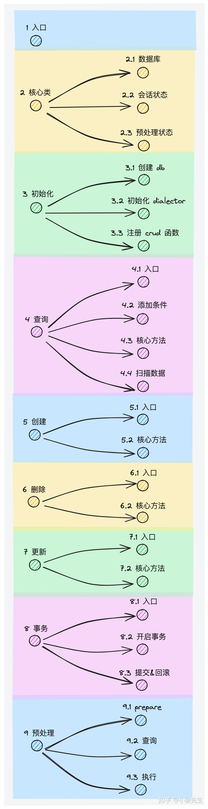


## 1 入口

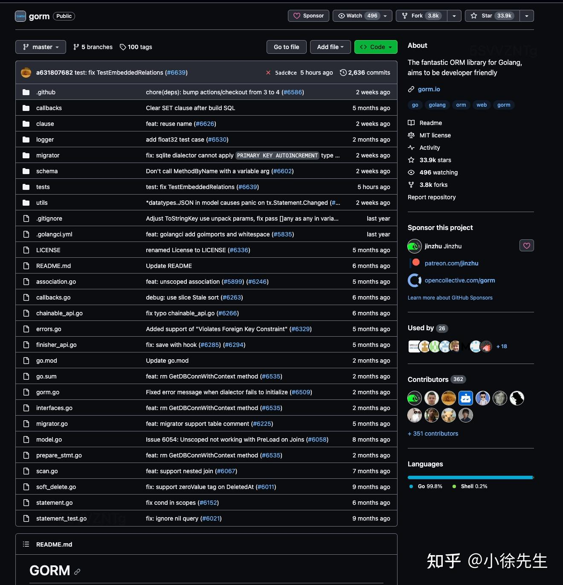


gorm 框架是国内的大神 jinzhu 基于 go 语言开源实现的一款数据库 orm 框架. 【gorm】一词恢弘大气，前缀 go 代表 go 语言， 后缀 **orm 全称 [Object Relation Mapping](https://zhida.zhihu.com/search?content_id=235619602&content_type=Article&match_order=1&q=Object+Relation+Mapping&zhida_source=entity)，指的是使用对象映射的方式，让使用方能够像操作本地对象实例一样轻松便捷地完成远端数据库的操作.**

gorm 框架开源地址为: [https://github.com/go-gorm/gorm](https://link.zhihu.com/?target=https%3A//github.com/go-gorm/gorm)

本期会涉及到大量 gorm 的源码走读环节，使用的代码版本为 **tag: v.1.25.5**

下面我们简单回顾一下针对 gorm 框架的常规用法：

### 1.1 初始化

gorm 框架通过一个 [gorm.DB](https://zhida.zhihu.com/search?content_id=235619602&content_type=Article&match_order=1&q=gorm.DB&zhida_source=entity) 实例来指代我们所操作的数据库. 使用 gorm 的第一步就是要**通过 Open 方法创建出一个 gorm.DB 实例，其中首个入参为连接器 dialector，本身是个抽象的 interface，其实现类关联了具体数据库类型.**

本文将统一**以 mysql 为例，注入 [http://gorm.io/driver/mysql](https://link.zhihu.com/?target=http%3A//gorm.io/driver/mysql) 包下定义的 dialector 类**.

```text
package mysql


import (
    "gorm.io/driver/mysql"
    "gorm.io/gorm"
)


var (
    // 全局 db 模式
    db *gorm.DB
    // 单例工具
    dbOnce sync.Once
    // 连接 mysql 的 dsn
    dsn = "username:password@(ip:port)/database?timeout=5000ms&readTimeout=5000ms&writeTimeout=5000ms&charset=utf8mb4&parseTime=true&loc=Local"
)


func getDB()(*gorm.DB, error){
    var err error
    dbOnce.Do(func(){
       // 创建 db 实例
       db, err = gorm.Open(mysql.Open(dsn),&gorm.Config{})
    })  
    return db,err
}
```

本文将以 gorm.Open 方法为入口，在第 3 章中深入源码底层链路.


### 1.2 po 模型

基于 orm 的思路，**与某张数据表所关联映射的是 po (persist object)模型**.

定义 po 类时，可以通过**声明 TableName 方法，来指定该类对应的表名**.

```text
type Reward struct {
    gorm.Model
    Amount sql.NullInt64 `gorm:"column:amount"`
    Type   string `gorm:"not null"`
    UserID int64  `gorm:"not null"`
}


func (r Reward) TableName() string {
    return "reward"
}
```

定义 po 类时，可以通过组合 gorm.Model 的方式，完成主键、增删改时间等4列信息的一键添加，并且**由于声明了 DeletedAt 字段，gorm 将会默认会启动软删除模式**. （有关软删除的内容，可参见前文——gorm 框架使用教程）

```text
type Model struct {
    ID        uint `gorm:"primarykey"`
    CreatedAt time.Time
    UpdatedAt time.Time
    DeletedAt DeletedAt `gorm:"index"`
}
```


### 1.3 查询

下面展示的是使用 gorm 进行数据查询操作的代码示例. 本文第 4 章会以 db.First(...) 方法为入口，展开底层源码链路的走读.

```text
func Test_query(t *testing.T) {
    // 获取 db 
    db, _ := getDB()


    // 超时控制
    ctx, cancel := context.WithTimeout(context.Background(), time.Second)
    defer cancel()


    // 查询
    var r Reward
    if err := db.WithContext(ctx).First(&r).Error; err != nil {
        t.Error(err)
        return
    }


    t.Logf("reward: %+v", r)
}
```


### 1.4 创建

下面展示的是使用 gorm 进行数据创建操作的代码示例. 本文第 5 章会以 db.Create(...) 方法为入口，展开底层源码链路的走读.

```text
func Test_create(t *testing.T) {
    // 获取 db 实例
    db, _ := getDB()
    
    // 构造 po 实例
    r := Reward{
        Amount: sql.NullInt64{
            Int64: 0,
            Valid: true,
        },
        Type:   "money",
        UserID: 123,
    }


    // 超时控制
    ctx, cancel := context.WithTimeout(context.Background(), time.Second)
    defer cancel()


    // 创建
    if err := db.WithContext(ctx).Create(&r).Error; err != nil {
        t.Error(err)
        return
    }
}
```


### 1.5 删除

下面展示的是使用 gorm 进行数据删除操作的代码示例. 本文第 6 章会以 db.Delete(...) 方法为入口，展开底层源码链路的走读.

```text
func Test_delete(t *testing.T) {
    // 获取 db 实例
    db, _ := getDB()
    
    // 构造 po 实例
    r := Reward{  
    }


    // 超时控制
    ctx, cancel := context.WithTimeout(context.Background(), time.Second)
    defer cancel()


    // 更新主键 id 为 1 的记录
    if err := db.WithContext(ctx).Delete(&r,1).Error; err != nil {
        t.Error(err)
        return
    }
}
```


### 1.6 更新

下面展示的是使用 gorm 进行数据更新操作的代码示例. 本文第 7 章会以 db.Update(...) 方法为入口，展开底层源码链路的走读.

```text
func Test_update(t *testing.T) {
    // 获取 db 实例
    db, _ := getDB()
    
    // 构造 po 实例
    r := Reward{
        Amount: sql.NullInt64{
            Int64: 1000,
            Valid: true,
        }         
    }


    // 超时控制
    ctx, cancel := context.WithTimeout(context.Background(), time.Second)
    defer cancel()


    // 更新主键 id 为 2 的记录，将金额设置为 1000
    if err := db.WithContext(ctx).Where("id = ?",2).Update(&r).Error; err != nil {
        t.Error(err)
        return
    }
}
```


### 1.7 事务

下面展示的是使用 gorm 开启事务的代码示例. 本文第 8 章会以 db.Transaction(...) 方法为入口，展开底层源码链路的走读.

```text
func Test_tx(t *testing.T) {
    // 获取 db 实例
    db, _ := getDB()


    // 事务内的执行逻辑
    do := func(ctx context.Context, tx *gorm.DB) error {
        // do somethine ...
        return nil
    }


    // 超时控制
    ctx, cancel := context.WithTimeout(context.Background(), time.Second)
    defer cancel()


    // 执行事务
    if err := db.WithContext(ctx).Transaction(func(tx *gorm.DB) error {
        // do ...
        err := do(ctx, tx)
        // do ...
        return err
    }); err != nil {
        t.Error(err)
        return
    }
}
```


## 2 核心类

本章中，我会首先向大家介绍 gorm 框架中各个核心类的定义.


### 2.1 数据库

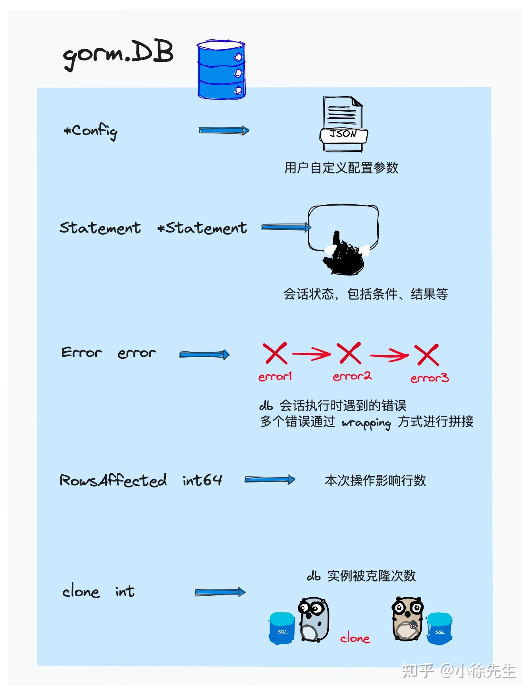


gorm.DB 是 gorm 定义的数据库类. 所有执行的数据库的操作都将紧密围绕这个类，以链式调用的方式展开. **每当执行过链式调用后，新生成的 DB 对象中就存储了一些当前请求特有的状态信息，我们把这种对象称作“会话”.**

DB 类中的核心字段包括：

- Config：用户自定义的配置项
- Error：一次会话执行过程中遇到的错误
- RowsAffected：该请求影响的行数
- Statement：一次会话的状态信息，比如请求和响应信息
- clone：会话被克隆的次数. **倘若 clone = 1，代表是始祖 DB 实例；倘若 clone > 1，代表是从始祖 DB 克隆出来的会话**

DB 类定义的代码如下：

```text
// gorm 中定义的数据库类
// 所有 orm 的思想
type DB struct {
    // 配置
    *Config
    // 错误
    Error        error
    // 影响的行数
    RowsAffected int64
    // 会话状态信息
    Statement    *Statement
    // 克隆次数
    clone        int
}
```

**I 错误处理**

DB 类的 AddError 方法，用于在会话执行过程中抛出错误.

一次会话在执行过程中可能会遇到多个错误，因此会通过 error wrapping 的方式，实现错误的拼接.

```text
func (db *DB) AddError(err error) error {
    if err != nil {
        // ...
        if db.Error == nil {
            db.Error = err
        } else {
            db.Error = fmt.Errorf("%v; %w", db.Error, err)
        }
    }
    return db.Error
}
```

**II 表名设置**

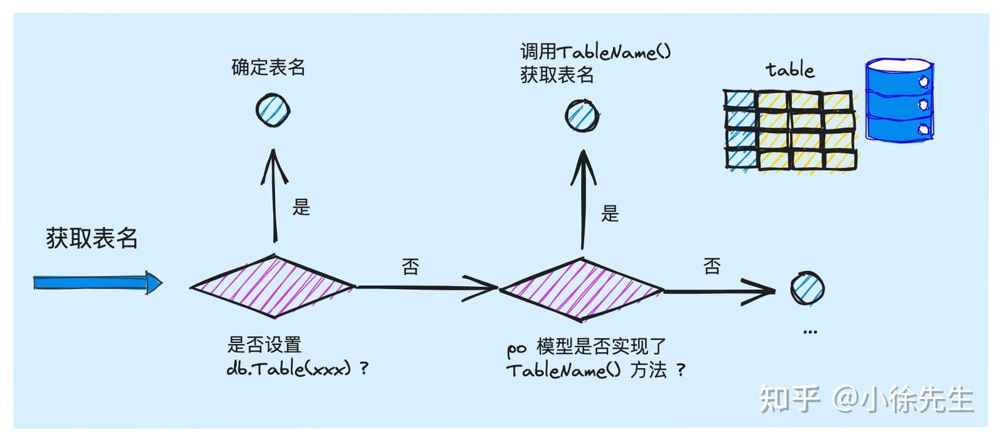


请求在执行时，需要明确操作的是哪张数据表.

使用方可以**通过链式调用 DB.Table 方法，显式声明本次操作所针对的数据表，这种方式的优先级是最高的**.

```text
func (db *DB) Table(name string, args ...interface{}) (tx *DB) {
    tx = db.getInstance()
    // ...
    tx.Statement.Table = name
    // ...
    return
}
```

在 **DB.Table 方法缺省**的情况下，gorm 则会尝试**通过 po 类的 TableName 方法获取表名**.

在 gorm 中声明了一个 tabler interface：

```text
type Tabler interface {
    TableName() string
}
```


倘若 po 模型声明了 TableName 方法，则隐式实现了该 interface，在处理过程中会被断言成 tabler 类型，然后调用 TableName 方法获取其表名.

该流程对应的源码展示如下：

```text
func (stmt *Statement) ParseWithSpecialTableName(value interface{}, specialTableName string) (err error) {
    // ...
    stmt.Schema, err = schema.ParseWithSpecialTableName(value, stmt.DB.cacheStore, stmt.DB.NamingStrategy, specialTableName)
    // ...
    stmt.Table = stmt.Schema.Table
    // ...
    return err
}
// ParseWithSpecialTableName get data type from dialector with extra schema table
func ParseWithSpecialTableName(dest interface{}, cacheStore *sync.Map, namer Namer, specialTableName string) (*Schema, error) {
    if dest == nil {
        return nil, fmt.Errorf("%w: %+v", ErrUnsupportedDataType, dest)
    }


    // ...
    modelType := reflect.Indirect(value).Type()


    // ...
    modelValue := reflect.New(modelType)
    tableName := namer.TableName(modelType.Name())
    // 将 po 模型断言成 tabler interface，然后调用 TableName 方法获取表名
    if tabler, ok := modelValue.Interface().(Tabler); ok {
        tableName = tabler.TableName()
    }
    // ...
    // 将表名信息添加到 schema 当中
    schema := &Schema{
        // ...
        Table:            tableName,
        // ...
    }
    // ...
    return schema, schema.err
}
```


### 2.2 会话状态

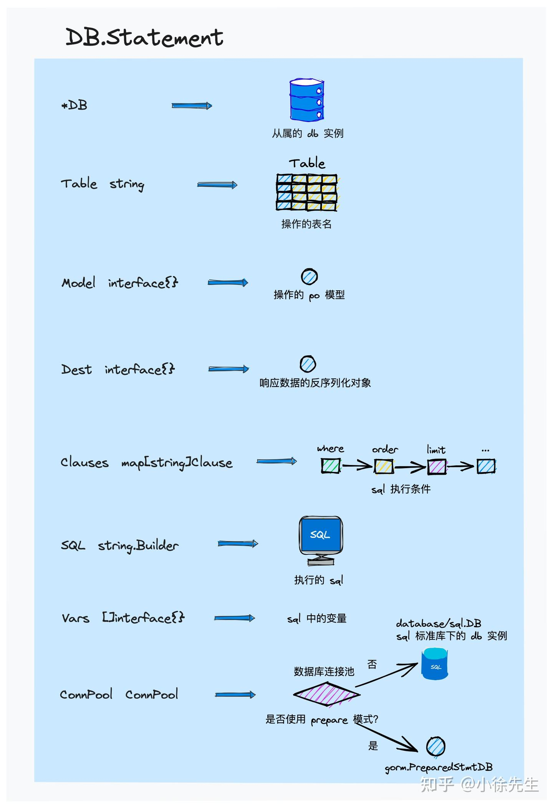


接下来介绍的是 gorm 中非常核心的 **statement 类，里面存储了一次会话中包含的状态信息，比如请求中的条件、sql 语句拼接格式、响应参数类型、数据表的名称等等**.

statement 类中涉及到的各个核心字段通过下方的代码和注释加以介绍：

```text
// Statement statement
type Statement struct {
    // 数据库实例
    *DB
    // ...
    // 表名
    Table                string
    // 操作的 po 模型
    Model                interface{}
    // ...
    // 处理结果反序列化到此处
    Dest                 interface{}
    // ...
    // 各种条件语句
    Clauses              map[string]clause.Clause
    
    // ...
    // 是否启用 distinct 模式
    Distinct             bool
    // select 语句
    Selects              []string // selected columns
    // omit 语句
    Omits                []string // omit columns
    // join 
    Joins                []join
    
    // ...
    // 连接池，通常情况下是 database/sql 库下的 *DB  类型.  在 prepare 模式为 gorm.PreparedStmtDB
    ConnPool             ConnPool
    // 操作表的概要信息
    Schema               *schema.Schema
    // 上下文，请求生命周期控制管理
    Context              context.Context
    // 在未查找到数据记录时，是否抛出 recordNotFound 错误
    RaiseErrorOnNotFound bool
    // ...
    // 执行的 sql，调用 state.Build 方法后，会将 sql 各部分文本依次追加到其中. 具体可见 2.5 小节
    SQL                  strings.Builder
    // 存储的变量
    Vars                 []interface{}
    // ...
}
```

**I connPool**

这里额外强调一下 **connPool 字段，其含义是连接池，和数据库的交互操作都需要依赖它才得以执行**. connPool 本身是个 interface，定义如下：

```text
type ConnPool interface {
    PrepareContext(ctx context.Context, query string) (*sql.Stmt, error)
    ExecContext(ctx context.Context, query string, args ...interface{}) (sql.Result, error)
    QueryContext(ctx context.Context, query string, args ...interface{}) (*sql.Rows, error)
    QueryRowContext(ctx context.Context, query string, args ...interface{}) *sql.Row
}
```

connPool 根据是否启用了 prepare 预处理模式，存在不同的实现类版本：

- **在普通模式下，connPool 的实现类为 database/sql 库下的 \*DB 类**（详细内容参见前文——Golang sql 标准库源码解析）
- 在 **prepare 模式下，connPool 实现类型为 gorm 中定义的 PreparedStmtDB 类**，在本文 2.3 小节中展开

**II db 克隆**

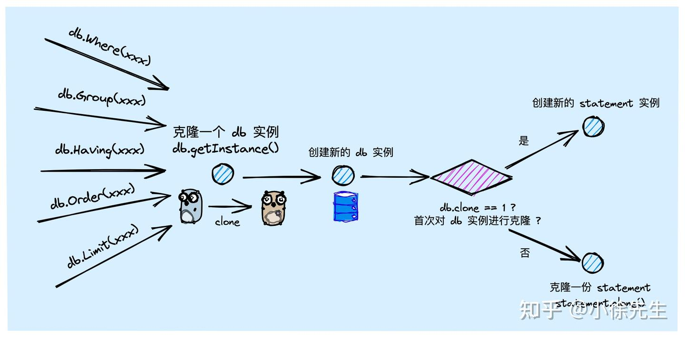


此处额外介绍一下 DB 的克隆流程，**所有在始祖 DB 基础上追加状态信息，克隆出来的 DB 实例都可以称为“会话”.**

会话的状态信息主要存储在 statement 当中的，所以在**克隆 DB 时，很重要的一环就是完成对 其中 statement 部分的创建/克隆**.

该流程对应的方法为 DB.getInstance 方法，主要**通过 DB 中的 clone 字段来判断当前是首次从始祖 DB 中执行克隆操作还是在一个会话的基础上克隆出一个新的会话实例**，对应的源码展示如下：

```text
func (db *DB) getInstance() *DB {
    if db.clone > 0 {
        tx := &DB{Config: db.Config, Error: db.Error}


        // 倘若是首次对 db 进行 clone，则需要构造出一个新的 statement 实例
        if db.clone == 1 {
            // clone with new statement
            tx.Statement = &Statement{
                DB:       tx,
                ConnPool: db.Statement.ConnPool,
                Context:  db.Statement.Context,
                Clauses:  map[string]clause.Clause{},
                Vars:     make([]interface{}, 0, 8),
            }
        // 倘若已经 db clone 过了，则还需要 clone 原先的 statement
        } else {
            // with clone statement
            tx.Statement = db.Statement.clone()
            tx.Statement.DB = tx
        }


        return tx
    }


    return db
}
```


### 2.3 预处理DB

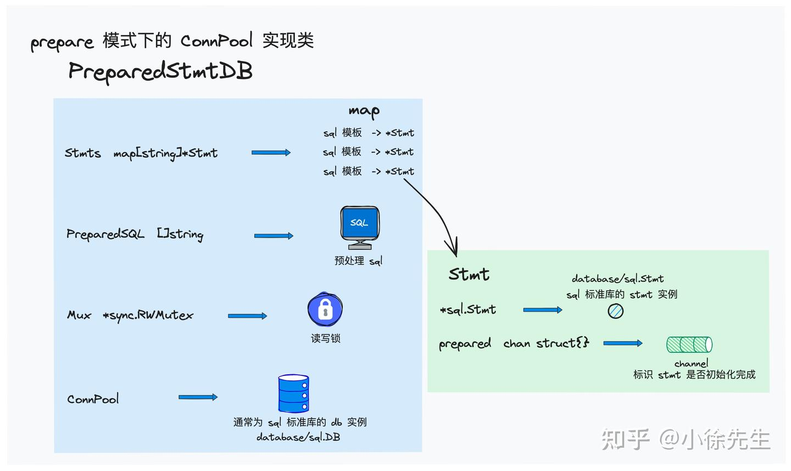


在 prepare 预处理模式下，DB 中连接池 connPool 的实现类为 PreparedStmtDB. 定义该类的目的是为了**使用 database/sql 标准库中的 prepare 能力，完成预处理状态 statement 的构造和复用**.

PreparedStmtDB 的类定义如下：

```text
// prepare 模式下的 connPool 实现类. 
type PreparedStmtDB struct {
    // 各 stmt 实例. 其中 key 为 sql 模板，stmt 是对封 database/sql 中 *Stmt 的封装 
    Stmts       map[string]*Stmt
    // ...
    Mux         *sync.RWMutex
    // 内置的 ConnPool 字段通常为 database/sql 中的 *DB
    ConnPool
}
```

Stmt 类是 gorm 框架对 database/sql 标准库下 Stmt 类的简单封装，两者区别并不大：

```text
type Stmt struct {
    // database/sql 标准库下的 statement
    *sql.Stmt
    // 是否处于事务
    Transaction bool
    // 标识当前 stmt 是否已初始化完成
    prepared    chan struct{}
    prepareErr  error
}
```


### 2.4 执行器

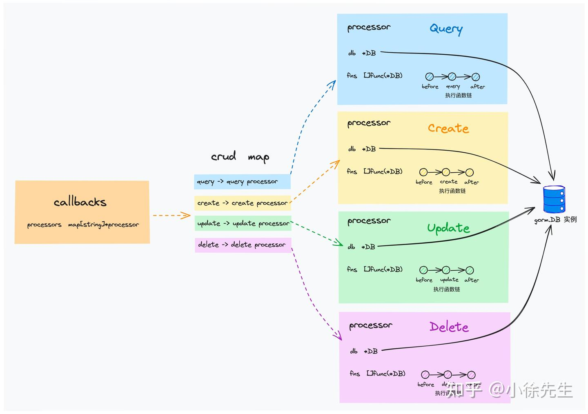


接下来介绍的是，gorm 框架执行 crud 操作逻辑时使用到的执行器 processor，针对 crud 操作的处理函数会以 list 的形式聚合在对应类型 processor 的 fns 字段当中.

```text
type callbacks struct {
    // 对应存储了 crud 等各类操作对应的执行器 processor
    // query -> query processor
    // create -> create processor
    // update -> update processor
    // delete -> delete processor
    processors map[string]*processor
}
```

各类 processor 的初始化是通过 initializeCallbacks 方法完成，该方法的调用入口在本文 3.1 小节的 gorm.Open 方法中.

```text
func initializeCallbacks(db *DB) *callbacks {
    return &callbacks{
        processors: map[string]*processor{
            "create": {db: db},
            "query":  {db: db},
            "update": {db: db},
            "delete": {db: db},
            "row":    {db: db},
            "raw":    {db: db},
        },
    }
}
```

后续在请求执行过程中，会根据 crud 的类型，从 callbacks 中获取对应类型的 processor. 比如一笔查询操作，会通过 callbacks.Query() 方法获取对应的 processor：

```text
func (cs *callbacks) Query() *processor {
    return cs.processors["query"]
}
```

执行器 processor 具体的类定义如下，其中核心字段包括：

- db：从属的 gorm.DB 实例
- Clauses：根据 crud 类型确定的 SQL 格式模板，后续用于拼接生成 sql
- fns：对应于 crud 类型的执行函数链

```text
type processor struct {
    // 从属的 DB 实例
    db        *DB
    // 拼接 sql 时的关键字顺序. 比如 query 类，固定为 SELECT,FROM,WHERE,GROUP BY, ORDER BY, LIMIT, FOR
    Clauses   []string
    // 对应于 crud 类型的执行函数链
    fns       []func(*DB)
    callbacks []*callback
}
```

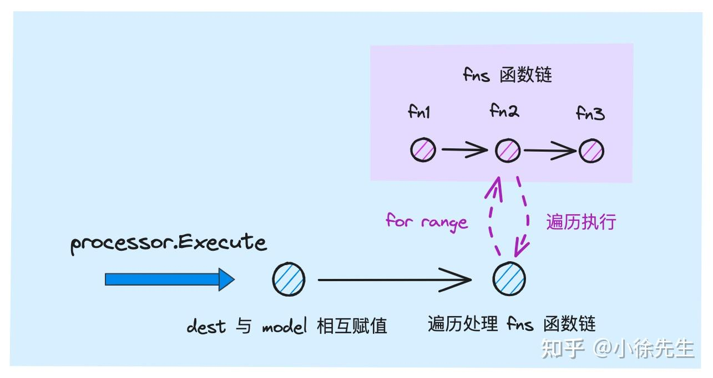


所有请求遵循的处理思路都是，首先根据其从属的 crud 类型，找到对应的 processor，然后调用 processor 的 Execute 方法，执行该 processor 下的 fns 函数链.

这一点，在接下来 4、5、 6、 7 章中介绍的 crud 流程都是如此.

```text
// 通用的 processor 执行函数，其中对应于 crud 的核心操作都被封装在 processor 对应的 fns list 当中了
func (p *processor) Execute(db *DB) *DB {
    // call scopes
    var (
        // ...
        stmt = db.Statement
        // ...
    )


    if len(stmt.BuildClauses) == 0 {
        // 根据 crud 类型，对 buildClauses 进行复制，用于后续的 sql 拼接
        stmt.BuildClauses = p.Clauses
        // ...
    }
    
    // ...
    // dest 和 model 相互赋值
    if stmt.Model == nil {
        stmt.Model = stmt.Dest
    } else if stmt.Dest == nil {
        stmt.Dest = stmt.Model
    }


    // 解析 model，获取对应表的 schema 信息
    if stmt.Model != nil {
        // ...
    }


    // 处理 dest 信息，将其添加到 stmt 当中
    if stmt.Dest != nil {
        // ...
    }


    // 执行一系列的 callback 函数，其中最核心的 create/query/update/delete 操作都被包含在其中了. 还包括了一系列前、后处理函数，具体可见第 3 章
    for _, f := range p.fns {
        f(db)
    }


    //...
    return db
}
```

在 Execute 方法中，还有一项很重要的事情，是根据 crud 的类型，获取 sql 拼接格式 clauses，将其赋值到该 processor 的 BuildClauses 字段当中. crud 各类 clauses 格式展示如下：

```text
var (
    createClauses = []string{"INSERT", "VALUES", "ON CONFLICT"}
    queryClauses  = []string{"SELECT", "FROM", "WHERE", "GROUP BY", "ORDER BY", "LIMIT", "FOR"}
    updateClauses = []string{"UPDATE", "SET", "WHERE"}
    deleteClauses = []string{"DELETE", "FROM", "WHERE"}
)
```


### 2.5 条件

接下来要介绍的是 gorm 框架中的条件 Clause. **一条执行 sql 中，各个部分都属于一个 clause**，比如一条 SELECT * FROM reward WHERE id < 10 ORDER by id 的 SQL，其中就包含了 SELECT、FROM、WHERE 和 ORDER 四个 clause.

当使用方通过链式操作克隆 DB时，对应**追加的状态信息就会生成一个新的 clause，追加到 statement 对应的 clauses 集合**当中. 当**请求实际执行时，会取出 clauses 集合，拼接生成完整的 sql** 用于执行.

条件 clause 本身是个抽象的 interface，定义如下：

```text
// Interface clause interface
type Interface interface {
    // clause 名称
    Name() string
    // 生成对应的 sql 部分
    Build(Builder)
    // 和同类 clause 合并
    MergeClause(*Clause)
}
```

不同的 clause 有不同的实现类，我们以 SELECT 为例进行展示：

```text
type Select struct {
    // 使用使用 distinct 模式
    Distinct   bool
    // 是否 select 查询指定的列，如 select id,name
    Columns    []Column
    Expression Expression
}


func (s Select) Name() string {
    return "SELECT"
}


func (s Select) Build(builder Builder) {
    // select  查询指定的列
    if len(s.Columns) > 0 {
        if s.Distinct {
            builder.WriteString("DISTINCT ")
        }


        // 将指定列追加到 sql 语句中
        for idx, column := range s.Columns {
            if idx > 0 {
                builder.WriteByte(',')
            }
            builder.WriteQuoted(column)
        }
    // 不查询指定列，则使用 select *
    } else {
        builder.WriteByte('*')
    }
}
```

拼接 sql 是通过调用 Statement.Build 方法来实现的，入参对应的是 crud 中某一类 processor 的 BuildClauses.

```text
func (stmt *Statement) Build(clauses ...string) {
    var firstClauseWritten bool


    for _, name := range clauses {
        if c, ok := stmt.Clauses[name]; ok {
            if firstClauseWritten {
                stmt.WriteByte(' ')
            }


            firstClauseWritten = true
            if b, ok := stmt.DB.ClauseBuilders[name]; ok {
                b(c, stmt)
            } else {
                c.Build(stmt)
            }
        }
    }
}
```

以 query 查询类为例，会遵循 "SELECT"->"FROM"->"WHERE"->"GROUP BY"->"ORDER BY"->"LIMIT"->"FOR" 的顺序，依次从 statement 中获取对应的 clause，通过调用 clause.Build 方法，将 sql 本文组装到 statement 的 SQL 字段中.

**以 query 流程为例，拼接 sql 的流程入口可以参见 4.3 小节代码展示当中的 BuildQuerySQL(...) 方法.**

## 3 初始化

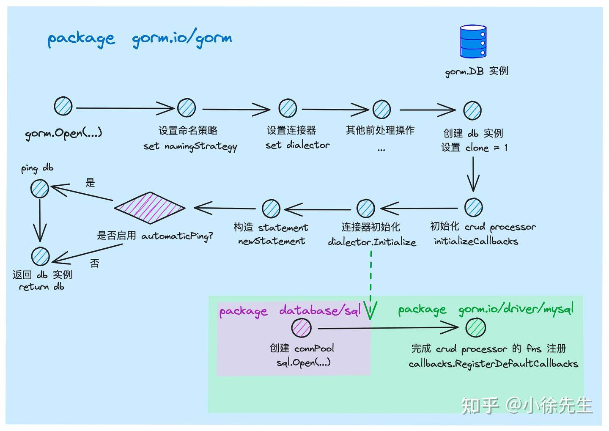


本章中，我们将会以 gorm.Open 方法作为入口，详细展开创建 gorm.DB 实例的源码细节.


### 3.1 创建 db

gorm.Open 方法是创建 DB 实例的入口方法，其中包含如下几项核心步骤：

- 完成 gorm.Config 配置的创建和注入
- 完成连接器 dialector 的注入，本篇使用的是 mysql 版本
- **完成 callbacks 中 crud 等几类 processor 的创建 ( 通过 initializeCallbacks(...) 方法 )**
- **完成 connPool 的创建以及各类 processor fns 函数的注册（ 通过 dialector.Initialize(...) 方法 ）**
- 倘若启用了 prepare 模式，需要使用 preparedStmtDB 进行 connPool 的平替
- 构造 statement 实例
- 根据策略，决定是否通过 ping 请求测试连接
- 返回创建好的 db 实例

```text
func Open(dialector Dialector, opts ...Option) (db *DB, err error) {
    config := &Config{}


    // ...
    
    // 表、列命名策略
    if config.NamingStrategy == nil {
        config.NamingStrategy = schema.NamingStrategy{IdentifierMaxLength: 64} // Default Identifier length is 64
    }


    // ...
    // 连接器
    if dialector != nil {
        config.Dialector = dialector
    }


    // ...


    db = &DB{Config: config, clone: 1}
    
    // 初始化 callback 当中的各个 processor
    db.callbacks = initializeCallbacks(db)


    // ...
    if config.Dialector != nil {
        // 在其中会对 crud 各个方法的 callback 方法进行注册
        // 会对 db.connPool 进行初始化，通常情况下是 database/sql 库下 *sql.DB 的类型        
        err = config.Dialector.Initialize(db)
        // ...
    }


    // 是否启用 prepare 模式
    if config.PrepareStmt {
        preparedStmt := NewPreparedStmtDB(db.ConnPool)
        db.cacheStore.Store(preparedStmtDBKey, preparedStmt)
        // 倘若启用了 prepare 模式，会对 conn 进行替换
        db.ConnPool = preparedStmt
    }


    // 构造一个 statement 用于存储处理链路中的一些状态信息
    db.Statement = &Statement{
        DB:       db,
        ConnPool: db.ConnPool,
        Context:  context.Background(),
        Clauses:  map[string]clause.Clause{},
    }


    // 倘若未禁用 AutomaticPing，
    if err == nil && !config.DisableAutomaticPing {
        if pinger, ok := db.ConnPool.(interface{ Ping() error }); ok {
            err = pinger.Ping()
        }
    }


    // ...
    return
}
```


### 3.2 初始化 dialector

mysql 是我们常用的数据库，对应于 **mysql 版本的 dialector 实现类位于 [http://github.com/go-sql-driver/mysql](https://link.zhihu.com/?target=http%3A//github.com/go-sql-driver/mysql) 包**下. 使用方可以通过 Open 方法，将传入的 dsn 解析成配置，然后返回 mysql 版本的 Dialector 实例.

```text
package mysql


func Open(dsn string) gorm.Dialector {
    dsnConf, _ := mysql.ParseDSN(dsn)
    return &Dialector{Config: &Config{DSN: dsn, DSNConfig: dsnConf}}
}
```

**通过 Dialector.Initialize 方法**完成连接器初始化操作，其中也会**涉及到对连接池 connPool 的初构造**，并**通过 callbacks.RegisterDefaultCallbacks 方法完成 crud 四类 processor 当中 fns 的注册操作**：

```text
import(
    "github.com/go-sql-driver/mysql"
)


func (dialector Dialector) Initialize(db *gorm.DB) (err error) {
    if dialector.DriverName == "" {
        dialector.DriverName = "mysql"
    }


    // connPool 初始化
    if dialector.Conn != nil {
        db.ConnPool = dialector.Conn
    } else {
        db.ConnPool, err = sql.Open(dialector.DriverName, dialector.DSN)
        if err != nil {
            return err
        }
    }


    // ...
    // register callbacks
    callbackConfig := &callbacks.Config{
        CreateClauses: CreateClauses,
        QueryClauses:  QueryClauses,
        UpdateClauses: UpdateClauses,
        DeleteClauses: DeleteClauses,
    }


    // ...完成 crud 类操作 callback 函数的注册
    callbacks.RegisterDefaultCallbacks(db, callbackConfig)


    // ...
    return
}
```


### 3.3 注册 crud 函数

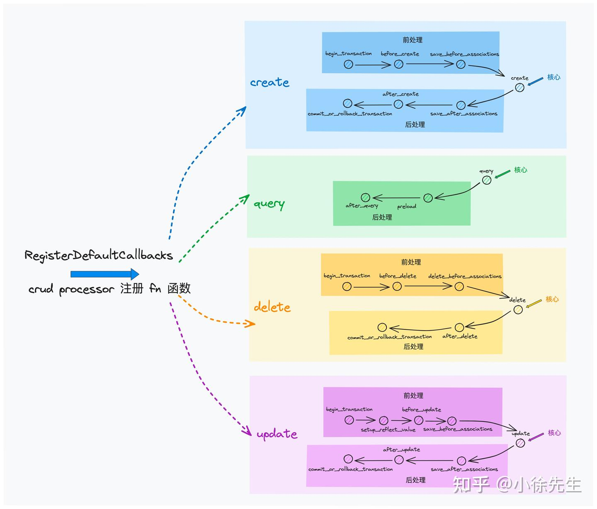


对应于 **crud 四类 processor，注册的函数链 fns 的内容和顺序是固定**的，展示如上图. 相应的源码展示如下，对应的方法为 RegisterDefaultCallbacks(...)：

```text
func RegisterDefaultCallbacks(db *gorm.DB, config *Config) {
    // ...
    //  创建类 create processor
    createCallback := db.Callback().Create()
 createCallback.Match(enableTransaction).Register("gorm:begin_transaction", BeginTransaction)
    createCallback.Register("gorm:before_create", BeforeCreate)
    createCallback.Register("gorm:save_before_associations", SaveBeforeAssociations(true))
    createCallback.Register("gorm:create", Create(config))
    createCallback.Register("gorm:save_after_associations", SaveAfterAssociations(true))
    createCallback.Register("gorm:after_create", AfterCreate)
    createCallback.Match(enableTransaction).Register("gorm:commit_or_rollback_transaction", CommitOrRollbackTransaction)
    createCallback.Clauses = config.CreateClauses


    // 查询类 query processor
    queryCallback := db.Callback().Query()
    queryCallback.Register("gorm:query", Query)
    queryCallback.Register("gorm:preload", Preload)
    queryCallback.Register("gorm:after_query", AfterQuery)
    queryCallback.Clauses = config.QueryClauses


    // 删除类 delete processor
    deleteCallback := db.Callback().Delete()    deleteCallback.Match(enableTransaction).Register("gorm:begin_transaction", BeginTransaction)
    deleteCallback.Register("gorm:before_delete", BeforeDelete)
    deleteCallback.Register("gorm:delete_before_associations", DeleteBeforeAssociations)
    deleteCallback.Register("gorm:delete", Delete(config))
    deleteCallback.Register("gorm:after_delete", AfterDelete)
deleteCallback.Match(enableTransaction).Register("gorm:commit_or_rollback_transaction", CommitOrRollbackTransaction)
    deleteCallback.Clauses = config.DeleteClauses


    // 更新类 update processor
    updateCallback := db.Callback().Update()    updateCallback.Match(enableTransaction).Register("gorm:begin_transaction", BeginTransaction)
    updateCallback.Register("gorm:setup_reflect_value", SetupUpdateReflectValue)
    updateCallback.Register("gorm:before_update", BeforeUpdate)
    updateCallback.Register("gorm:save_before_associations", SaveBeforeAssociations(false))
    updateCallback.Register("gorm:update", Update(config))
    updateCallback.Register("gorm:save_after_associations", SaveAfterAssociations(false))
    updateCallback.Register("gorm:after_update", AfterUpdate)    updateCallback.Match(enableTransaction).Register("gorm:commit_or_rollback_transaction", CommitOrRollbackTransaction)
    updateCallback.Clauses = config.UpdateClauses


    // row 类
    rowCallback := db.Callback().Row()
    rowCallback.Register("gorm:row", RowQuery)
    rowCallback.Clauses = config.QueryClauses


    // raw 类
    rawCallback := db.Callback().Raw()
    rawCallback.Register("gorm:raw", RawExec)
    rawCallback.Clauses = config.QueryClauses
}
```

**注册某个特定 fn 函数的入口是 processor.Register 方法**，对应的核心源码链路展示如下：

```text
func (p *processor) Register(name string, fn func(*DB)) error {
    return (&callback{processor: p}).Register(name, fn)
}
func (c *callback) Register(name string, fn func(*DB)) error {
    c.name = name
    c.handler = fn
    c.processor.callbacks = append(c.processor.callbacks, c)
    return c.processor.compile()
}
func (p *processor) compile() (err error) {
    var callbacks []*callback
    for _, callback := range p.callbacks {
        if callback.match == nil || callback.match(p.db) {
            callbacks = append(callbacks, callback)
        }
    }
    p.callbacks = callbacks


    if p.fns, err = sortCallbacks(p.callbacks); err != nil {
        p.db.Logger.Error(context.Background(), "Got error when compile callbacks, got %v", err)
    }
    return
}
func sortCallbacks(cs []*callback) (fns []func(*DB), err error) {
    var (
        names, sorted []string
        sortCallback  func(*callback) error
    )
    
    // ...
    sortCallback = func(c *callback) error {
        // ...
        // if current callback haven't been sorted, append it to last
        if getRIndex(sorted, c.name) == -1 {
            sorted = append(sorted, c.name)
        }


        return nil
    }


    for _, c := range cs {
        if err = sortCallback(c); err != nil {
            return
        }
    }


    for _, name := range sorted {
        if idx := getRIndex(names, name); !cs[idx].remove {
            fns = append(fns, cs[idx].handler)
        }
    }


    return
}
```

## 4 查询

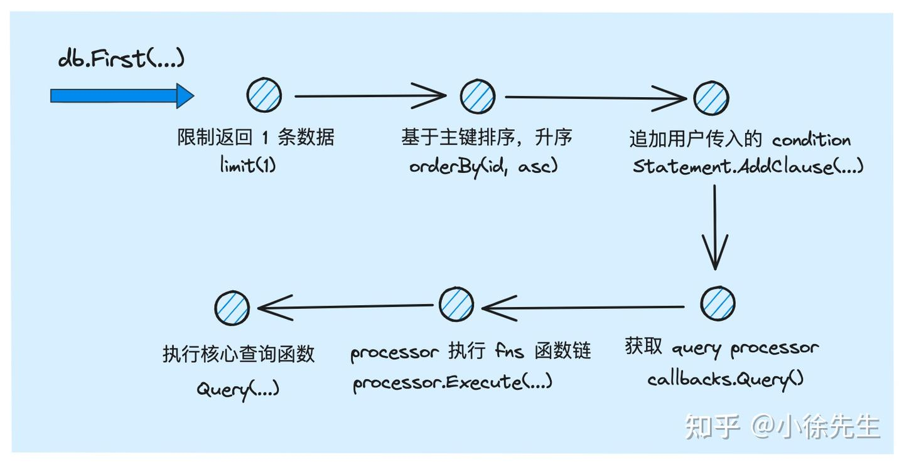


接下来以 db.First 方法作为入口，展示数据库查询的方法链路：


### 4.1 入口

在 db.First 方法当中：

- 遵循 First 的语义，通过 limit 和 order 追加 clause，限制只取满足条件且主键最小的一笔数据
- 追加用户传入的一系列 condition，进行 clause 追加
- 在 **First、Take、Last** 等方法中，会**设置 RaiseErrorOnNotFound** 标识为 true，倘若未找到记录，则会**抛出 ErrRecordNotFound 错误**

```text
var ErrRecordNotFound = logger.ErrRecordNotFound
```

- 设置 statement 中的 dest 为用户传入的 dest，作为反序列化响应结果的对象实例
- **获取 query 类型的 processor，调用 Execute 方法执行其中的 fn 函数链**，完成 query 操作

```text
func (db *DB) First(dest interface{}, conds ...interface{}) (tx *DB) {
    // order by id limit 1
    tx = db.Limit(1).Order(clause.OrderByColumn{
        Column: clause.Column{Table: clause.CurrentTable, Name: clause.PrimaryKey},
    })
    // append clauses
    if len(conds) > 0 {
        if exprs := tx.Statement.BuildCondition(conds[0], conds[1:]...); len(exprs) > 0 {
            tx.Statement.AddClause(clause.Where{Exprs: exprs})
        }
    }
    // set RaiseErrorOnNotFound
    tx.Statement.RaiseErrorOnNotFound = true
    // set dest
    tx.Statement.Dest = dest
    // execute ...
    return tx.callbacks.Query().Execute(tx)
}
```


### 4.2 添加条件

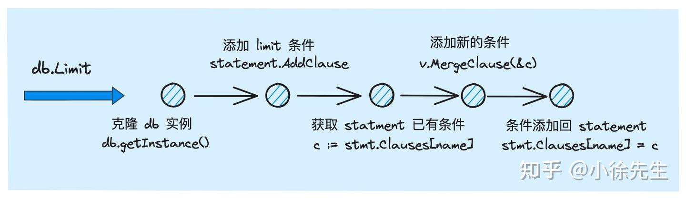


执行查询类操作时，通常会通过链式调用的方式，传入一些查询限制条件，比如 Where、Group By、Order、Limit 之类. 我们以 Limit 为例，进行展开介绍：

- 首先**调用 db.getInstance() 方法**，克隆出一份 DB 会话实例
- **调用 statement.AddClause 方法**，将 limit 条件追加到 statement 的 Clauses map 中

```text
func (db *DB) Limit(limit int) (tx *DB) {
    tx = db.getInstance()
    tx.Statement.AddClause(clause.Limit{Limit: &limit})
    return
}
func (stmt *Statement) AddClause(v clause.Interface) {
    // ...
    name := v.Name()
    c := stmt.Clauses[name]
    c.Name = name
    v.MergeClause(&c)
    stmt.Clauses[name] = c   
}
```


### 4.3 核心方法

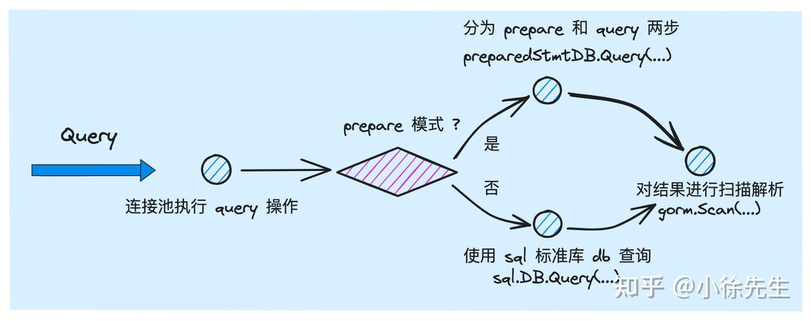


在 query 类型 processor 的 fns 函数链中，最主要的函数是 Query，其中涉及的核心步骤包括：

- **调用 BuildQuerySQL(...) 方法**，根据传入的 clauses 组装生成 sql
- **调用 connPool.QueryContext(...)**，完成查询类 sql 的执行，返回查到的行数据 rows（非 prepare 模式下，此处会对接 database/sql 库，走到 sql.DB.QueryContext(...) 方法中）
- **调用 gorm.Scan() 方法**，将结果数据反序列化到 statement 的 dest 当中

```text
func Query(db *gorm.DB) {
    if db.Error == nil {
        // 拼接生成 sql
        BuildQuerySQL(db)


        if !db.DryRun && db.Error == nil {
            rows, err := db.Statement.ConnPool.QueryContext(db.Statement.Context, db.Statement.SQL.String(), db.Statement.Vars...)
            if err != nil {
                db.AddError(err)
                return
            }
            defer func() {
                db.AddError(rows.Close())
            }()
            gorm.Scan(rows, db, 0)
        }
    }
}
```


### 4.4 扫描数据

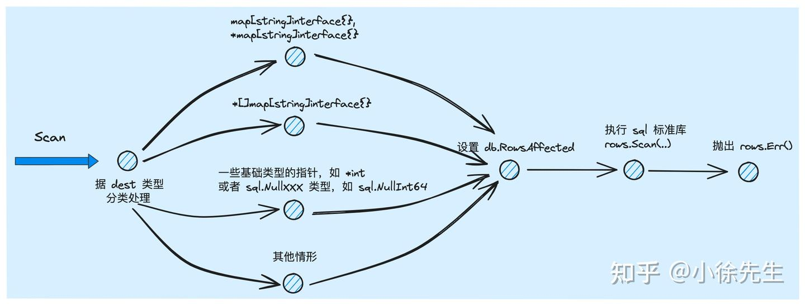


接下来展示一下，gorm.Scan() 方法，其作用是将查询结果数据反序列化到 dest 当中：

- 通过对 statement 中的 dest 进行分类，采取的不同的处理方式
- 核心方法都是**通过 rows.Scan(...) 方法**，将响应数据反序列化到 dest 当中
- **调用 rows.Err() 方法**，抛出请求过程中遇到的错误
- 倘若启用了 RaiseErrorOnNotFound 模式且查询到的行数为 0，则抛出错误 ErrRecordNotFound

对应源码展示如下：

```text
// Scan 方法将 rows 中的数据扫描解析到 db statement 中的 dest 当中
// 其中 rows 通常为 database/sql 下的 *Rows 类型
// 扫描数据的核心在于调用了 rows.Scan 方法
func Scan(rows Rows, db *DB, mode ScanMode) {
    var (
        columns, _          = rows.Columns()
        values              = make([]interface{}, len(columns))
        initialized         = mode&ScanInitialized != 0
        update              = mode&ScanUpdate != 0
        onConflictDonothing = mode&ScanOnConflictDoNothing != 0
    )


    // 影响的行数
    db.RowsAffected = 0


    // 根据 dest 类型进行断言分配
    switch dest := db.Statement.Dest.(type) {        
    case map[string]interface{}, *map[string]interface{}:
        if initialized || rows.Next() {
            // ...
            db.RowsAffected++
            // 扫描数据的核心在于，调用 rows
            db.AddError(rows.Scan(values...))
            // ...
        }
    case *[]map[string]interface{}:
        columnTypes, _ := rows.ColumnTypes()
        for initialized || rows.Next() {
            // ...
            db.RowsAffected++
       
            db.AddError(rows.Scan(values...))


            mapValue := map[string]interface{}{}
            scanIntoMap(mapValue, values, columns)
            *dest = append(*dest, mapValue)
        }
    case *int, *int8, *int16, *int32, *int64,
        *uint, *uint8, *uint16, *uint32, *uint64, *uintptr,
        *float32, *float64,
        *bool, *string, *time.Time,
        *sql.NullInt32, *sql.NullInt64, *sql.NullFloat64,
        *sql.NullBool, *sql.NullString, *sql.NullTime:
        for initialized || rows.Next() {
            initialized = false
            db.RowsAffected++
            db.AddError(rows.Scan(dest))
        }
    default:
        // ...
        // 根据 dest 类型进行前处理 ...
        db.AddError(rows.Scan(dest))
        // ...
    }


    // 倘若 rows 中存在错误，需要抛出
    if err := rows.Err(); err != nil && err != db.Error {
        db.AddError(err)
    }


    // 在 first、last、take 模式下，RaiseErrorOnNotFound 标识为 true，在没有查找到数据时，会抛出 ErrRecordNotFound 错误
    if db.RowsAffected == 0 && db.Statement.RaiseErrorOnNotFound && db.Error == nil {
        db.AddError(ErrRecordNotFound)
    }
}
```

## 5 创建

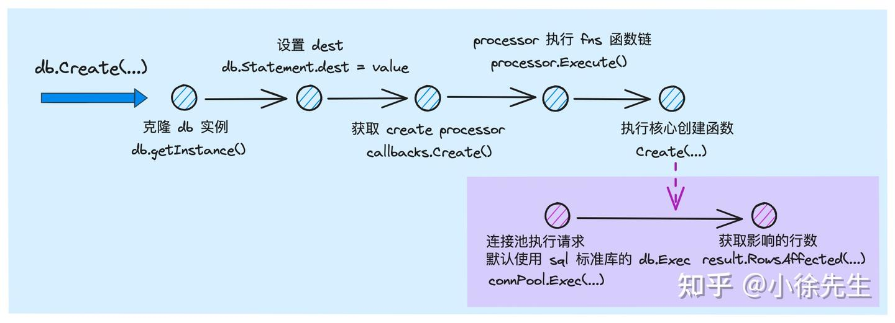


本章以 db.Create(...) 方法为入口，展开介绍一下创建数据记录的流程.


### 5.1 入口

创建数据记录操作主要通过调用 gorm.DB 的 Create 方法完成，其包括如下核心步骤：

- **通过 db.getInstance()** 克隆出一个 DB 会话实例
- 设置 statement 中的 dest 为用户传入的 dest
- 获取到 create 类型的 processor
- **调用 processor 的 Execute 方法**，遍历执行 fns 函数链，完成创建操作

```text
// Create inserts value, returning the inserted data's primary key in value's id
func (db *DB) Create(value interface{}) (tx *DB) {
    // ...
    // 克隆 db 会话实例
    tx = db.getInstance()
    // 设置 dest
    tx.Statement.Dest = value
    // 执行 create processor
    return tx.callbacks.Create().Execute(tx)
}
```


### 5.2 核心方法

在 create 类型 processor 的 fns 函数链中，最主要的执行函数就是 Create，其中核心步骤包括：

- **调用 statement.Build(...) 方法**，生成 sql
- **调用 connPool.ExecContext(...) 方法**，请求 mysql 服务端执行 sql（默认情况下，此处会使用 database/sql 标准库的 db.ExecContext(...) 方法）
- **调用 result.RowsAffected()**，获取到本次创建操作影响的数据行数

```text
// Create create hook
func Create(config *Config) func(db *gorm.DB) {
    supportReturning := utils.Contains(config.CreateClauses, "RETURNING")
    return func(db *gorm.DB) {
        // 生成 sql
        if db.Statement.SQL.Len() == 0 {
            db.Statement.SQL.Grow(180)
            db.Statement.AddClauseIfNotExists(clause.Insert{})
            db.Statement.AddClause(ConvertToCreateValues(db.Statement))


            db.Statement.Build(db.Statement.BuildClauses...)
        }
         
        // ... 执行 sql
        result, err := db.Statement.ConnPool.ExecContext(
            db.Statement.Context, db.Statement.SQL.String(), db.Statement.Vars...,
        )
        // ... 获取影响的行数
        db.RowsAffected, _ = result.RowsAffected()        
        // ...
    }
}
```

## 6 删除

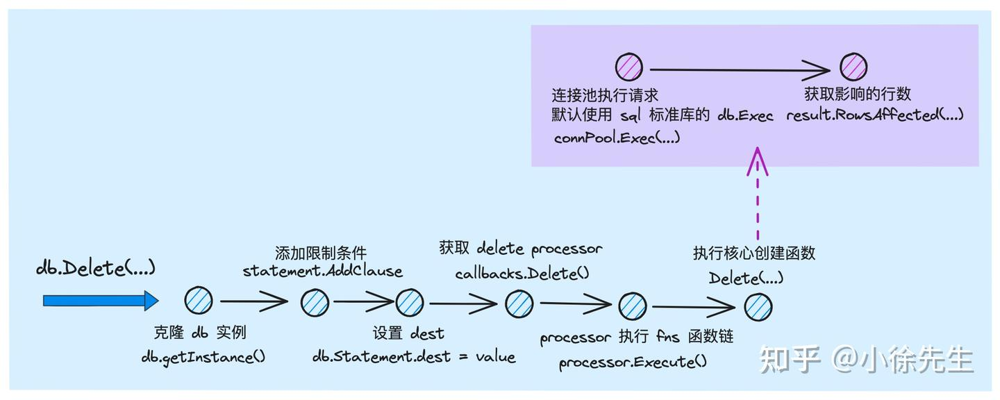


接下来是数据记录删除流程，以 db.Delete 方法作为走读入口：


### 6.1 入口

在 db.Delete 方法中，核心步骤包括：

- **通过 db.getInstance() 方法**获取 db 的克隆实例
- **通过 statement.AddClause(...) 方法**追加使用方传入的条件 condition
- 设置 statement dest 为使用方传入的 value
- 获取 delete 类型的 processor
- **执行 processor.Execute(...) 方法**，遍历调用 fns 函数链

```text
func (db *DB) Delete(value interface{}, conds ...interface{}) (tx *DB) {
    tx = db.getInstance()
    if len(conds) > 0 {
        if exprs := tx.Statement.BuildCondition(conds[0], conds[1:]...); len(exprs) > 0 {
            tx.Statement.AddClause(clause.Where{Exprs: exprs})
        }
    }
    tx.Statement.Dest = value
    return tx.callbacks.Delete().Execute(tx)
}
```


### 6.2 核心方法

在 delete 类型的 processor 的 fns 函数链中，最核心的函数是 Delete，其中的核心步骤包括：

- **调用 statement.Build(...) 方法**，生成 sql
- 倘若**未启用 AllowGlobalUpdate 模式**，则会校验使用方**是否设置了 where 条件**，未设置会**抛出 gorm.ErrMissingWhereClause 错误**（对应 **checkMissingWhereConditions() 方法**）

```text
var ErrMissingWhereClause = errors.New("WHERE conditions required")
```

- **调用 connPool.ExecContext(...) 方法**，执行删除操作（默认使用的是标准库 database/sql 中的 db.ExecContxt(...) 方法）
- **调用 result.RowsAffected() 方法**，获取本次删除操作影响的数据行数

```text
func Delete(config *Config) func(db *gorm.DB) {
    supportReturning := utils.Contains(config.DeleteClauses, "RETURNING")


    return func(db *gorm.DB) {
       // ...
        if db.Statement.Schema != nil {
            for _, c := range db.Statement.Schema.DeleteClauses {
                db.Statement.AddClause(c)
            }
        }


        // 生成 sql
        if db.Statement.SQL.Len() == 0 {
            db.Statement.SQL.Grow(100)
            db.Statement.AddClauseIfNotExists(clause.Delete{})


            // ...


            db.Statement.AddClauseIfNotExists(clause.From{})
            db.Statement.Build(db.Statement.BuildClauses...)
        }
        // ...


        checkMissingWhereConditions(db)
    
        // ...
        if !db.DryRun && db.Error == nil {
            // ...
            result, err := db.Statement.ConnPool.ExecContext(db.Statement.Context, db.Statement.SQL.String(), db.Statement.Vars...)
            if db.AddError(err) == nil {
                db.RowsAffected, _ = result.RowsAffected()
            }


        }
    }
}
```

checkMissingWhereConditions 方法的源码如下：

```text
func checkMissingWhereConditions(db *gorm.DB) {
    // 倘若 AllowGlobalUpdate 标识不为 true 且 error 为空，则需要对 where 条件进行校验
    if !db.AllowGlobalUpdate && db.Error == nil {
        where, withCondition := db.Statement.Clauses["WHERE"]
        // ...
        // 不存在 where 条件，则需要抛出错误
        if !withCondition {
            db.AddError(gorm.ErrMissingWhereClause)
        }
        return
    }
}
```

## 7 更新

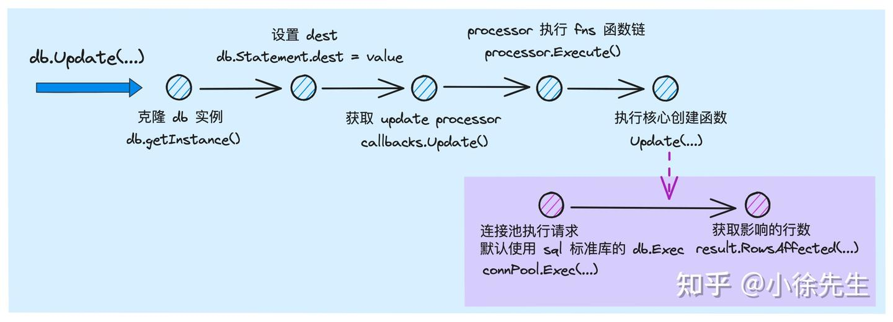


下面展示的是通过 gorm 更新数据的流程，以 db.Update(...) 方法作为源码走读的入口：


### 7.1 入口

在 db.Update 方法中，核心步骤包括：

- **通过 db.getInstance() 方法**获取 db 的克隆实例
- 设置 statement dest 为使用方传入的 value
- 获取 update 类型的 processor
- **执行 processor.Execute(...) 方法**，遍历调用 fns 函数链

```text
func (db *DB) Updates(values interface{}) (tx *DB) {
    tx = db.getInstance()
    tx.Statement.Dest = values
    return tx.callbacks.Update().Execute(tx)
}
```


### 7.2 核心方法

在 update 类型 processor 的 fns 函数链中，最核心的函数就是 Update，其中核心步骤包括：

- **调用 statement.Build(...) 方法**，生成 sql
- 和 Delete 流程类似，倘若**未启用 AllowGlobalUpdate 模式**，则会校验使用方**是否设置了 where 条件**，未设置会**抛出 gorm.ErrMissingWhereClause 错误**
- **调用 connPool.ExecContext(...) 方法**，执行 sql（默认情况下，此处会使用 database/sql 标准库的 db.ExecContext(...) 方法）
- **调用 result.RowsAffected() 方法**，获取到本次更新操作影响的行数

```text
// Update update hook
func Update(config *Config) func(db *gorm.DB) {
    supportReturning := utils.Contains(config.UpdateClauses, "RETURNING")


    return func(db *gorm.DB) {
        // ...
        if db.Statement.Schema != nil {
            for _, c := range db.Statement.Schema.UpdateClauses {
                db.Statement.AddClause(c)
            }
        }


  
        // 生成 sql
        if db.Statement.SQL.Len() == 0 {
            db.Statement.SQL.Grow(180)
            db.Statement.AddClauseIfNotExists(clause.Update{})
            // ...
            db.Statement.Build(db.Statement.BuildClauses...)
        }
        
        // ... 校验 where 条件
        checkMissingWhereConditions(db)
        if !db.DryRun && db.Error == nil {
            // ... 执行 sql
            result, err := db.Statement.ConnPool.ExecContext(db.Statement.Context, db.Statement.SQL.String(), db.Statement.Vars...)


            if db.AddError(err) == nil {
                // 获取影响的行数
                db.RowsAffected, _ = result.RowsAffected()
            }       
        }
    }
}
```

## 8 事务

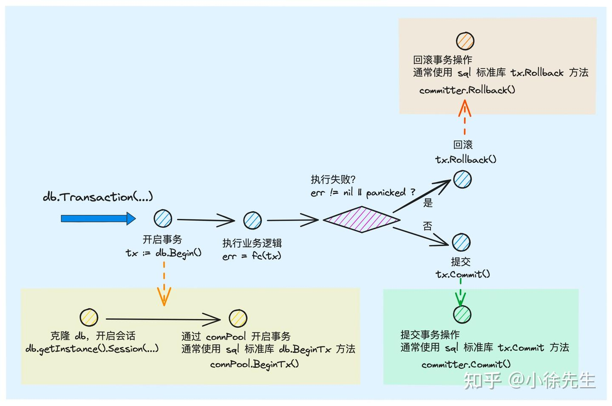


通过 gorm 框架同样能够很方便地使用事务相关的功能：

- **调用 db.Transaction(...) 方法**
- 传入闭包函数 fc，其中**入参 tx 为带有事务会话属性的 db 实例**，后续**事务内所有执行操作都需要围绕这个 tx 展开**
- 可以使用该 tx 实例完成事务的**提交 tx.Commit()** 和**回滚 tx.Rollback()** 操作


### 8.1 入口

db.Transaction(...) 方法是启动事务的入口：

- 首先会**调用 db.Begin(...) 方法启动事务**，此时会克隆出一个**带有事务属性的 DB 会话实例：tx**
- 以 tx 为入参，**调用使用方传入的闭包函数 fc(tx)**
- 倘若 fc **执行成功**，则自动为用户**执行 tx.Commit()** 操作
- 倘若 fc **执行出错或者发生 panic**，则会 defer 保证**执行 tx.Rollback()** 操作

```text
func (db *DB) Transaction(fc func(tx *DB) error, opts ...*sql.TxOptions) (err error) {
    panicked := true


    if committer, ok := db.Statement.ConnPool.(TxCommitter); ok && committer != nil {
        // ...
    } else {
        // 开启事务
        tx := db.Begin(opts...)
        if tx.Error != nil {
            return tx.Error
        }


        defer func() {
            // 倘若发生错误或者 panic，则进行 rollback 回滚
            if panicked || err != nil {
                tx.Rollback()
            }
        }()


        // 执行事务内的逻辑
        if err = fc(tx); err == nil {
            panicked = false
            // 指定成功会进行 commit 操作
            return tx.Commit().Error
        }
    }


    panicked = false
    return
}
```


### 8.2 开启事务

对于 DB.Begin() 方法，在默认模式下会**使用 database/sql 库下的 sql.DB.BeginTx 方法创建出一个 sql.Tx 对象**，将其**赋给当前事务会话 DB 的 statement.ConnPool 字段**，以供后续使用：

```text
// Begin begins a transaction with any transaction options opts
func (db *DB) Begin(opts ...*sql.TxOptions) *DB {
    var (
        // clone statement
        tx  = db.getInstance().Session(&Session{Context: db.Statement.Context, NewDB: db.clone == 1})
        opt *sql.TxOptions
        err error
    )


    if len(opts) > 0 {
        opt = opts[0]
    }


    switch beginner := tx.Statement.ConnPool.(type) {
    // 标准模式，会走到 sql.DB.BeginTX 方法
    case TxBeginner:
        // 创建好的 tx 赋给 statment.ConnPool
        tx.Statement.ConnPool, err = beginner.BeginTx(tx.Statement.Context, opt)
    // prepare 模式，会走到 PreparedStmtDB.BeginTx 方法中
    case ConnPoolBeginner:
        // 创建好的 tx 赋给 statment.ConnPool
        tx.Statement.ConnPool, err = beginner.BeginTx(tx.Statement.Context, opt)
    default:
        err = ErrInvalidTransaction
    }


    if err != nil {
        tx.AddError(err)
    }


    return tx
}
```


### 8.3 提交&回滚

事务的提交和回滚操作，会**执行 statement 中的 connPool 的 Commit 和 Rollback 方法**完成：

- 执行事务提交操作：

```text
// Commit commits the changes in a transaction
func (db *DB) Commit() *DB {
    // 默认情况下，此处的 ConnPool 实现类为 database/sql.Tx
    if committer, ok := db.Statement.ConnPool.(TxCommitter); ok && committer != nil && !reflect.ValueOf(committer).IsNil() {
        db.AddError(committer.Commit())
    } else {
        db.AddError(ErrInvalidTransaction)
    }
    return db
}
```

- 执行事务回滚操作：

```text
// Rollback rollbacks the changes in a transaction
func (db *DB) Rollback() *DB {
    // 默认情况下，此处的 ConnPool 实现类为 database/sql.Tx
    if committer, ok := db.Statement.ConnPool.(TxCommitter); ok && committer != nil {
        if !reflect.ValueOf(committer).IsNil() {
            db.AddError(committer.Rollback())
        }
    } else {
        db.AddError(ErrInvalidTransaction)
    }
    return db
}
```

## 9 预处理

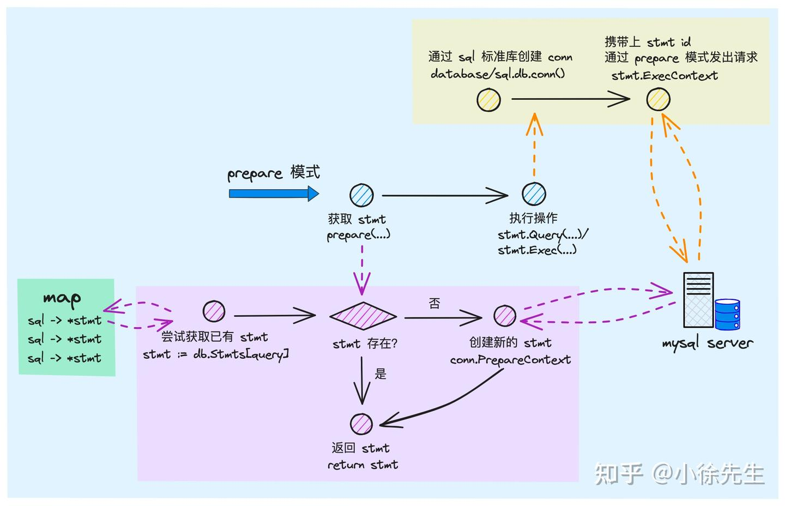


倘若创建 gorm.DB 时，倘若**在 Config 中设置了 PrepareStmt 标识**，则代表后续会**启用 prepare 预处理模式**. 次吃，在执行 query 或者 exec 操作时，使用的 **ConnPool 的实现版本是 PreparedStmtDB**，执行时会拆分为两个步骤：

- **通过 PreparedStmtDB.prepare(...) 操作创建/复用 stmt**，后续相同 sql 模板可以复用此 stmt
- **通过 stmt.Query(...)/Exec(...) 执行 sql**


### 9.1 prepare

在 PreparedStmtDB.prepare 方法中，会通过**加锁 double check** 的方式，**创建或复用 sql 模板对应的 stmt**. **创建 stmt 的操作通过调用 conn.PrepareContext 方法完成**.（通常此处的 conn 为 database/sql 库下的 sql.DB）

PreparedStmtDB.prepare 方法核心流程梳理如下：

- 加读锁，然后以 sql 模板为 key，尝试从 db.Stmts map 中获取 stmt 复用
- 倘若 stmt 不存在，则加写锁 double check
- **调用 conn.PrepareContext(...) 方法，创建新的 stmt**，并存放到 map 中供后续复用

完整的代码和对应的注释展示如下：

```text
func (db *PreparedStmtDB) prepare(ctx context.Context, conn ConnPool, isTransaction bool, query string) (Stmt, error) {
    db.Mux.RLock()
    // 以 sql 模板为 key，优先复用已有的 stmt 
    if stmt, ok := db.Stmts[query]; ok && (!stmt.Transaction || isTransaction) {
        db.Mux.RUnlock()
        // 并发场景下，只允许有一个 goroutine 完成 stmt 的初始化操作
        <-stmt.prepared
        if stmt.prepareErr != nil {
            return Stmt{}, stmt.prepareErr
        }


        return *stmt, nil
    }
    db.Mux.RUnlock()


    // 加锁 double check，确认未完成 stmt 初始化则执行初始化操作
    db.Mux.Lock()
    // double check
    if stmt, ok := db.Stmts[query]; ok && (!stmt.Transaction || isTransaction) {
        db.Mux.Unlock()
        // wait for other goroutines prepared
        <-stmt.prepared
        if stmt.prepareErr != nil {
            return Stmt{}, stmt.prepareErr
        }


        return *stmt, nil
    }


    // 创建 stmt 实例，并添加到 stmts map 中
    cacheStmt := Stmt{Transaction: isTransaction, prepared: make(chan struct{})}
    db.Stmts[query] = &cacheStmt
    // 此时可以提前解锁是因为还通过 channel 保证了其他使用者会阻塞等待初始化操作完成
    db.Mux.Unlock()


    // 所有工作执行完之后会关闭 channel，唤醒其他阻塞等待使用 stmt 的 goroutine
    defer close(cacheStmt.prepared)


    // 调用 *sql.DB 的 prepareContext 方法，创建真正的 stmt
    stmt, err := conn.PrepareContext(ctx, query)
    if err != nil {
        cacheStmt.prepareErr = err
        db.Mux.Lock()
        delete(db.Stmts, query)
        db.Mux.Unlock()
        return Stmt{}, err
    }


    db.Mux.Lock()
    cacheStmt.Stmt = stmt
    db.PreparedSQL = append(db.PreparedSQL, query)
    db.Mux.Unlock()


    return cacheStmt,nil
}
```


### 9.2 查询

在 prepare 模式下，**查询操作通过 PreparedStmtDB.QueryContext(...) 方法实现.** 首先**通过 PreparedStmtDB.prepare(...) 方法尝试复用 stmt**，然后**调用 stmt.QueryContext(...) 执行查询操作.**

此处 stm.QueryContext(...) 方法本质上会使用 database/sql 中的 sql.Stmt 完成任务.

```text
func (db *PreparedStmtDB) QueryContext(ctx context.Context, query string, args ...interface{}) (rows *sql.Rows, err error) {
    stmt, err := db.prepare(ctx, db.ConnPool, false, query)
    if err == nil {
        rows, err = stmt.QueryContext(ctx, args...)
        if err != nil {
            db.Mux.Lock()
            defer db.Mux.Unlock()


            go stmt.Close()
            delete(db.Stmts, query)
        }
    }
    return rows, err
}
```


### 9.3 执行

在 prepare 模式下，**执行操作通过 PreparedStmtDB.ExecContext(...) 方法实现.** 首先**通过 PreparedStmtDB.prepare(...) 方法尝试复用 stmt**，然后**调用 stmt.ExecContext(...) 执行查询操作.**

此处 stm.ExecContext(...) 方法本质上会使用 database/sql 中的 sql.Stmt 完成任务.

```text
func (db *PreparedStmtDB) ExecContext(ctx context.Context, query string, args ...interface{}) (result sql.Result, err error) {
    stmt, err := db.prepare(ctx, db.ConnPool, false, query)
    if err == nil {
        result, err = stmt.ExecContext(ctx, args...)
        if err != nil {
            db.Mux.Lock()
            defer db.Mux.Unlock()
            go stmt.Close()
            delete(db.Stmts, query)
        }
    }
    return result, err
}
```

