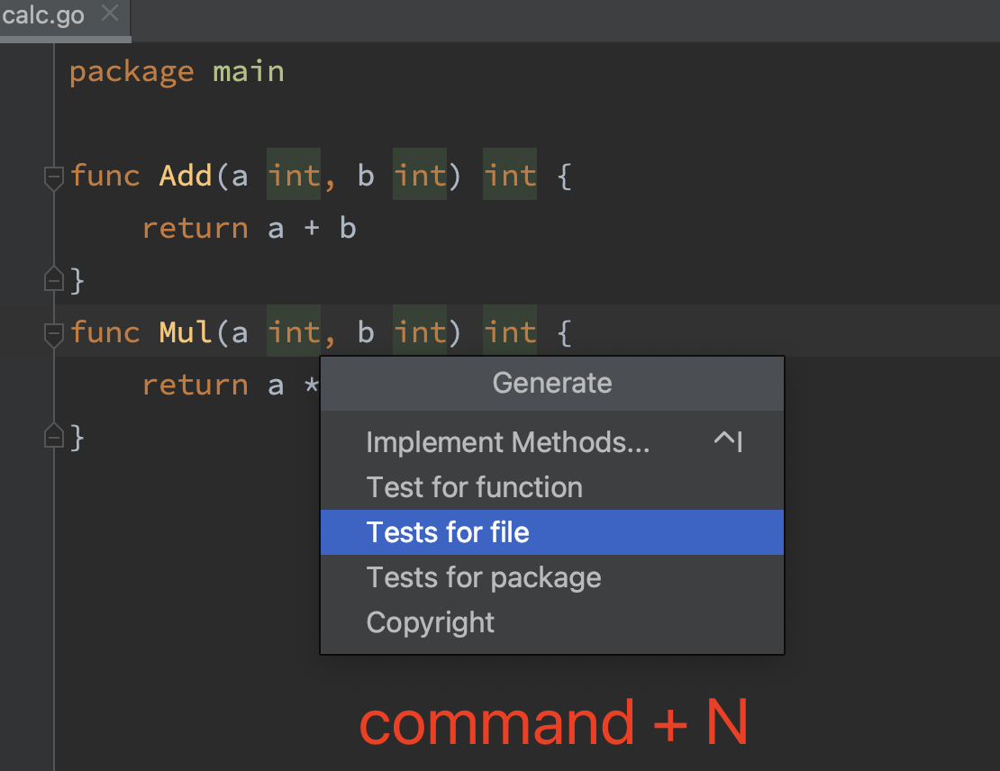

# Go单元测试

## 单元测试要求

由于Golang语言(下面咱们将统称为Go)较为偏向工程性设计，所以Go在单元测试对文件名、方法名、参数都有很严格的要求

例如：

1. 测试文件命名必须 xxx_test.go 命名；
2. 测试方法必须是Test[^a~z]开头,不强制要求驼峰或下划线但风格建议保持一致；
3. 测试方法参数必须 t *testing.T 或 b *testing.B;
4. 测试文件和被测试文件必须在一个包中；


## Go语言如何编写单元测试

相比C/CPP或者是java(或者大多数的主流编程语言)他们虽然都有较为成熟的单元测试框架，例如前者的Check或者后者的JUnit，但是这些框架本质还是第三方开发产品，相比之下Go语言官方则提供了语言级的单元测试支持，即"testing"包，而且仅仅通过go工具本身就能很方便的生成覆盖率数据，开发者只需编写单元测试用例，不用额外工程搭建任何第三方就可执行单测或生成测试覆盖率，可见Go语言官方对于单元测试的重视性。

| 类型         | 格式                  | 作用                           |
| :----------- | :-------------------- | :----------------------------- |
| 单元测试函数 | 函数名前缀为Test      | 测试程序的一些逻辑行为是否正确 |
| 性能基准函数 | 函数名前缀为Benchmark | 测试函数的性能                 |
| 示例函数     | 函数名前缀为Example   | 为文档提供示例文档             |


### *编写简单的单元测试*

我们来创建一个示例，创建名为 calc.go的文件

```
package main

package main

func Add(a int, b int) int {
	return a + b
}
func Mul(a int, b int) int {
	return a * b
}
12345678910
```

借助Goland我们为calc.go生成并编写测试用例
您可以右键点击函数，转到 *Generate* | *Test for file /function*（生成 | 函数测试）。
PS：快捷键以MAC为例 Command + N
当然最标准的当然是 [GoLand 文档](https://link.zhihu.com/?target=https%3A//www.jetbrains.com.cn/help/go/create-tests.html%23create-test) 你可以进一步了解更多详细信息。

`calc_test.go` 中的测试用例可以这么写：



Goland 为我们生成了如下单测文件

```
package main

import "testing"

func TestAdd(t *testing.T) {
	type args struct {
		a int
		b int
	}
	tests := []struct {
		name string
		args args
		want int
	}{
		{"Test1", args{1, 2}, 3},
		{"Test2", args{3, 4}, 7},
		{"Test3", args{5, 6}, 11},
	}
	for _, tt := range tests {
		t.Run(tt.name, func(t *testing.T) {
			if got := Add(tt.args.a, tt.args.b); got != tt.want {
				t.Errorf("Add() = %v, want %v", got, tt.want)
			}
		})
	}
}

func TestMul(t *testing.T) {
	type args struct {
		a int
		b int
	}
	tests := []struct {
		name string
		args args
		want int
	}{

		{"Test4", args{12, 13}, 2},
		{"Test5", args{15, 16}, 4},
		{"Test6", args{185, 19}, 6},
	}
	for _, tt := range tests {
		t.Run(tt.name, func(t *testing.T) {
			if got := Mul(tt.args.a, tt.args.b); got != tt.want {
				t.Errorf("Mul() = %v, want %v", got, tt.want)
			}
		})
	}
}


12345678910111213141516171819202122232425262728293031323334353637383940414243444546474849505152
```

运行 `go test`，该 package 下所有的测试用例都会被执行。

```
PASS
ok      calc.go 0.499s
12
```

或 `go test -v`，`-v` 参数会显示每个用例的测试结果，另外 `-cover` 参数可以查看覆盖率。
当然如果只想运行其中的一个用例，例如 `TestAdd`，可以用 `-run` 参数指定，该参数支持通配符 `*`，和部分正则表达式，例如 `^`、`$`

```
go test -v
=== RUN   TestAdd
=== RUN   TestAdd/Test1
=== RUN   TestAdd/Test2
=== RUN   TestAdd/Test3
--- PASS: TestAdd (0.00s)
    --- PASS: TestAdd/Test1 (0.00s)
    --- PASS: TestAdd/Test2 (0.00s)
    --- PASS: TestAdd/Test3 (0.00s)
=== RUN   TestMul
=== RUN   TestMul/Test4
=== RUN   TestMul/Test5
=== RUN   TestMul/Test6
--- PASS: TestMul (0.00s)
    --- PASS: TestMul/Test4 (0.00s)
    --- PASS: TestMul/Test5 (0.00s)
    --- PASS: TestMul/Test6 (0.00s)
PASS
ok      calc.go 0.197s
12345678910111213141516171819
```

我们单独针对Mul进行单测 执行：go test -run TestMul -v

```
=== RUN   TestMul
=== RUN   TestMul/Test4
    calc_test.go:46: Mul() = 156, want 1561
=== RUN   TestMul/Test5
=== RUN   TestMul/Test6
    calc_test.go:46: Mul() = 342, want 3423
--- FAIL: TestMul (0.00s)
    --- FAIL: TestMul/Test4 (0.00s)
    --- PASS: TestMul/Test5 (0.00s)
    --- FAIL: TestMul/Test6 (0.00s)
FAIL
exit status 1
FAIL    calc.go 0.304s
12345678910111213
```

加上 -cover 得到覆盖率

```
coverage: 100.0% of statements
```

以上就是一个从编写一个函数利用Goland生成单测，并对其进行单测的整体过程


## 进阶

下面我们借助golang 单元测试，使用golang 自带的mock工具来完成mock测试
你可以在这里 github.com/golang/mock 进一步了解

首先go get 对应的工具

```
go get -u github.com/golang/mock/gomock
go get -u github.com/golang/mock/mockgen
12
```

让我们一起写一个dome实践一下

创建一个 audit_repo.go 内含一个接口 其内实现一个GetAuditInfo()方法，获取审核信息

```
package mymock

type AuditRepo interface {
	GetAuditInfo() string
}

123456
```

再创建一个 audit_svc.go 再其内部调用 audit_repo 的方法，获取信息

```
package mymock

func getUser(m AuditRepo) string {
	user := m.GetAuditInfo()
	return user
}

1234567
```

接下来借助 mock 生成 mock_audit_repo.go
注意：mock_audit_repo.go 可不是咱们自己创建的，而是通过 mockgen 生成出来的，执行如下命令生成；我们使用 source 方式生成

```
mockgen -source=audit_repo.go -destination=mocks/audit_repo_mock.go -package=mymock
* -source 源文件方式
* -destination 目标文件
* -package 指定包名(如果不指定的话会以mock_目标文件名命名)
1234
```

详细的文档可以通过这里 111 进一步了解
我们用mockgen生成了在mocks下的audit_repo_mock.go如下文件

```
// Code generated by MockGen. DO NOT EDIT.
// Source: audit_repo.go

// Package mymock is a generated GoMock package.
package mymock

import (
	reflect "reflect"

	gomock "github.com/golang/mock/gomock"
)

// MockAuditRepo is a mock of AuditRepo interface.
type MockAuditRepo struct {
	ctrl     *gomock.Controller
	recorder *MockAuditRepoMockRecorder
}

// MockAuditRepoMockRecorder is the mock recorder for MockAuditRepo.
type MockAuditRepoMockRecorder struct {
	mock *MockAuditRepo
}

// NewMockAuditRepo creates a new mock instance.
func NewMockAuditRepo(ctrl *gomock.Controller) *MockAuditRepo {
	mock := &MockAuditRepo{ctrl: ctrl}
	mock.recorder = &MockAuditRepoMockRecorder{mock}
	return mock
}

// EXPECT returns an object that allows the caller to indicate expected use.
func (m *MockAuditRepo) EXPECT() *MockAuditRepoMockRecorder {
	return m.recorder
}

// GetAuditInfo mocks base method.
func (m *MockAuditRepo) GetAuditInfo() string {
	m.ctrl.T.Helper()
	ret := m.ctrl.Call(m, "GetAuditInfo")
	ret0, _ := ret[0].(string)
	return ret0
}

// GetAuditInfo indicates an expected call of GetAuditInfo.
func (mr *MockAuditRepoMockRecorder) GetAuditInfo() *gomock.Call {
	mr.mock.ctrl.T.Helper()
	return mr.mock.ctrl.RecordCallWithMethodType(mr.mock, "GetAuditInfo", reflect.TypeOf((*MockAuditRepo)(nil).GetAuditInfo))
}

12345678910111213141516171819202122232425262728293031323334353637383940414243444546474849
```

借助开始的单测步骤，我们为 audit_svc.go 创建对应的单测文件 并在内部使用mock方式。

```
package mymock

import (
    "fmt"
    "testing"
    gomock "github.com/golang/mock/gomock"
)

func Test_getAuditInfo(t *testing.T) {
	mockCtl := gomock.NewController(t)
	mockMyFunc := mymock.NewMockAuditRepo(mockCtl)
	mockMyFunc.EXPECT().GetAuditInfo().Return("getAuditInfo")
	v := getAuditInfo(mockMyFunc)
	if v == "xiaomotong" {
		fmt.Println("return info!")
	} else {
		t.Error("get err audit info")
	}
}
12345678910111213141516171819
```

这里可能有些同学有疑问 "和单测有什么区别呢？",ok！让我们来看下用单测要如何实现。

```
//单测实现
func Test_getAuditInfoNotMock(t *testing.T) {
	auditRepo := AuditRepo.NewGetAudit() // 这里需要自己创建一个对象
	v := getAuditInfo(auditRepo)
	if v == "getAuditInfo" {
		fmt.Println("return info!")
	} else {
		t.Error("get err audit info")
	}
}
12345678910
```

如此实现来看并没有任何问题，但是在实际中，NewGetAudit是需要实现外部dbClient的这时候我们执行这个单测就只会得到 fail，一定要实现其所依赖的一切Init，否则我们的单测就被阻塞住了。
而使用Mock 方式，我们只需要Mock一个AuditRepo对象并预期一个返回值即可。
让我们来Run一下

```
go test -run Test_getAuditInfo -v -cover
```

结果

```
=== RUN   Test_getAuditInfo
return info!
--- PASS: Test_getAuditInfo (0.00s)
PASS
coverage: 50.0% of statements
ok      mymock  0.372s

1234567
```

哦吼，由于我们在audit_svc.go创建了两个方法，由此我们的覆盖率得到了"50.0%"


### 单元测试的一些通常原则

```
1. 每个测试单元必须完全独立、能单独运行。
2. 一个测试单元应只关注一个功能函数，证明它是正确的；
3. 测试代码要能够快速执行。
4. 不能为了单元测试而修改已完成的代码在编写代码后执行针对本次的单元测试，并执行之前的单元测试用例。
5. 以保证你后来编写的代码不会破坏任何事情；
6. 单元测试函数使用长的而且具有描述性的名字，例如都以test_开头，然后加上具体的函数名字或者功能描述；例如：func_test.go。
7. 测试代码必须具有可读性。
```