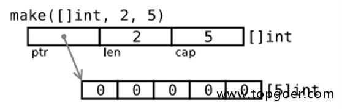

# 切片Slice


## 切片Slice 的定义

需要说明，slice 并不是数组或数组指针。它通过内部指针和相关属性引用数组片段，以实现变长方案。

```
1. 切片：切片是数组的一个引用，因此切片是引用类型。但自身是结构体，值拷贝传递。
2. 切片的长度可以改变，因此，切片是一个可变的数组。
3. 切片遍历方式和数组一样，可以用len()求长度。表示可用元素数量，读写操作不能超过该限制。 
4. cap可以求出slice最大扩张容量，不能超出数组限制。0 <= len(slice) <= len(array)，其中array是slice引用的数组。
5. 切片的定义：var 变量名 []类型，比如 var str []string  var arr []int。
6. 如果 slice == nil，那么 len、cap 结果都等于 0。
```


## 创建切片的各种方式


### 零切片、空切片、nil切片是什么

为什么问题中这么多种切片呢？因为在Go语言中切片的创建方式有五种，不同方式创建出来的切片也不一样；

- 零切片

  我们把切片内部数组的元素都是零值或者底层数组的内容就全是 nil的切片叫做零切片，使用make创建的、长度、容量都不为0的切片就是零值切片：

  ```shell
  slice := make([]int,5) // 0 0 0 0 0
  slice := make([]*int,5) // nil nil nil nil nil
  ```

- nil切片

  nil切片的长度和容量都为0，并且和nil比较的结果为true，采用直接创建切片的方式、new创建切片的方式都可以创建nil切片：

  ```shell
  var slice []int
  var slice = *new([]int)
  ```

- 空切片

  空切片的长度和容量也都为0，但是和nil的比较结果为false，因为所有的空切片的数据指针都指向同一个地址 0xc42003bda0；使用字面量、make可以创建空切片：

  ```go
  var slice = []int{}
  var slice = make([]int, 0)
  ```

  空切片指向的 zerobase 内存地址是一个神奇的地址，从 Go 语言的源代码中可以看到它的定义：

  ```
  // base address for all 0-byte allocations
  var zerobase uintptr
  
  // 分配对象内存
  func mallocgc(size uintptr, typ *_type, needzero bool) unsafe.Pointer {
   ...
   if size == 0 {
    return unsafe.Pointer(&zerobase)
   }
    ...
  }
  ```


### `nil` 切片的使用场景

作为未初始化状态，表示“无数据”

- 当切片的值为 `nil`，它通常用于表示 **当前没有数据，而不是空数据**。
- 适用于：**数据库查询、API 响应、未初始化的缓存** 等场景。

示例：

```go
func getData() []int {
    var result []int // nil 切片
    return result
}

data := getData()
fmt.Println(data == nil) // true，表示没有数据
fmt.Println(len(data))   // 0
```

✅ `nil` 切片是 `json.Marshal` 序列化时的默认行为，不会被序列化成 `[]`，而是 `nil`：

```go
type Response struct {
    Items []int `json:"items"`
}

r := Response{}
jsonData, _ := json.Marshal(r)
fmt.Println(string(jsonData)) // {"items":null}
```

⚠️ **避免使用 `make([]T, 0)`，因为它会被序列化为 `[]` 而不是 `null`。**


### 空切片的使用场景

 **需要显式表示“空但已初始化”**

- 用于：**避免 `nil` 造成的 `runtime panic`，或者 JSON 序列化时要求 `[]` 代替 `null`**。

示例：

```
func getData() []int {
    return make([]int, 0) // 空切片
}

data := getData()
fmt.Println(data == nil) // false
fmt.Println(len(data))   // 0
```

✅ **JSON 序列化时不会返回 `null`，而是 `[]`**：

```
r := Response{Items: make([]int, 0)}
jsonData, _ := json.Marshal(r)
fmt.Println(string(jsonData)) // {"items":[]}
```

✅ **避免 `nil` 可能引起的 `panic`**

```
var s []int // nil
fmt.Println(s[0]) // panic: index out of range

s = make([]int, 0) // 空切片
fmt.Println(s[0]) // 仍然 panic，但更明确表示已初始化
```

**结论**：如果 API 需要 `[]` 而不是 `null`，或者你想避免 `nil` 带来的 `panic`，请使用 **空切片 (`make([]T, 0)`)**。


### 零切片的使用场景


### **总结**

| 类型       | 是否为 `nil`     | `len(slice)` | `cap(slice)`        | 是否可 `append` |
| ---------- | ---------------- | ------------ | ------------------- | --------------- |
| `nil` 切片 | ✅ `true`         | `0`          | `0`                 | ✅ 可以          |
| 空切片     | ❌ `false`        | `0`          | `X` (取决于 `make`) | ✅ 可以          |
| 零切片     | `nil` 或非 `nil` | `0`          | `0` 或 `X`          | ✅ 可以          |

**`append` 对 `nil` 切片、空切片和零切片的行为是一样的：它们都会动态扩展并变成非 `nil` 切片。**


## 切片初始化

```
全局：
var arr = [...]int{0, 1, 2, 3, 4, 5, 6, 7, 8, 9}
var slice0 []int = arr[start:end] 
var slice1 []int = arr[:end]        
var slice2 []int = arr[start:]        
var slice3 []int = arr[:] 
var slice4 = arr[:len(arr)-1]      //去掉切片的最后一个元素
局部：
arr2 := [...]int{9, 8, 7, 6, 5, 4, 3, 2, 1, 0}
slice5 := arr[start:end]
slice6 := arr[:end]        
slice7 := arr[start:]     
slice8 := arr[:]  
slice9 := arr[:len(arr)-1] //去掉切片的最后一个元素
```


代码：

```go
package main

import (
    "fmt"
)

var arr = [...]int{0, 1, 2, 3, 4, 5, 6, 7, 8, 9}
var slice0 []int = arr[2:8]
var slice1 []int = arr[0:6]        //可以简写为 var slice []int = arr[:end]
var slice2 []int = arr[5:10]       //可以简写为 var slice[]int = arr[start:]
var slice3 []int = arr[0:len(arr)] //var slice []int = arr[:]
var slice4 = arr[:len(arr)-1]      //去掉切片的最后一个元素
func main() {
    fmt.Printf("全局变量：arr %v\n", arr)
    fmt.Printf("全局变量：slice0 %v\n", slice0)
    fmt.Printf("全局变量：slice1 %v\n", slice1)
    fmt.Printf("全局变量：slice2 %v\n", slice2)
    fmt.Printf("全局变量：slice3 %v\n", slice3)
    fmt.Printf("全局变量：slice4 %v\n", slice4)
    fmt.Printf("-----------------------------------\n")
    arr2 := [...]int{9, 8, 7, 6, 5, 4, 3, 2, 1, 0}
    slice5 := arr[2:8]
    slice6 := arr[0:6]         //可以简写为 slice := arr[:end]
    slice7 := arr[5:10]        //可以简写为 slice := arr[start:]
    slice8 := arr[0:len(arr)]  //slice := arr[:]
    slice9 := arr[:len(arr)-1] //去掉切片的最后一个元素
    fmt.Printf("局部变量： arr2 %v\n", arr2)
    fmt.Printf("局部变量： slice5 %v\n", slice5)
    fmt.Printf("局部变量： slice6 %v\n", slice6)
    fmt.Printf("局部变量： slice7 %v\n", slice7)
    fmt.Printf("局部变量： slice8 %v\n", slice8)
    fmt.Printf("局部变量： slice9 %v\n", slice9)
}
```

输出结果：

```
全局变量：arr [0 1 2 3 4 5 6 7 8 9]
全局变量：slice0 [2 3 4 5 6 7]
全局变量：slice1 [0 1 2 3 4 5]
全局变量：slice2 [5 6 7 8 9]
全局变量：slice3 [0 1 2 3 4 5 6 7 8 9]
全局变量：slice4 [0 1 2 3 4 5 6 7 8]
-----------------------------------
局部变量： arr2 [9 8 7 6 5 4 3 2 1 0]
局部变量： slice5 [2 3 4 5 6 7]
局部变量： slice6 [0 1 2 3 4 5]
局部变量： slice7 [5 6 7 8 9]
局部变量： slice8 [0 1 2 3 4 5 6 7 8 9]
局部变量： slice9 [0 1 2 3 4 5 6 7 8]
```


## 通过make来创建切片

```
    var slice []type = make([]type, len)
    slice  := make([]type, len)
    slice  := make([]type, len, cap)
```



代码：

```go
package main

import (
    "fmt"
)

var slice0 []int = make([]int, 10)
var slice1 = make([]int, 10)
var slice2 = make([]int, 10, 10)

func main() {
    fmt.Printf("make全局slice0 ：%v\n", slice0)
    fmt.Printf("make全局slice1 ：%v\n", slice1)
    fmt.Printf("make全局slice2 ：%v\n", slice2)
    fmt.Println("--------------------------------------")
    slice3 := make([]int, 10)
    slice4 := make([]int, 10)
    slice5 := make([]int, 10, 10)
    fmt.Printf("make局部slice3 ：%v\n", slice3)
    fmt.Printf("make局部slice4 ：%v\n", slice4)
    fmt.Printf("make局部slice5 ：%v\n", slice5)
}
```

输出结果：

```
make全局slice0 ：[0 0 0 0 0 0 0 0 0 0]
make全局slice1 ：[0 0 0 0 0 0 0 0 0 0]
make全局slice2 ：[0 0 0 0 0 0 0 0 0 0]
--------------------------------------
make局部slice3 ：[0 0 0 0 0 0 0 0 0 0]
make局部slice4 ：[0 0 0 0 0 0 0 0 0 0]
make局部slice5 ：[0 0 0 0 0 0 0 0 0 0]
```

切片的内存布局


读写操作实际目标是底层数组，只需注意索引号的差别。

```go
package main

import (
    "fmt"
)

func main() {
    data := [...]int{0, 1, 2, 3, 4, 5}

    s := data[2:4]
    s[0] += 100
    s[1] += 200

    fmt.Println(s)
    fmt.Println(data)
}
```

输出:

```
[102 203]
[0 1 102 203 4 5]
```

可直接创建 slice 对象，自动分配底层数组。

```go
package main

import "fmt"

func main() {
    s1 := []int{0, 1, 2, 3, 8: 100} // 通过初始化表达式构造，可使用索引号。
    fmt.Println(s1, len(s1), cap(s1))

    s2 := make([]int, 6, 8) // 使用 make 创建，指定 len 和 cap 值。
    fmt.Println(s2, len(s2), cap(s2))

    s3 := make([]int, 6) // 省略 cap，相当于 cap = len。
    fmt.Println(s3, len(s3), cap(s3))
}
```

输出结果:

```
[0 1 2 3 0 0 0 0 100] 9 9
[0 0 0 0 0 0] 6 8
[0 0 0 0 0 0] 6 6
```

使用 make 动态创建slice，避免了数组必须用常量做长度的麻烦。还可用指针直接访问底层数组，退化成普通数组操作。

```go
package main

import "fmt"

func main() {
    s := []int{0, 1, 2, 3}
    p := &s[2] // *int, 获取底层数组元素指针。
    *p += 100

    fmt.Println(s)
}
```

输出结果:

```
[0 1 102 3]
```

至于 [][]T，是指元素类型为 []T 。

```go
package main

import (
    "fmt"
)

func main() {
    data := [][]int{
        []int{1, 2, 3},
        []int{100, 200},
        []int{11, 22, 33, 44},
    }
    fmt.Println(data)
}
```

输出结果：

```
[[1 2 3] [100 200] [11 22 33 44]]
```

可直接修改 struct array/slice 成员。

```go
package main

import (
    "fmt"
)

func main() {
    d := [5]struct {
        x int
    }{}

    s := d[:]

    d[1].x = 10
    s[2].x = 20

    fmt.Println(d)
    fmt.Printf("%p, %p\n", &d, &d[0])

}
```

输出结果:

```
[{0} {10} {20} {0} {0}]
0xc4200160f0, 0xc4200160f0
```


## 用append内置函数操作切片（切片追加）

```go
package main

import (
    "fmt"
)

func main() {

    var a = []int{1, 2, 3}
    fmt.Printf("slice a : %v\n", a)
    var b = []int{4, 5, 6}
    fmt.Printf("slice b : %v\n", b)
    c := append(a, b...)
    fmt.Printf("slice c : %v\n", c)
    d := append(c, 7)
    fmt.Printf("slice d : %v\n", d)
    e := append(d, 8, 9, 10)
    fmt.Printf("slice e : %v\n", e)

}
```

输出结果：

```
slice a : [1 2 3]
slice b : [4 5 6]
slice c : [1 2 3 4 5 6]
slice d : [1 2 3 4 5 6 7]
slice e : [1 2 3 4 5 6 7 8 9 10]
```

append ：向 slice 尾部添加数据，返回新的 slice 对象。

```go
package main

import (
    "fmt"
)

func main() {

    s1 := make([]int, 0, 5)
    fmt.Printf("%p\n", &s1)

    s2 := append(s1, 1)
    fmt.Printf("%p\n", &s2)

    fmt.Println(s1, s2)

}
```

输出结果：

```
0xc42000a060
0xc42000a080
[] [1]
```


## 超出原 slice.cap 限制，就会重新分配底层数组，即便原数组并未填满

```go
package main

import (
    "fmt"
)

func main() {

    data := [...]int{0, 1, 2, 3, 4, 10: 0}
    s := data[:2:3]

    s = append(s, 100, 200) // 一次 append 两个值，超出 s.cap 限制。

    fmt.Println(s, data)         // 重新分配底层数组，与原数组无关。
    fmt.Println(&s[0], &data[0]) // 比对底层数组起始指针。

}
```

输出结果:

```
[0 1 100 200] [0 1 2 3 4 0 0 0 0 0 0]
0xc4200160f0 0xc420070060
```

从输出结果可以看出，append 后的 s 重新分配了底层数组，并复制数据。如果只追加一个值，则不会超过 s.cap 限制，也就不会重新分配。 通常以 2 倍容量重新分配底层数组。在大批量添加数据时，建议一次性分配足够大的空间，以减少内存分配和数据复制开销。或初始化足够长的 len 属性，改用索引号进行操作。及时释放不再使用的 slice 对象，避免持有过期数组，造成 GC 无法回收。


## slice中cap重新分配规律：

```go
package main

import (
    "fmt"
)

func main() {

    s := make([]int, 0, 1)
    c := cap(s)

    for i := 0; i < 50; i++ {
        s = append(s, i)
        if n := cap(s); n > c {
            fmt.Printf("cap: %d -> %d\n", c, n)
            c = n
        }
    }

}
```

输出结果:

```
cap: 1 -> 2
cap: 2 -> 4
cap: 4 -> 8
cap: 8 -> 16
cap: 16 -> 32
cap: 32 -> 64
```


## 切片拷贝

```go
package main

import (
    "fmt"
)

func main() {

    s1 := []int{1, 2, 3, 4, 5}
    fmt.Printf("slice s1 : %v\n", s1)
    s2 := make([]int, 10)
    fmt.Printf("slice s2 : %v\n", s2)
    copy(s2, s1)
    fmt.Printf("copied slice s1 : %v\n", s1)
    fmt.Printf("copied slice s2 : %v\n", s2)
    s3 := []int{1, 2, 3}
    fmt.Printf("slice s3 : %v\n", s3)
    s3 = append(s3, s2...)
    fmt.Printf("appended slice s3 : %v\n", s3)
    s3 = append(s3, 4, 5, 6)
    fmt.Printf("last slice s3 : %v\n", s3)

}
```

输出结果：

```
slice s1 : [1 2 3 4 5]
slice s2 : [0 0 0 0 0 0 0 0 0 0]
copied slice s1 : [1 2 3 4 5]
copied slice s2 : [1 2 3 4 5 0 0 0 0 0]
slice s3 : [1 2 3]
appended slice s3 : [1 2 3 1 2 3 4 5 0 0 0 0 0]
last slice s3 : [1 2 3 1 2 3 4 5 0 0 0 0 0 4 5 6]
```

copy ：函数 copy 在两个 slice 间复制数据，复制长度以 len 小的为准。两个 slice 可指向同一底层数组，允许元素区间重叠。

```go
package main

import (
    "fmt"
)

func main() {

    data := [...]int{0, 1, 2, 3, 4, 5, 6, 7, 8, 9}
    fmt.Println("array data : ", data)
    s1 := data[8:]
    s2 := data[:5]
    fmt.Printf("slice s1 : %v\n", s1)
    fmt.Printf("slice s2 : %v\n", s2)
    copy(s2, s1)
    fmt.Printf("copied slice s1 : %v\n", s1)
    fmt.Printf("copied slice s2 : %v\n", s2)
    fmt.Println("last array data : ", data)

}
```

输出结果:

```
array data :  [0 1 2 3 4 5 6 7 8 9]
slice s1 : [8 9]
slice s2 : [0 1 2 3 4]
copied slice s1 : [8 9]
copied slice s2 : [8 9 2 3 4]
last array data :  [8 9 2 3 4 5 6 7 8 9]
```

应及时将所需数据 copy 到较小的 slice，以便释放超大号底层数组内存。

## slice遍历

```go
func main() {

    data := [...]int{0, 1, 2, 3, 4, 5, 6, 7, 8, 9}
    slice := data[:]
    for index, value := range slice {
        fmt.Printf("inde : %v , value : %v\n", index, value)
    }

}
```

输出结果：

```
inde : 0 , value : 0
inde : 1 , value : 1
inde : 2 , value : 2
inde : 3 , value : 3
inde : 4 , value : 4
inde : 5 , value : 5
inde : 6 , value : 6
inde : 7 , value : 7
inde : 8 , value : 8
inde : 9 , value : 9
```


## 切片resize（调整大小）

```go
package main

import (
    "fmt"
)

func main() {
    var a = []int{1, 3, 4, 5}
    fmt.Printf("slice a : %v , len(a) : %v\n", a, len(a))
    b := a[1:2]
    fmt.Printf("slice b : %v , len(b) : %v\n", b, len(b))
    c := b[0:3]
    fmt.Printf("slice c : %v , len(c) : %v\n", c, len(c))
}
```

输出结果：

```
slice a : [1 3 4 5] , len(a) : 4
slice b : [3] , len(b) : 1
slice c : [3 4 5] , len(c) : 3
```


## 数组和切片的内存布局


##  字符串和切片（string and slice）

string底层就是一个byte的数组，因此，也可以进行切片操作。

```go
package main

import (
    "fmt"
)

func main() {
    str := "hello world"
    s1 := str[0:5]
    fmt.Println(s1)

    s2 := str[6:]
    fmt.Println(s2)
}
```

输出结果：

```
    hello
    world
```

string本身是不可变的，因此要改变string中字符。需要如下操作： 英文字符串：

```go
package main

import (
    "fmt"
)

func main() {
    str := "Hello world"
    s := []byte(str) //中文字符需要用[]rune(str)
    s[6] = 'G'
    s = s[:8]
    s = append(s, '!')
    str = string(s)
    fmt.Println(str)
}
```

输出结果：

```
Hello Go!
```


## 含有中文字符串

```go
package main

import (
    "fmt"
)

func main() {
    str := "你好，世界！hello world！"
    s := []rune(str) 
    s[3] = '够'
    s[4] = '浪'
    s[12] = 'g'
    s = s[:14]
    str = string(s)
    fmt.Println(str)
}
```

输出结果：

```
你好，够浪！hello go
```

golang slice data[:6:8] 两个冒号的理解

常规slice , data[6:8]，从第6位到第8位（返回6， 7），长度len为2， 最大可扩充长度cap为4（6-9）

另一种写法： data[:6:8] 每个数字前都有个冒号， slice内容为data从0到第6位，长度len为6，最大扩充项cap设置为8

a[x:y:z] 切片内容 [x:y] 切片长度: y-x 切片容量:z-x

```go
package main

import (
    "fmt"
)

func main() {
    slice := []int{0, 1, 2, 3, 4, 5, 6, 7, 8, 9}
    d1 := slice[6:8]
    fmt.Println(d1, len(d1), cap(d1))
    d2 := slice[:6:8]
    fmt.Println(d2, len(d2), cap(d2))
}
```

数组or切片转字符串：

```
strings.Replace(strings.Trim(fmt.Sprint(array_or_slice), "[]"), " ", ",", -1)
```