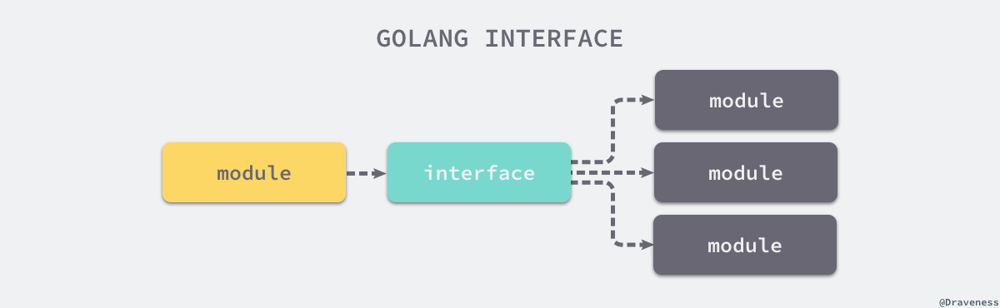
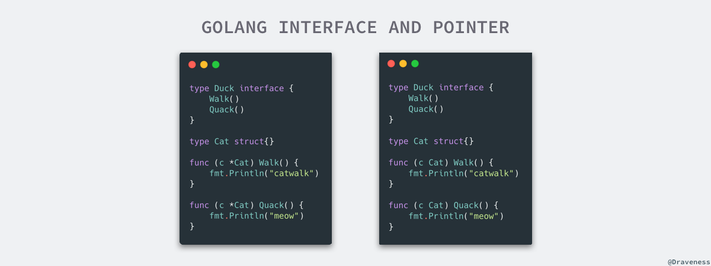
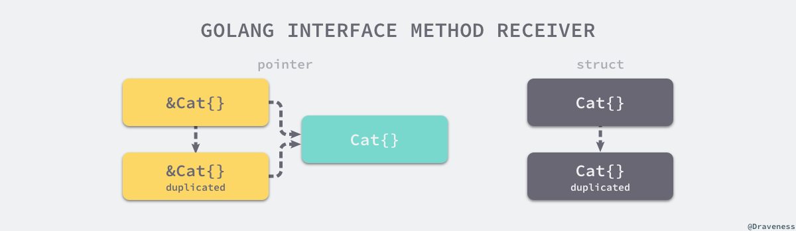
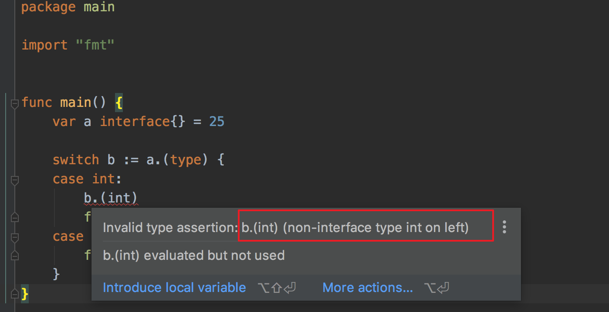

# 接口


Go 语言中的接口是一组方法的签名，它是 Go 语言的重要组成部分。使用接口能够让我们写出易于测试的代码，然而很多工程师对 Go 的接口了解都非常有限，也不清楚其底层的实现原理，这成为了开发高性能服务的阻碍。

本节会介绍使用接口时遇到的一些常见问题以及它的设计与实现，包括接口的类型转换、类型断言以及动态派发机制，帮助各位读者更好地理解接口类型。

## 概述

在计算机科学中，接口是计算机系统中多个组件共享的边界，不同的组件能够在边界上交换信息[1](https://draven.co/golang/docs/part2-foundation/ch04-basic/golang-interface/#fn:1)。如下图所示，接口的本质是引入一个新的中间层，调用方可以通过接口与具体实现分离，解除上下游的耦合，上层的模块不再需要依赖下层的具体模块，只需要依赖一个约定好的接口。



**图 4-5 上下游通过接口解耦**

这种面向接口的编程方式有着非常强大的生命力，无论是在框架还是操作系统中我们都能够找到接口的身影。可移植操作系统接口（Portable Operating System Interface，POSIX)[2](https://draven.co/golang/docs/part2-foundation/ch04-basic/golang-interface/#fn:2)就是一个典型的例子，它定义了应用程序接口和命令行等标准，为计算机软件带来了可移植性 — 只要操作系统实现了 POSIX，计算机软件就可以直接在不同操作系统上运行。

除了解耦有依赖关系的上下游，接口还能够帮助我们隐藏底层实现，减少关注点。《计算机程序的构造和解释》中有这么一句话：

> 代码必须能够被人阅读，只是机器恰好可以执行[3](https://draven.co/golang/docs/part2-foundation/ch04-basic/golang-interface/#fn:3)

人能够同时处理的信息非常有限，定义良好的接口能够隔离底层的实现，让我们将重点放在当前的代码片段中。SQL 就是接口的一个例子，当我们使用 SQL 语句查询数据时，其实不需要关心底层数据库的具体实现，我们只在乎 SQL 返回的结果是否符合预期。


**图 4-6 SQL 和不同数据库**

计算机科学中的接口是比较抽象的概念，但是编程语言中接口的概念就更加具体。Go 语言中的接口是一种内置的类型，它定义了一组方法的签名，本节会介绍 Go 语言接口的几个基本概念以及常见问题，为后面的实现原理做铺垫。

### 隐式接口 

很多面向对象语言都有接口这一概念，例如 Java 和 C#。Java 的接口不仅可以定义方法签名，还可以定义变量，这些定义的变量可以直接在实现接口的类中使用，这里简单介绍一下 Java 中的接口：

```java
public interface MyInterface {
    public String hello = "Hello";
    public void sayHello();
}
```

上述代码定义了一个必须实现的方法 `sayHello` 和一个会注入到实现类的变量 `hello`。在下面的代码中，`MyInterfaceImpl` 实现了 `MyInterface` 接口：

```java
public class MyInterfaceImpl implements MyInterface {
    public void sayHello() {
        System.out.println(MyInterface.hello);
    }
}
```

Java 中的类必须通过上述方式显式地声明实现的接口，但是在 Go 语言中实现接口就不需要使用类似的方式。首先，我们简单了解一下在 Go 语言中如何定义接口。定义接口需要使用 `interface` 关键字，在接口中我们只能定义方法签名，不能包含成员变量，一个常见的 Go 语言接口是这样的：

```go
type error interface {
	Error() string
}
```

如果一个类型需要实现 `error` 接口，那么它只需要实现 `Error() string` 方法，下面的 `RPCError` 结构体就是 `error` 接口的一个实现：

```go
type RPCError struct {
	Code    int64
	Message string
}

func (e *RPCError) Error() string {
	return fmt.Sprintf("%s, code=%d", e.Message, e.Code)
}
```

细心的读者可能会发现上述代码根本就没有 `error` 接口的影子，这是为什么呢？Go 语言中**接口的实现都是隐式的**，我们只需要实现 `Error() string` 方法就实现了 `error` 接口。Go 语言实现接口的方式与 Java 完全不同：

- 在 Java 中：实现接口需要显式地声明接口并实现所有方法；
- 在 Go 中：实现接口的所有方法就隐式地实现了接口；

我们使用上述 `RPCError` 结构体时并不关心它实现了哪些接口，Go 语言只会在传递参数、返回参数以及变量赋值时才会对某个类型是否实现接口进行检查，这里举几个例子来演示发生接口类型检查的时机：

```go
func main() {
	var rpcErr error = NewRPCError(400, "unknown err") // typecheck1
	err := AsErr(rpcErr) // typecheck2
	println(err)
}

func NewRPCError(code int64, msg string) error {
	return &RPCError{ // typecheck3
		Code:    code,
		Message: msg,
	}
}

func AsErr(err error) error {
	return err
}
```

Go 语言在[编译期间](https://draven.co/golang/docs/part1-prerequisite/ch02-compile/golang-compile-intro/)对代码进行类型检查，上述代码总共触发了三次类型检查：

1. 将 `*RPCError` 类型的变量赋值给 `error` 类型的变量 `rpcErr`；
2. 将 `*RPCError` 类型的变量 `rpcErr` 传递给签名中参数类型为 `error` 的 `AsErr` 函数；
3. 将 `*RPCError` 类型的变量从函数签名的返回值类型为 `error` 的 `NewRPCError` 函数中返回；

从类型检查的过程来看，编译器仅在需要时才检查类型，类型实现接口时只需要实现接口中的全部方法，不需要像 Java 等编程语言中一样显式声明。


### 类型

接口也是 Go 语言中的一种类型，它能够出现在变量的定义、函数的入参和返回值中并对它们进行约束，不过 Go 语言中有两种略微不同的接口，一种是带有一组方法的接口，另一种是不带任何方法的 `interface{}`：


**图 4-7 Go 语言中的两种接口**

Go 语言使用 [`runtime.iface`](https://draven.co/golang/tree/runtime.iface) 表示第一种接口，使用 [`runtime.eface`](https://draven.co/golang/tree/runtime.eface) 表示第二种不包含任何方法的接口 `interface{}`，两种接口虽然都使用 `interface` 声明，但是由于后者在 Go 语言中很常见，所以在实现时使用了特殊的类型。

需要注意的是，与 C 语言中的 `void *` 不同，`interface{}` 类型**不是任意类型**。如果我们将类型转换成了 `interface{}` 类型，变量在运行期间的类型也会发生变化，获取变量类型时会得到 `interface{}`。

```go
package main

func main() {
	type Test struct{}
	v := Test{}
	Print(v)
}

func Print(v interface{}) {
	println(v)
}
```

上述函数不接受任意类型的参数，只接受 `interface{}` 类型的值，在调用 `Print` 函数时会对参数 `v` 进行类型转换，将原来的 `Test` 类型转换成 `interface{}` 类型，本节会在后面介绍类型转换的实现原理。


### 指针和接口

在 Go 语言中同时使用指针和接口时会发生一些让人困惑的问题，接口在定义一组方法时没有对实现的接收者做限制，所以我们会看到某个类型实现接口的两种方式：



**图 4-8 结构体和指针实现接口**

这是因为结构体类型和指针类型是不同的，就像我们不能向一个接受指针的函数传递结构体一样，在实现接口时这两种类型也不能划等号。虽然两种类型不同，但是上图中的两种实现不可以同时存在，Go 语言的编译器会在结构体类型和指针类型都实现一个方法时报错 “method redeclared”。

对 `Cat` 结构体来说，它在实现接口时可以选择接受者的类型，即结构体或者结构体指针，在初始化时也可以初始化成结构体或者指针。下面的代码总结了如何使用结构体、结构体指针实现接口，以及如何使用结构体、结构体指针初始化变量。

```go
type Cat struct {}
type Duck interface { ... }

func (c  Cat) Quack {}  // 使用结构体实现接口
func (c *Cat) Quack {}  // 使用结构体指针实现接口

var d Duck = Cat{}      // 使用结构体初始化变量
var d Duck = &Cat{}     // 使用结构体指针初始化变量
```

实现接口的类型和初始化返回的类型两个维度共组成了四种情况，然而这四种情况不是都能通过编译器的检查：

|                      | 结构体实现接口 | 结构体指针实现接口 |
| :------------------: | :------------: | :----------------: |
|   结构体初始化变量   |      通过      |       不通过       |
| 结构体指针初始化变量 |      通过      |        通过        |

四种中只有使用指针实现接口，使用结构体初始化变量无法通过编译，其他的三种情况都可以正常执行。当实现接口的类型和初始化变量时返回的类型时相同时，代码通过编译是理所应当的：

- 方法接受者和初始化类型都是结构体；
- 方法接受者和初始化类型都是结构体指针；

而剩下的两种方式为什么一种能够通过编译，另一种无法通过编译呢？我们先来看一下能够通过编译的情况，即方法的接受者是结构体，而初始化的变量是结构体指针：

```go
type Cat struct{}

func (c Cat) Quack() {
	fmt.Println("meow")
}

func main() {
	var c Duck = &Cat{}
	c.Quack()
}
```

作为指针的 `&Cat{}` 变量能够**隐式地获取**到指向的结构体，所以能在结构体上调用 `Walk` 和 `Quack` 方法。我们可以将这里的调用理解成 C 语言中的 `d->Walk()` 和 `d->Speak()`，它们都会先获取指向的结构体再执行对应的方法。

但是如果我们将上述代码中方法的接受者和初始化的类型进行交换，代码就无法通过编译了：

```go
type Duck interface {
	Quack()
}

type Cat struct{}

func (c *Cat) Quack() {
	fmt.Println("meow")
}

func main() {
	var c Duck = Cat{}
	c.Quack()
}

$ go build interface.go
./interface.go:20:6: cannot use Cat literal (type Cat) as type Duck in assignment:
	Cat does not implement Duck (Quack method has pointer receiver)
```

编译器会提醒我们：`Cat` 类型没有实现 `Duck` 接口，`Quack` 方法的接受者是指针。这两个报错对于刚刚接触 Go 语言的开发者比较难以理解，如果我们想要搞清楚这个问题，首先要知道 Go 语言在[传递参数](https://draven.co/golang/docs/part2-foundation/ch04-basic/golang-function-call/)时都是传值的。



**图 4-9 实现接口的接受者类型**

如上图所示，无论上述代码中初始化的变量 `c` 是 `Cat{}` 还是 `&Cat{}`，使用 `c.Quack()` 调用方法时都会发生值拷贝：

- 如上图左侧，对于 `&Cat{}` 来说，这意味着拷贝一个新的 `&Cat{}` 指针，这个指针与原来的指针指向一个相同并且唯一的结构体，所以编译器可以隐式的对变量解引用（dereference）获取指针指向的结构体；
- 如上图右侧，对于 `Cat{}` 来说，这意味着 `Quack` 方法会接受一个全新的 `Cat{}`，因为方法的参数是 `*Cat`，编译器不会无中生有创建一个新的指针；即使编译器可以创建新指针，这个指针指向的也不是最初调用该方法的结构体；

上面的分析解释了指针类型的现象，当我们使用指针实现接口时，只有指针类型的变量才会实现该接口；当我们使用结构体实现接口时，指针类型和结构体类型都会实现该接口。当然这并不意味着我们应该一律使用结构体实现接口，这个问题在实际工程中也没那么重要，在这里我们只想解释现象背后的原因。


### nil 和 non-nil

我们可以通过一个例子理解**Go 语言的接口类型不是任意类型**这一句话，下面的代码在 `main` 函数中初始化了一个 `*TestStruct` 类型的变量，由于指针的零值是 `nil`，所以变量 `s` 在初始化之后也是 `nil`：

```go
package main

type TestStruct struct{}

func NilOrNot(v interface{}) bool {
	return v == nil
}

func main() {
	var s *TestStruct
	fmt.Println(s == nil)      // #=> true
	fmt.Println(NilOrNot(s))   // #=> false
}

$ go run main.go
true
false
```

我们简单总结一下上述代码执行的结果：

- 将上述变量与 `nil` 比较会返回 `true`；
- 将上述变量传入 `NilOrNot` 方法并与 `nil` 比较会返回 `false`；

出现上述现象的原因是 —— 调用 `NilOrNot` 函数时发生了**隐式的类型转换**，除了向方法传入参数之外，变量的赋值也会触发隐式类型转换。在类型转换时，`*TestStruct` 类型会转换成 `interface{}` 类型，转换后的变量不仅包含转换前的变量，还包含变量的类型信息 `TestStruct`，所以转换后的变量与 `nil` 不相等。


## 数据结构 


## 类型转换


## 接口的三个”潜规则”


### 1. 对方法的调用限制

接口是一组固定的方法集，由于静态类型的限制，接口变量有时仅能调用其中特定的一些方法。

请看下面这段代码

```go
package main

import "fmt"

type Phone interface {
    call()
}

type iPhone struct {
    name string
}

func (phone iPhone)call()  {
    fmt.Println("Hello, iPhone.")
}

func (phone iPhone)send_wechat()  {
    fmt.Println("Hello, Wechat.")
}

func main() {
    var phone Phone
    phone = iPhone{name:"ming's iphone"}
    phone.call()
    phone.send_wechat()
}
```

我定义了一个 Phone 的接口，只要求实现 call 方法即可，也就是只要能打电话的设备就是一个电话（好像是一句没用的废话）。

然后再定义了一个 iPhone 的结构体，该结构体接收两个方法，一个是打电话（ call 函数），一个是发微信（send_wechat 函数）。

最后一步是关键，我们定义了一个 Phone 接口类型的 phone 对象，该对象的内容是 iPhone 结构体。然后我们调用该对象的 call 方法，一切正常。

但是当你调用 `phone.send_wechat`方法，程序会报错，提示我们 Phone 类型的方法没有 send_wechat 的字段或方法。

```go
# command-line-arguments
./demo.go:30:10: phone.send_wechat undefined (type Phone has no field or method send_wechat)
```

原因也很明显，因为我们的phone对象显式声明为 Phone 接口类型，因此 phone调用的方法会受到此接口的限制。

**那么如何让 phone 可以调用 send_wechat 方法呢？**

答案是可以不显式的声明为 Phone接口类型 ，但要清楚 phone 对象实际上是隐式的实现了 Phone 接口，如此一来，方法的调用就不会受到接口类型的约束。

修改 main 方法成如下

```go
func main() {
    phone := iPhone{name:"ming's iphone"}
    phone.call()
    phone.send_wechat()
}
```

运行后，一切正常，没有报错。

```go
Hello, iPhone.
Hello, Wechat.
```


### 2. 调用函数时的隐式转换

Go 语言中的函数调用都是值传递的，变量会在方法调用前进行类型转换。

比如下面这段代码

```go
import (
    "fmt"
)

func printType(i interface{})  {

    switch i.(type) {
    case int:
        fmt.Println("参数的类型是 int")
    case string:
        fmt.Println("参数的类型是 string")
    }
}

func main() {
    a := 10
    printType(a)
}
```

如果你运行后，会发现一切都很正常

```go
参数的类型是 int
```

但是如果你把函数内的内容搬到到外面来

```go
package main

import "fmt"


func main() {
    a := 10

    switch a.(type) {
    case int:
        fmt.Println("参数的类型是 int")
    case string:
        fmt.Println("参数的类型是 string")
    }
}
```

就会有意想不到的结果，居然报错了。

```go
# command-line-arguments
./demo.go:9:5: cannot type switch on non-interface value a (type int)
```

这个操作会让一个新人摸不着头脑，代码逻辑都是一样的，为什么一个不会报错，一个会报错呢？

原因其实很简单。

当一个函数接口 interface{} 空接口类型时，我们说它可以接收什么任意类型的参数（江湖上称之为无招胜有招）。

当你使用这种写法时，Go 会默默地为我们做一件事，就是把传入函数的参数值（注意：Go 语言中的函数调用都是值传递的）的类型隐式的转换成 interface{} 类型。


#### 如何进行接口类型的显式转换

上面了解了函数中 接口类型的隐式转换后，你的心里可能开始有了疑问了，难道我使用类型断言，只能通过一个接收空接口类型的函数才能实现吗？

答案当然是 No.

如果你想手动对其进行类型转换，可以像下面这样子，就可以将变量 a 的静态类型转换为 interface{} 类型然后赋值给 b （此时 a 的静态类型还是 int，而 b 的静态类型为 interface{}）

```go
var a int = 25
b := interface{}(a)
```

知道了方法后，将代码修改成如下：

```go
package main

import "fmt"


func main() {
    a := 10

    switch interface{}(a).(type) {
    case int:
        fmt.Println("参数的类型是 int")
    case string:
        fmt.Println("参数的类型是 string")
    }
}
```

运行后，一切正常。

```go
参数的类型是 int
```


### 3. 类型断言中的隐式转换

上面我们知道了，只有静态类型为接口类型的对象才可以进行类型断言。

而当类型断言完成后，会返回一个静态类型为你断言的类型的对象，也就是说，当我们使用了类型断言，Go 实际上又会默认为我们进行了一次隐式的类型转换。

验证方法也很简单，使用完一次类型断言后，对返回的对象再一次使用类型断言，Goland 立马就会提示我们新对象 b 不是一个接口类型的对象，不允许进行类型断言。




>- **显示转换** 是静态的，适用于已知类型之间的强制转换，通常用于数值类型的转换（比如 `int` 到 `float64`），转换时没有运行时检查，只有在编译时进行检查。
>- **类型断言** 是动态的，适用于从接口类型（通常是 `interface{}`）中提取具体类型的值，使用时必须在运行时判断接口的实际类型。如果类型不匹配，可以选择使用带有检查的类型断言来避免 `panic`。
>
>这两者之间的最大区别在于：
>
>- **显示转换** 是静态的编译时行为，
>- **类型断言** 是动态的运行时行为。