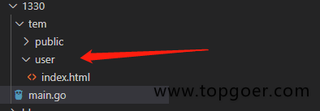

#  gin 渲染


## 各种数据格式的响应

- json、结构体、XML、YAML类似于java的properties、ProtoBuf

```go
package main

import (
    "github.com/gin-gonic/gin"
    "github.com/gin-gonic/gin/testdata/protoexample"
)

// 多种响应方式
func main() {
    // 1.创建路由
    // 默认使用了2个中间件Logger(), Recovery()
    r := gin.Default()
    // 1.json
    r.GET("/someJSON", func(c *gin.Context) {
        c.JSON(200, gin.H{"message": "someJSON", "status": 200})
    })
    // 2. 结构体响应
    r.GET("/someStruct", func(c *gin.Context) {
        var msg struct {
            Name    string
            Message string
            Number  int
        }
        msg.Name = "root"
        msg.Message = "message"
        msg.Number = 123
        c.JSON(200, msg)
    })
    // 3.XML
    r.GET("/someXML", func(c *gin.Context) {
        c.XML(200, gin.H{"message": "abc"})
    })
    // 4.YAML响应
    r.GET("/someYAML", func(c *gin.Context) {
        c.YAML(200, gin.H{"name": "zhangsan"})
    })
    // 5.protobuf格式,谷歌开发的高效存储读取的工具
    // 数组？切片？如果自己构建一个传输格式，应该是什么格式？
    r.GET("/someProtoBuf", func(c *gin.Context) {
        reps := []int64{int64(1), int64(2)}
        // 定义数据
        label := "label"
        // 传protobuf格式数据
        data := &protoexample.Test{
            Label: &label,
            Reps:  reps,
        }
        c.ProtoBuf(200, data)
    })

    r.Run(":8000")
}
```


## HTML模板渲染

- gin支持加载HTML模板, 然后根据模板参数进行配置并返回相应的数据，本质上就是字符串替换
- LoadHTMLGlob()方法可以加载模板文件

```go
package main

import (
    "net/http"

    "github.com/gin-gonic/gin"
)

func main() {
    r := gin.Default()
    r.LoadHTMLGlob("tem/*")
    r.GET("/index", func(c *gin.Context) {
        c.HTML(http.StatusOK, "index.html", gin.H{"title": "我是测试", "ce": "123456"})
    })
    r.Run()
}
<!DOCTYPE html>
<html lang="en">
<head>
    <meta charset="UTF-8">
    <meta name="viewport" content="width=device-width, initial-scale=1.0">
    <meta http-equiv="X-UA-Compatible" content="ie=edge">
    <title>{{.title}}</title>
</head>
    <body>
        fgkjdskjdsh{{.ce}}
    </body>
</html>
```

目录结构:


- 如果你的目录结构是下面的情况



代码如下：

```go
package main

import (
    "net/http"

    "github.com/gin-gonic/gin"
)

func main() {
    r := gin.Default()
    r.LoadHTMLGlob("tem/**/*")
    r.GET("/index", func(c *gin.Context) {
        c.HTML(http.StatusOK, "user/index.html", gin.H{"title": "我是测试", "address": "www.5lmh.com"})
    })
    r.Run()
}
{{ define "user/index.html" }}
<!DOCTYPE html>
<html lang="en">
<head>
    <meta charset="UTF-8">
    <meta name="viewport" content="width=device-width, initial-scale=1.0">
    <meta http-equiv="X-UA-Compatible" content="ie=edge">
    <title>{{.title}}</title>
</head>
    <body>
        fgkjdskjdsh{{.address}}
    </body>
</html>
{{ end }}
```

- 如果你想进行头尾分离就是下面这种写法了：


```go
package main

import (
    "net/http"

    "github.com/gin-gonic/gin"
)

func main() {
    r := gin.Default()
    r.LoadHTMLGlob("tem/**/*")
    r.GET("/index", func(c *gin.Context) {
        c.HTML(http.StatusOK, "user/index.html", gin.H{"title": "我是测试", "address": "www.5lmh.com"})
    })
    r.Run()
}
```

`user/index.html`文件代码：

```html
{{ define "user/index.html" }}
{{template "public/header" .}}
        fgkjdskjdsh{{.address}}
{{template "public/footer" .}}
{{ end }}
```

`public/header.html`文件代码：

```html
{{define "public/header"}}
<!DOCTYPE html>
<html lang="en">
<head>
    <meta charset="UTF-8">
    <meta name="viewport" content="width=device-width, initial-scale=1.0">
    <meta http-equiv="X-UA-Compatible" content="ie=edge">
    <title>{{.title}}</title>
</head>
    <body>

{{end}}
```

`public/footer.html`文件代码：

```html
{{define "public/footer"}}
</body>
</html>
{{ end }}
```

- 如果你需要引入静态文件需要定义一个静态文件目录

```
    r.Static("/assets", "./assets")
```


## 重定向

```go
package main

import (
    "net/http"

    "github.com/gin-gonic/gin"
)

func main() {
    r := gin.Default()
    r.GET("/index", func(c *gin.Context) {
        c.Redirect(http.StatusMovedPermanently, "http://www.5lmh.com")
    })
    r.Run()
}
```


## 同步异步

- goroutine机制可以方便地实现异步处理
- 另外，在启动新的goroutine时，不应该使用原始上下文，必须使用它的只读副本

```go
package main

import (
    "log"
    "time"

    "github.com/gin-gonic/gin"
)

func main() {
    // 1.创建路由
    // 默认使用了2个中间件Logger(), Recovery()
    r := gin.Default()
    // 1.异步
    r.GET("/long_async", func(c *gin.Context) {
        // 需要搞一个副本
        copyContext := c.Copy()
        // 异步处理
        go func() {
            time.Sleep(3 * time.Second)
            log.Println("异步执行：" + copyContext.Request.URL.Path)
        }()
    })
    // 2.同步
    r.GET("/long_sync", func(c *gin.Context) {
        time.Sleep(3 * time.Second)
        log.Println("同步执行：" + c.Request.URL.Path)
    })

    r.Run(":8000")
}
```

