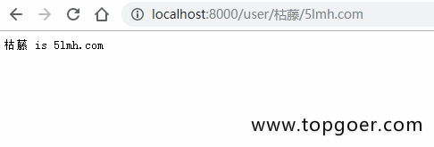
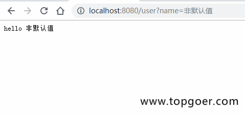
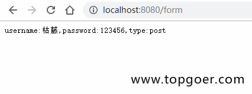

# gin路由


## 基本路由

- gin 框架中采用的路由库是基于httprouter做的
- 地址为：https://github.com/julienschmidt/httprouter

```java
package main

import (
    "net/http"

    "github.com/gin-gonic/gin"
)

func main() {
    r := gin.Default()
    r.GET("/", func(c *gin.Context) {
        c.String(http.StatusOK, "hello word")
    })
    r.POST("/xxxpost",getting)
    r.PUT("/xxxput")
    //监听端口默认为8080
    r.Run(":8000")
}
```


## Restful风格的API

- gin支持Restful风格的API
- 即Representational State Transfer的缩写。直接翻译的意思是"表现层状态转化"，是一种互联网应用程序的API设计理念：URL定位资源，用HTTP描述操作

1.获取文章 /blog/getXxx Get blog/Xxx

2.添加 /blog/addXxx POST blog/Xxx

3.修改 /blog/updateXxx PUT blog/Xxx

4.删除 /blog/delXxxx DELETE blog/Xxx


## API参数

- 可以通过Context的Param方法来获取API参数
- localhost:8000/xxx/zhangsan

```java
package main

import (
    "net/http"
    "strings"

    "github.com/gin-gonic/gin"
)

func main() {
    r := gin.Default()
    r.GET("/user/:name/*action", func(c *gin.Context) {
        name := c.Param("name")
        action := c.Param("action")
        //截取/
        action = strings.Trim(action, "/")
        c.String(http.StatusOK, name+" is "+action)
    })
    //默认为监听8080端口
    r.Run(":8000")
}
```

输出结果：




## URL参数

- URL参数可以通过DefaultQuery()或Query()方法获取
- DefaultQuery()若参数不村则，返回默认值，Query()若不存在，返回空串
- API ? name=zs

```java
package main

import (
    "fmt"
    "net/http"

    "github.com/gin-gonic/gin"
)

func main() {
    r := gin.Default()
    r.GET("/user", func(c *gin.Context) {
        //指定默认值
        //http://localhost:8080/user 才会打印出来默认的值
        name := c.DefaultQuery("name", "枯藤")
        c.String(http.StatusOK, fmt.Sprintf("hello %s", name))
    })
    r.Run()
}
```

不传递参数输出的结果：


传递参数输出的结果：




## 表单参数

- 表单传输为post请求，http常见的传输格式为四种：
  - application/json
  - application/x-www-form-urlencoded
  - application/xml
  - multipart/form-data
- 表单参数可以通过PostForm()方法获取，该方法默认解析的是x-www-form-urlencoded或from-data格式的参数

```html
<!DOCTYPE html>
<html lang="en">
<head>
    <meta charset="UTF-8">
    <meta name="viewport" content="width=device-width, initial-scale=1.0">
    <meta http-equiv="X-UA-Compatible" content="ie=edge">
    <title>Document</title>
</head>
<body>
    <form action="http://localhost:8080/form" method="post" action="application/x-www-form-urlencoded">
        用户名：<input type="text" name="username" placeholder="请输入你的用户名">  <br>
        密&nbsp;&nbsp;&nbsp;码：<input type="password" name="userpassword" placeholder="请输入你的密码">  <br>
        <input type="submit" value="提交">
    </form>
</body>
</html>
```

```go
package main

//
import (
    "fmt"
    "net/http"

    "github.com/gin-gonic/gin"
)

func main() {
    r := gin.Default()
    r.POST("/form", func(c *gin.Context) {
        types := c.DefaultPostForm("type", "post")
        username := c.PostForm("username")
        password := c.PostForm("userpassword")
        // c.String(http.StatusOK, fmt.Sprintf("username:%s,password:%s,type:%s", username, password, types))
        c.String(http.StatusOK, fmt.Sprintf("username:%s,password:%s,type:%s", username, password, types))
    })
    r.Run()
}
```

输出结果：





## 上传单个文件

- multipart/form-data格式用于文件上传
- gin文件上传与原生的net/http方法类似，不同在于gin把原生的request封装到c.Request中

```java
<!DOCTYPE html>
<html lang="en">
<head>
    <meta charset="UTF-8">
    <meta name="viewport" content="width=device-width, initial-scale=1.0">
    <meta http-equiv="X-UA-Compatible" content="ie=edge">
    <title>Document</title>
</head>
<body>
    <form action="http://localhost:8080/upload" method="post" enctype="multipart/form-data">
          上传文件:<input type="file" name="file" >
          <input type="submit" value="提交">
    </form>
</body>
</html>
```

```java
package main

import (
    "github.com/gin-gonic/gin"
)

func main() {
    r := gin.Default()
    //限制上传最大尺寸
    r.MaxMultipartMemory = 8 << 20
    r.POST("/upload", func(c *gin.Context) {
        file, err := c.FormFile("file")
        if err != nil {
            c.String(500, "上传图片出错")
        }
        // c.JSON(200, gin.H{"message": file.Header.Context})
        c.SaveUploadedFile(file, file.Filename)
        c.String(http.StatusOK, file.Filename)
    })
    r.Run()
}
```

效果演示：


### 上传特定文件

有的用户上传文件需要限制上传文件的类型以及上传文件的大小，但是gin框架暂时没有这些函数(也有可能是我没找到)，因此基于原生的函数写法自己写了一个可以限制大小以及文件类型的上传函数

```java
package main

import (
    "fmt"
    "log"
    "net/http"

    "github.com/gin-gonic/gin"
)

func main() {
    r := gin.Default()
    r.POST("/upload", func(c *gin.Context) {
        _, headers, err := c.Request.FormFile("file")
        if err != nil {
            log.Printf("Error when try to get file: %v", err)
        }
        //headers.Size 获取文件大小
        if headers.Size > 1024*1024*2 {
            fmt.Println("文件太大了")
            return
        }
        //headers.Header.Get("Content-Type")获取上传文件的类型
        if headers.Header.Get("Content-Type") != "image/png" {
            fmt.Println("只允许上传png图片")
            return
        }
        c.SaveUploadedFile(headers, "./video/"+headers.Filename)
        c.String(http.StatusOK, headers.Filename)
    })
    r.Run()
}
```


## 上传多个文件

```java
<!DOCTYPE html>
<html lang="en">
<head>
    <meta charset="UTF-8">
    <meta name="viewport" content="width=device-width, initial-scale=1.0">
    <meta http-equiv="X-UA-Compatible" content="ie=edge">
    <title>Document</title>
</head>
<body>
    <form action="http://localhost:8000/upload" method="post" enctype="multipart/form-data">
          上传文件:<input type="file" name="files" multiple>
          <input type="submit" value="提交">
    </form>
</body>
</html>
```

```java
package main

import (
   "github.com/gin-gonic/gin"
   "net/http"
   "fmt"
)

// gin的helloWorld

func main() {
   // 1.创建路由
   // 默认使用了2个中间件Logger(), Recovery()
   r := gin.Default()
   // 限制表单上传大小 8MB，默认为32MB
   r.MaxMultipartMemory = 8 << 20
   r.POST("/upload", func(c *gin.Context) {
      form, err := c.MultipartForm()
      if err != nil {
         c.String(http.StatusBadRequest, fmt.Sprintf("get err %s", err.Error()))
      }
      // 获取所有图片
      files := form.File["files"]
      // 遍历所有图片
      for _, file := range files {
         // 逐个存
         if err := c.SaveUploadedFile(file, file.Filename); err != nil {
            c.String(http.StatusBadRequest, fmt.Sprintf("upload err %s", err.Error()))
            return
         }
      }
      c.String(200, fmt.Sprintf("upload ok %d files", len(files)))
   })
   //默认端口号是8080
   r.Run(":8000")
}
```

效果演示：


## routes group

- routes group是为了管理一些相同的URL

```java
package main

import (
   "github.com/gin-gonic/gin"
   "fmt"
)

// gin的helloWorld

func main() {
   // 1.创建路由
   // 默认使用了2个中间件Logger(), Recovery()
   r := gin.Default()
   // 路由组1 ，处理GET请求
   v1 := r.Group("/v1")
   // {} 是书写规范
   {
      v1.GET("/login", login)
      v1.GET("submit", submit)
   }
   v2 := r.Group("/v2")
   {
      v2.POST("/login", login)
      v2.POST("/submit", submit)
   }
   r.Run(":8000")
}

func login(c *gin.Context) {
   name := c.DefaultQuery("name", "jack")
   c.String(200, fmt.Sprintf("hello %s\n", name))
}

func submit(c *gin.Context) {
   name := c.DefaultQuery("name", "lily")
   c.String(200, fmt.Sprintf("hello %s\n", name))
}
```

效果演示:


## 路由原理

- httproter会将所有路由规则构造一颗前缀树
- 例如有 root and as at cn com

