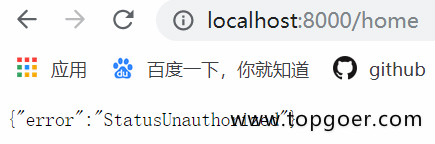

# 会话控制

## Cookie介绍

- HTTP是无状态协议，服务器不能记录浏览器的访问状态，也就是说服务器不能区分两次请求是否由同一个客户端发出
- Cookie就是解决HTTP协议无状态的方案之一，中文是小甜饼的意思
- Cookie实际上就是服务器保存在浏览器上的一段信息。浏览器有了Cookie之后，每次向服务器发送请求时都会同时将该信息发送给服务器，服务器收到请求后，就可以根据该信息处理请求
- Cookie由服务器创建，并发送给浏览器，最终由浏览器保存


## Cookie的使用

- 测试服务端发送cookie给客户端，客户端请求时携带cookie

```go
package main

import (
   "github.com/gin-gonic/gin"
   "fmt"
)

func main() {
   // 1.创建路由
   // 默认使用了2个中间件Logger(), Recovery()
   r := gin.Default()
   // 服务端要给客户端cookie
   r.GET("cookie", func(c *gin.Context) {
      // 获取客户端是否携带cookie
      cookie, err := c.Cookie("key_cookie")
      if err != nil {
         cookie = "NotSet"
         // 给客户端设置cookie
         //  maxAge int, 单位为秒
         // path,cookie所在目录
         // domain string,域名
         //   secure 是否智能通过https访问
         // httpOnly bool  是否允许别人通过js获取自己的cookie
         c.SetCookie("key_cookie", "value_cookie", 60, "/",
            "localhost", false, true)
      }
      fmt.Printf("cookie的值是： %s\n", cookie)
   })
   r.Run(":8000")
}
```


## Cookie练习

- 模拟实现权限验证中间件
  - 有2个路由，login和home
  - login用于设置cookie
  - home是访问查看信息的请求
  - 在请求home之前，先跑中间件代码，检验是否存在cookie
- 访问home，会显示错误，因为权限校验未通过



- 然后访问登录的请求，登录并设置cookie


- 再次访问home，访问成功


```go
package main

import (
   "github.com/gin-gonic/gin"
   "net/http"
)

func AuthMiddleWare() gin.HandlerFunc {
   return func(c *gin.Context) {
      // 获取客户端cookie并校验
      if cookie, err := c.Cookie("abc"); err == nil {
         if cookie == "123" {
            c.Next()
            return
         }
      }
      // 返回错误
      c.JSON(http.StatusUnauthorized, gin.H{"error": "err"})
      // 若验证不通过，不再调用后续的函数处理
      c.Abort()
      return
   }
}

func main() {
   // 1.创建路由
   r := gin.Default()
   r.GET("/login", func(c *gin.Context) {
      // 设置cookie
      c.SetCookie("abc", "123", 60, "/",
         "localhost", false, true)
      // 返回信息
      c.String(200, "Login success!")
   })
   r.GET("/home", AuthMiddleWare(), func(c *gin.Context) {
      c.JSON(200, gin.H{"data": "home"})
   })
   r.Run(":8000")
}
```

访问 /home 和 /login进行测试


## Cookie的缺点

- 不安全，明文
- 增加带宽消耗
- 可以被禁用
- cookie有上限


## Sessions

gorilla/sessions为自定义session后端提供cookie和文件系统session以及基础结构。

主要功能是：

- 简单的API：将其用作设置签名（以及可选的加密）cookie的简便方法。
- 内置的后端可将session存储在cookie或文件系统中。
- Flash消息：一直持续读取的session值。
- 切换session持久性（又称“记住我”）和设置其他属性的便捷方法。
- 旋转身份验证和加密密钥的机制。
- 每个请求有多个session，即使使用不同的后端也是如此。
- 自定义session后端的接口和基础结构：可以使用通用API检索并批量保存来自不同商店的session。

代码：

```go
package main

import (
    "fmt"
    "net/http"

    "github.com/gorilla/sessions"
)

// 初始化一个cookie存储对象
// something-very-secret应该是一个你自己的密匙，只要不被别人知道就行
var store = sessions.NewCookieStore([]byte("something-very-secret"))

func main() {
    http.HandleFunc("/save", SaveSession)
    http.HandleFunc("/get", GetSession)
    err := http.ListenAndServe(":8080", nil)
    if err != nil {
        fmt.Println("HTTP server failed,err:", err)
        return
    }
}

func SaveSession(w http.ResponseWriter, r *http.Request) {
    // Get a session. We're ignoring the error resulted from decoding an
    // existing session: Get() always returns a session, even if empty.

    //　获取一个session对象，session-name是session的名字
    session, err := store.Get(r, "session-name")
    if err != nil {
        http.Error(w, err.Error(), http.StatusInternalServerError)
        return
    }

    // 在session中存储值
    session.Values["foo"] = "bar"
    session.Values[42] = 43
    // 保存更改
    session.Save(r, w)
}
func GetSession(w http.ResponseWriter, r *http.Request) {
    session, err := store.Get(r, "session-name")
    if err != nil {
        http.Error(w, err.Error(), http.StatusInternalServerError)
        return
    }
    foo := session.Values["foo"]
    fmt.Println(foo)
}
```

删除session的值：

```
    // 删除
    // 将session的最大存储时间设置为小于零的数即为删除
    session.Options.MaxAge = -1
    session.Save(r, w)
```

官网地址：http://www.gorillatoolkit.org/pkg/sessions