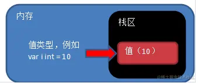
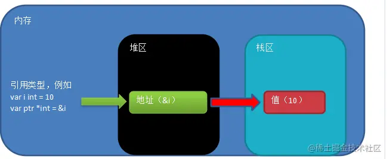

# golang面试题

## 值类型和引用类型


### 值类型有哪些?

基本数据类型都是值类型，包括：int系列、float系列、bool、字符串、数组、结构体struct。


### 引用类型有哪些？

切片slice、map、channel、指针、接口interface


## 值类型和引用类型的区别

值类型在内存中存储的是值本身，而引用类型在内存中存储的是值的内存地址。
值类型内存通常在栈中分配，引用类型内存通常在堆中分配。


## 垃圾回收

引用类型的内存在堆中分配，当没有任何变量引用堆中的内存地址时，该内存地址对应的数据存储空间就变成了垃圾，就会被GO语言的GC回收。




## 堆和栈


### 栈

在Go中，栈的内存是由编译器自动进行分配和释放，栈区往往存储着函数参数、局部变量和调用函数帧，它们随着函数的创建而分配，函数的退出而销毁。
一个goroutine对应一个栈，栈是调用栈（call stack）的简称。一个栈通常又包含了许多栈帧（stack frame），它描述的是函数之间的调用关系，每一帧对应一次尚未返回的函数调用，它本身也是以栈形式存放数据。


### 堆

与栈不同的是，应用程序在运行时只会存在一个堆。狭隘地说，内存管理只是针对堆内存而言的。程序在运行期间可以主动从堆上申请内存，这些内存通过Go的内存分配器分配，并由垃圾收集器回收。


## 切片

### 比较

切片之间是不能比较的，我们不能使用==操作符来判断两个切片是否含有全部相等元素。

切片唯一合法的比较操作是和nil比较。

**比较的详解**

要检查切片是否为空，应该使用

```
len(s) == 0
```

来判断，而不应该使用

```
s == nil
```

来判断。

原因：
**一个nil值的切片并没有底层数组，一个nil值的切片的长度和容量都是0。但是我们不能说一个长度和容量都是0的切片一定是nil。**

我们通过下面的示例就很好理解了：

```go
var s1 []int            //len(s1)=0;cap(s1)=0;s1==nil
s2 := []int{}           //len(s2)=0;cap(s2)=0;s2!=nil
s3 := make([]int, 0)    //len(s3)=0;cap(s3)=0;s3!=nil
```

所以要判断一个切片是否是空的，要是用 `len(s) == 0`来判断，不应该使用 `s == nil` 来判断。

其根本原因在于后面两种初始化方式已经给切片分配了空间，所以就算切片为空，也不等于 nil。但是 `len(s) == 0` 成立，则切片一定为空。

注意：
**在 `go` 中 `var` 是声明关键字，不会开辟内存空间；使用 `:=` 或者 `make` 关键字进行初始化时才会开辟内存空间。**