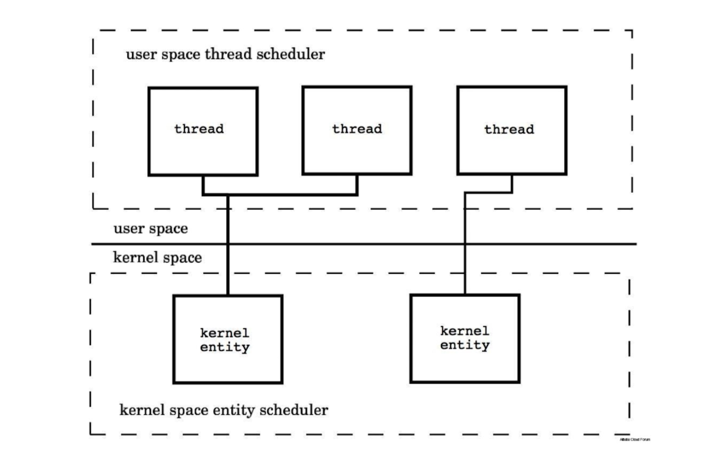
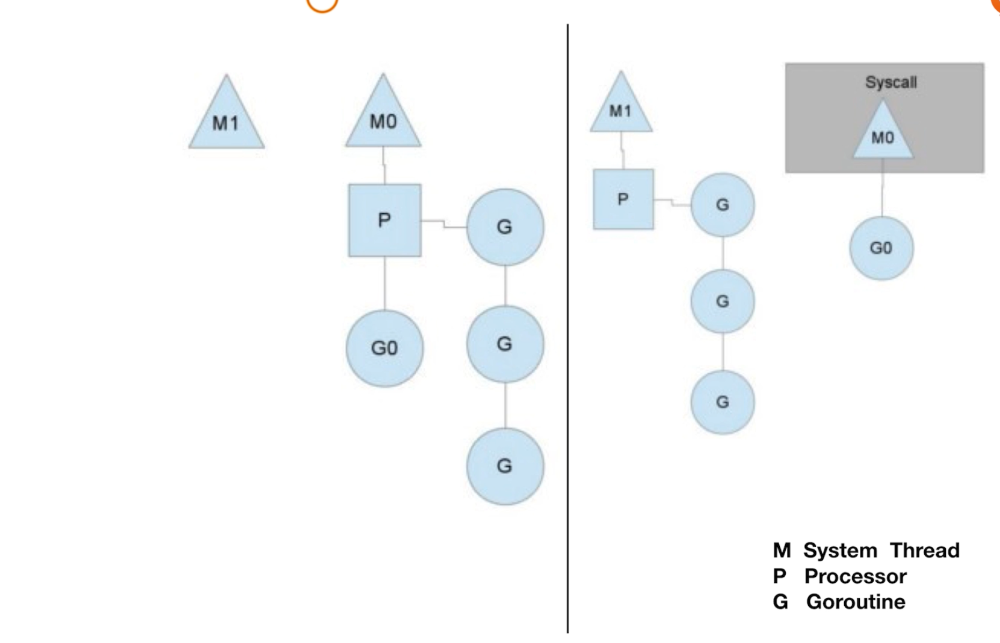

# 协程机制

## Thread vs Groutine

### 1.创建时默认的stack 的大小

- JDK5 以后 Java Thread stack 默认为 1 M
- Groutine 的Stack 初始化大小为 2K

### 2.和 KSE (Kernel Space Entity) 的对应关系

- Java Thread 是 1:1
- Groutine  是 M:N

（Kernel Space Entity-->系统线程）

go 的调用机制

 

