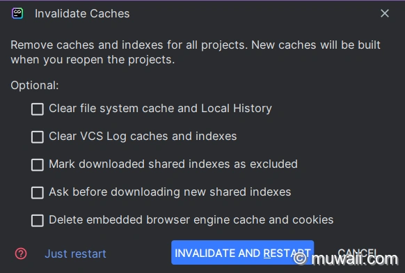
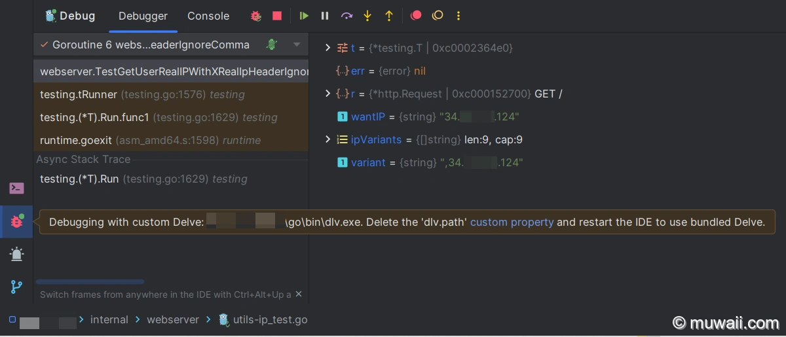

# GoLand - Delve 调试器版本升级


## 1 问题背景

笔者在直接运行代码没有问题，但是在启动调试器时，执行流不会在设定的断点处停下来，终端报错如下：

```bash
warning: undefined behavior - version of Delve is too old for Go version 1.20.1 (maximum supported version 1.19)
```


## 2 原因分析

系统安装的 GoLang 版本是 1.20.1。

```bash
go version go1.20.1 windows/amd64
```

当前 GoLang 版本信息为：

```bash
GoLand 2022.3.2
Build #GO-223.8617.58, built on January 27, 2023
Runtime version: 17.0.5+1-b653.25 amd64
VM: OpenJDK 64-Bit Server VM by JetBrains s.r.o.
```

自带的 `delve` 版本为：

```bash
"X:\Program Files\JetBrains\GoLand 2022.3.2\plugins\go-plugin\lib\dlv\windows\dlv.exe" version
Delve Debugger
Version: 1.9.1
```

而 GoLand IDE 当时发行时自带的调试器 `delve` 的版本较低，因此无法调试版本较新的 GoLang 编译出来的程序。[[1\]](https://muwaii.com/posts/upgrade-your-golang-debugger-delve-in-goland#footnote_1)


## 3 解决办法

解决办法有两种：

1. 被动：等 [JetBrains](https://www.jetbrains.com/go/) 官方发布更新修复包
2. 主动：IDE 配置中可能有类似环境变量的配置中心，修改 `delve` 的可执行文件路径即可

下面介绍主动修改配置法。


### 3.1 安装新版本 Delve

- 下载并安装

  更新方式也有两种，第一种用 "@version" 指定想要的版本，如 “@v1.20.2”，"@v1.20.1-0.20221212172146-8e48ad75747f"，或最新版 "@latest"。[[2\]](https://muwaii.com/posts/upgrade-your-golang-debugger-delve-in-goland#footnote_2)

  ```bash
  go install github.com/go-delve/delve/cmd/dlv@latest
  ```

  或者先下载源码，再从本地指定分支的源码安装

  ```bash
  $ git clone https://github.com/go-delve/delve
  $ cd delve
  $ git checkout -b release-v1.20.2 v1.20.2
  $ go install github.com/go-delve/delve/cmd/dlv
  ```

安装后，在 `$(go env GOPATH)/bin` 目录下，就可以看到新装好的 `delve` 可执行文件了。

```bash
ls -al $(go env GOPATH)/bin/
total 53738
drwxr-xr-x    1 Muwaii   UsersGrp         0 Apr 19 14:04 .
drwxr-xr-x    1 Muwaii   UsersGrp         0 Oct 12  2022 ..
-rwxr-xr-x    1 Muwaii   UsersGrp  16738304 Apr 19 14:04 dlv.exe
```

接着，在 GoLang 中依次点击菜单栏的 "Help -> Edit Custom Properties"。

在弹出的文本编辑器中，新增一行赋值命令。

```bash
# File: C:\Users\Muwaii\AppData\Roaming\JetBrains\GoLand2022.3\idea.properties
# custom GoLand properties (expand/override 'bin\idea.properties')
dlv.path=E:\\Users\\Dellas\\go\\bin\\dlv.exe
```

> 👀 注意
> 不同系统的路径格式有所差异，Linux 下路径是 `/path/to/your/delve` ，但在 Windows 系统中，要用 `\\path\\to\\your\\delve.exe`，用 `\`对反斜杠进行转义。

当修改完成之后，重启 IDE 才能生效。

一般来说，直接关闭 IDE，再打开就行。个人更习惯用菜单栏 "File -> Invalidate Caches -> Just restart"，如果重启仍有问题，可考虑清理缓存，参见下图。



### 3.2 验证更新效果

在重启后，我们再次进行调试源码，发现可以正常显示调用栈，执行流也能在预设的断点处暂停了。



值得注意：JetBrains 贴心地在调试图标旁边，提示我们正在使用自定义的调试器；并且告知我们通过删除/注释自定义属性的 `dlv.path`再重启，即可还原为 IDE 自带的调试器。

## 4 总结

在本文中，笔者遇到了 IDE 自带的 `devel` 版本较老，无法调试较新版本编译器输出的 Go 程序。

要么选择静候官方更新，要么主动更新调试器。笔者选择自行更新，在安装新版本的 `devel` 后，还需要在自定义属性中指定新版调试器的路径，确认无误后，重启即可生效。

## 5 参考链接

1. [Issue of old version delve | JetBrains YouTrack](https://youtrack.jetbrains.com/issue/GO-14287)[⤴](https://muwaii.com/posts/upgrade-your-golang-debugger-delve-in-goland#to_footnote_1)
2. [Installation of delve | GitHub](https://github.com/go-delve/delve/tree/master/Documentation/installation)[⤴](https://muwaii.com/posts/upgrade-your-golang-debugger-delve-in-goland#to_footnote_2)