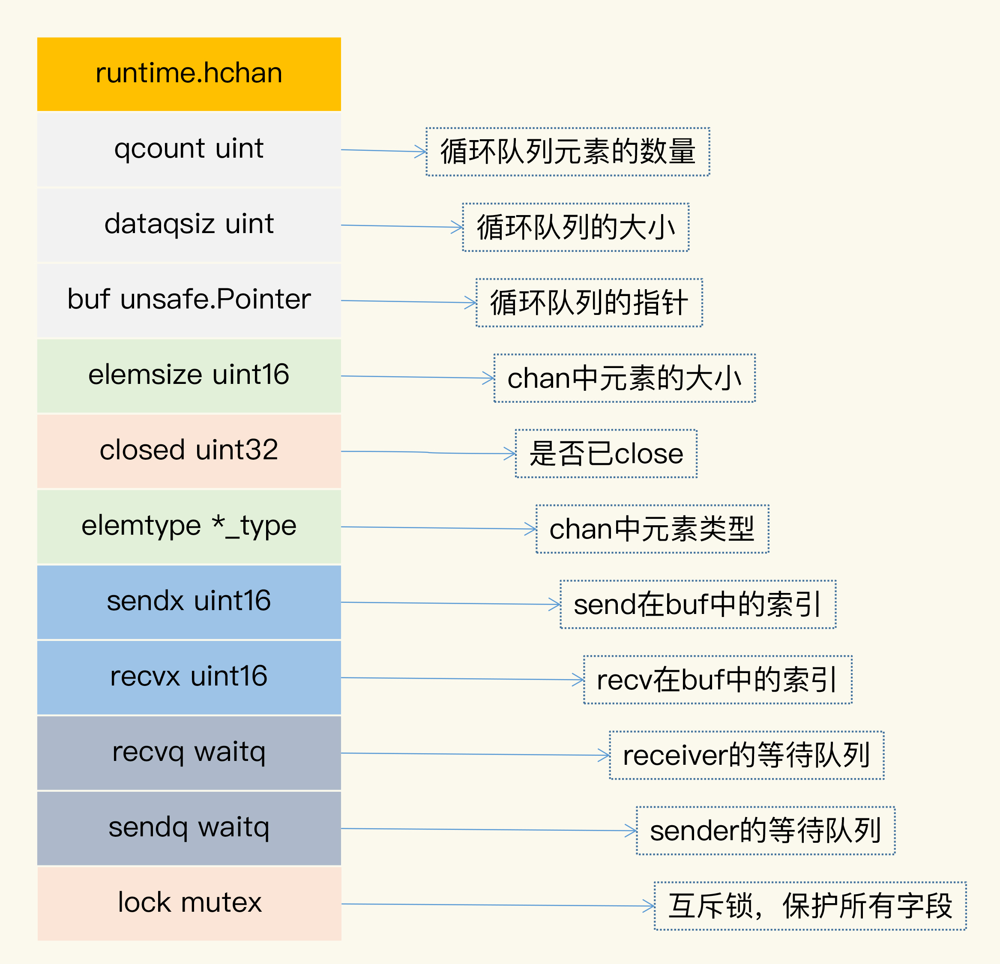
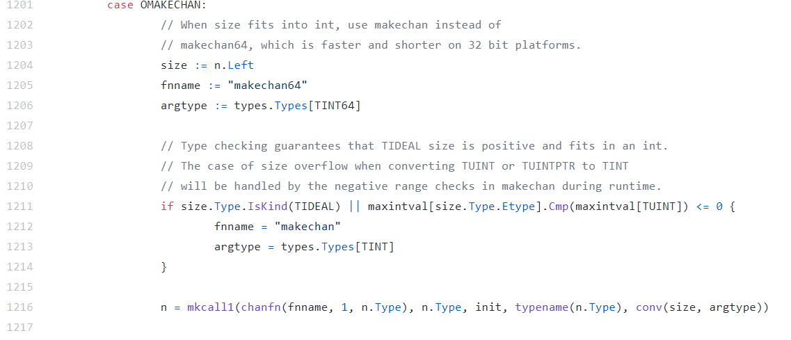

# channel的应用场景和原理


## 应用场景


## 原理

接下来，我会给你介绍 chan 的数据结构、初始化的方法以及三个重要的操作方法，分别 是 send、recv 和 close。


### chan 数据结构

chan 类型的数据结构如下图所示，它的数据类型是`runtime.hchan`。



下面我来具体解释各个字段的意义。

**qcount**：代表 chan 中已经接收但还没被取走的元素的个数。内建函数 len 可以返回这 个字段的值。

**dataqsiz**：队列的大小。chan 使用一个循环队列来存放元素，循环队列很适合这种生产 者 - 消费者的场景

**buf**：存放元素的循环队列的 buffer。 

**elemtype 和 elemsize**：chan 中元素的类型和 size。因为 chan 一旦声明，它的元素 类型是固定的，即普通类型或者指针类型，所以元素大小也是固定的。

**sendx**：处理发送数据的指针在 buf 中的位置。一旦接收了新的数据，指针就会加上  elemsize，移向下一个位置。buf 的总大小是 elemsize 的整数倍，而且 buf 是一个循 环列表。 

**recvx**：处理接收请求时的指针在 buf 中的位置。一旦取出数据，此指针会移动到下一 个位置。 

**recvq**：chan 是多生产者多消费者的模式，如果消费者因为没有数据可读而被阻塞了， 就会被加入到 recvq 队列中。 

**sendq**：如果生产者因为 buf 满了而阻塞，会被加入到 sendq 队列中。


### 初始化

Go 在编译的时候，会根据容量的大小选择调用 makechan64，还是 makechan。 

下面的代码是处理 make chan 的逻辑，它会决定是使用 makechan 还是 makechan64  来实现 chan 的初始化：



我们只关注 makechan 就好了，因为 `makechan64` 只是做了 size 检查，底层还是调用  makechan 实现的。makechan 的目标就是生成 `hchan` 对象。

让我们来看一下 `makechan` 的主要逻辑。主要的逻辑我都加上了注释， 它会根据 chan 的容量的大小和元素的类型不同，初始化不同的存储空间：

```go
func makechan(t *chantype, size int) *hchan {
	elem := t.elem

	// 检查代码
	if elem.size >= 1<<16 {
		throw("makechan: invalid channel element type")
	}
	if hchanSize%maxAlign != 0 || elem.align > maxAlign {
		throw("makechan: bad alignment")
	}

	mem, overflow := math.MulUintptr(elem.size, uintptr(size))
	if overflow || mem > maxAlloc-hchanSize || size < 0 {
		panic(plainError("makechan: size out of range"))
	}

	var c *hchan
	switch {
	case mem == 0:
		// chan的size或者元素的size是0，不必创建buf
		c = (*hchan)(mallocgc(hchanSize, nil, true))
		c.buf = c.raceaddr()
	case elem.ptrdata == 0:
		// 元素不是指针，分配一块连续的内存给hchan数据结构和buf
		c = (*hchan)(mallocgc(hchanSize+mem, nil, true))
        // hchan数据结构后面紧接着就是buf
		c.buf = add(unsafe.Pointer(c), hchanSize)
	default:
		// 元素包含指针，那么单独分配buf
		c = new(hchan)
		c.buf = mallocgc(mem, elem, true)
	}

    // 元素大小、类型、容量都记录下来
	c.elemsize = uint16(elem.size)
	c.elemtype = elem
	c.dataqsiz = uint(size)
	lockInit(&c.lock, lockRankHchan)

	if debugChan {
		print("makechan: chan=", c, "; elemsize=", elem.size, "; dataqsiz=", size, "\n")
	}
	return c
}
```

最终，针对不同的容量和元素类型，这段代码分配了不同的对象来初始化 hchan 对象的字 段，返回 hchan 对象。


### send

Go 在编译发送数据给 chan 的时候，会把 send 语句转换成 chansend1 函数， chansend1 函数会调用 chansend，我们分段学习它的逻辑：

```go
func chansend1(c *hchan, elem unsafe.Pointer) {
	chansend(c, elem, true, getcallerpc())
}

func chansend(c *hchan, ep unsafe.Pointer, block bool, callerpc uintptr) bool {
    // 第一部分
	if c == nil {
		if !block {
			return false
		}
		gopark(nil, nil, waitReasonChanSendNilChan, traceEvGoStop, 2)
		throw("unreachable")     // 11 行
	}
}
```

最开始，第一部分是进行判断：如果 chan 是 nil 的话，就把调用者 goroutine park（阻 塞休眠）， 调用者就永远被阻塞住了，所以，第 11 行是不可能执行到的代码。

```go
// 第二部分，如果chan没有被close,并且chan满了，直接返回
if !block && c.closed == 0 && full(c) {
    return false
}
```

第二部分的逻辑是当你往一个已经满了的 chan 实例发送数据时，并且想不阻塞当前调 用，那么这里的逻辑是直接返回。chansend1 方法在调用 chansend 的时候设置了阻塞参 数，所以不会执行到第二部分的分支里。

```go
// 第三部分，chan已经被close的情景
lock(&c.lock) // 开始加锁
if c.closed != 0 {
    unlock(&c.lock)
    panic(plainError("send on closed channel"))
}
```

第三部分显示的是，如果 chan 已经被 close 了，再往里面发送数据的话会 panic。

```go
// 第四部分，从接收队列中出队一个等待的receiver
if sg := c.recvq.dequeue(); sg != nil {
    send(c, sg, ep, func() { unlock(&c.lock) }, 3)
    return true
}
```

第四部分，如果等待队列中有等待的 receiver，那么这段代码就把它从队列中弹出，然后 直接把数据交给它（通过 `memmove(dst, src, t.size)`），而不需要放入到 buf 中，速度可 以更快一些。

```go
// 第五部分，buf还没满
if c.qcount < c.dataqsiz {
    qp := chanbuf(c, c.sendx)
    if raceenabled {
        raceacquire(qp)
        racerelease(qp)
    }
    typedmemmove(c.elemtype, qp, ep)
    c.sendx++
    if c.sendx == c.dataqsiz {
        c.sendx = 0
    }
    c.qcount++
    unlock(&c.lock)
    return true
}
```

第五部分说明当前没有 receiver，需要把数据放入到 buf 中，放入之后，就成功返回了。

```go
// 第六部分，buf满。
// chansend1不会进入if块里，因为chansend1的block=true
if !block {
    unlock(&c.lock)
    return false
}
.......
```

第六部分是处理 buf 满的情况。如果 buf 满了，发送者的 goroutine 就会加入到发送者的 等待队列中，直到被唤醒。这个时候，数据或者被取走了，或者 chan 被 close 了。


### recv

在处理从 chan 中接收数据时，Go 会把代码转换成 chanrecv1 函数，如果要返回两个返 回值，会转换成 chanrecv2，chanrecv1 函数和 chanrecv2 会调用 chanrecv。我们分段学习它的逻辑：

```go
func chanrecv1(c *hchan, elem unsafe.Pointer) {
	chanrecv(c, elem, true)
}

func chanrecv2(c *hchan, elem unsafe.Pointer) (received bool) {
	_, received = chanrecv(c, elem, true)
	return
}

func chanrecv(c *hchan, ep unsafe.Pointer, block bool) (selected, received bool) {
	if debugChan {
		print("chanrecv: chan=", c, "\n")
	}

    // 第一部分，chan为nil
	if c == nil {
		if !block {
			return
		}
		gopark(nil, nil, waitReasonChanReceiveNilChan, traceEvGoStop, 2)
		throw("unreachable")
	}
}
```

chanrecv1 和 chanrecv2 传入的 block 参数的值是 true，都是阻塞方式，所以我们分析  chanrecv 的实现的时候，不考虑 block=false 的情况。 

第一部分是 chan 为 nil 的情况。和 send 一样，从 nil chan 中接收（读取、获取）数据 时，调用者会被永远阻塞。

```go
// 第二部分, block=false且c为空
 if !block && empty(c) {
	 ......
 }

```

第二部分你可以直接忽略，因为不是我们这次要分析的场景。

```go
// 加锁，返回时释放锁
lock(&c.lock)
if c.closed != 0 {
    // 第三部分，c已经被close,且chan为空empty
    if c.qcount == 0 {
        if raceenabled {
            raceacquire(c.raceaddr())
        }
        unlock(&c.lock)
        if ep != nil {
            typedmemclr(c.elemtype, ep)
        }
        return true, false
    }
} else {
    // 第四部分，如果sendq队列中有等待发送的sender
    if sg := c.sendq.dequeue(); sg != nil {
        recv(c, sg, ep, func() { unlock(&c.lock) }, 3)
        return true, true
    }
}
```

第三部分是 chan 已经被 close 的情况。如果 chan 已经被 close 了，并且队列中没有缓存 的元素，那么返回 true、false。

第四部分是处理 sendq 队列中有等待者的情况。这个时候，如果 buf 中有数据，优先从  buf 中读取数据，否则直接从等待队列中弹出一个 sender，把它的数据复制给这个  receiver。

```go
// 第五部分, 没有等待的sender, buf中有数据
if c.qcount > 0 {
    qp := chanbuf(c, c.recvx)
    if ep != nil {
        typedmemmove(c.elemtype, ep, qp)
    }
    typedmemclr(c.elemtype, qp)
    c.recvx++
    if c.recvx == c.dataqsiz {
        c.recvx = 0
    }
    c.qcount--
    unlock(&c.lock)
    return true, true
}
if !block {
    unlock(&c.lock)
    return false, false
}
// 第六部分， buf中没有元素，阻塞
......
```

第五部分是处理没有等待的 sender 的情况。这个是和 chansend 共用一把大锁，所以不 会有并发的问题。如果 buf 有元素，就取出一个元素给 receiver。 

第六部分是处理 buf 中没有元素的情况。如果没有元素，那么当前的 receiver 就会被阻 塞，直到它从 sender 中接收了数据，或者是 chan 被 close，才返回。


### close

通过 close 函数，可以把 chan 关闭，编译器会替换成 closechan 方法的调用。

下面的代码是 close chan 的主要逻辑。如果 chan 为 nil，close 会 panic；如果 chan 已 经 closed，再次 close 也会 panic。否则的话，如果 chan 不为 nil，chan 也没有  closed，就把等待队列中的 sender（writer）和 receiver（reader）从队列中全部移除并 唤醒。 

下面的代码就是 close chan 的逻辑:

```go
func closechan(c *hchan) {
	if c == nil {    // chan为nil, panic

		panic(plainError("close of nil channel"))
	}

	lock(&c.lock)
	if c.closed != 0 {     // chan已经closed, pani
		unlock(&c.lock)
		panic(plainError("close of closed channel"))
	}

	if raceenabled {
		callerpc := getcallerpc()
		racewritepc(c.raceaddr(), callerpc, abi.FuncPCABIInternal(closechan))
		racerelease(c.raceaddr())
	}

	c.closed = 1

	var glist gList

	// 释放所有的reader
	for {
		sg := c.recvq.dequeue()
		if sg == nil {
			break
		}
		if sg.elem != nil {
			typedmemclr(c.elemtype, sg.elem)
			sg.elem = nil
		}
		if sg.releasetime != 0 {
			sg.releasetime = cputicks()
		}
		gp := sg.g
		gp.param = unsafe.Pointer(sg)
		sg.success = false
		if raceenabled {
			raceacquireg(gp, c.raceaddr())
		}
		glist.push(gp)
	}

	// 释放所有的writer (它们会panic)
	for {
		sg := c.sendq.dequeue()
		if sg == nil {
			break
		}
		sg.elem = nil
		if sg.releasetime != 0 {
			sg.releasetime = cputicks()
		}
		gp := sg.g
		gp.param = unsafe.Pointer(sg)
		sg.success = false
		if raceenabled {
			raceacquireg(gp, c.raceaddr())
		}
		glist.push(gp)
	}
	unlock(&c.lock)

	// Ready all Gs now that we've dropped the channel lock.
	for !glist.empty() {
		gp := glist.pop()
		gp.schedlink = 0
		goready(gp, 3)
	}
}
```

