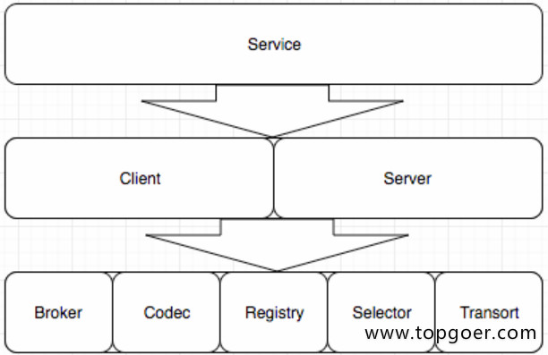

# Go Micro


##  go-micro简介

- Go Micro是一个插件化的基础框架，基于此可以构建微服务，Micro的设计哲学是可插拔的插件化架构
- 在架构之外，它默认实现了consul作为服务发现（2019年源码修改了默认使用mdns），通过http进行通信，通过protobuf和json进行编解码


## go-micro的主要功能

- 服务发现：自动服务注册和名称解析。服务发现是微服务开发的核心。当服务A需要与服务B通话时，它需要该服务的位置。默认发现机制是多播DNS（mdns），一种零配置系统。您可以选择使用SWIM协议为p2p网络设置八卦，或者为弹性云原生设置设置consul
- 负载均衡：基于服务发现构建的客户端负载均衡。一旦我们获得了服务的任意数量实例的地址，我们现在需要一种方法来决定要路由到哪个节点。我们使用随机散列负载均衡来提供跨服务的均匀分布，并在出现问题时重试不同的节点
- 消息编码：基于内容类型的动态消息编码。客户端和服务器将使用编解码器和内容类型为您无缝编码和解码Go类型。可以编码任何种类的消息并从不同的客户端发送。客户端和服务器默认处理此问题。这包括默认的protobuf和json
- 请求/响应：基于RPC的请求/响应，支持双向流。我们提供了同步通信的抽象。对服务的请求将自动解决，负载平衡，拨号和流式传输。启用tls时，默认传输为http / 1.1或http2
- Async Messaging：PubSub是异步通信和事件驱动架构的一流公民。事件通知是微服务开发的核心模式。启用tls时，默认消息传递是点对点http / 1.1或http2
- 可插拔接口：Go Micro为每个分布式系统抽象使用Go接口，因此，这些接口是可插拔的，并允许Go Micro与运行时无关，可以插入任何基础技术
  - 插件地址：https://github.com/micro/go-plugins


## go-micro通信流程

- Server监听客户端的调用，和Brocker推送过来的信息进行处理。并且Server端需要向Register注册自己的存在或消亡，这样Client才能知道自己的状态
- Register服务的注册的发现，Client端从Register中得到Server的信息，然后每次调用都根据算法选择一个的Server进行通信，当然通信是要经过编码/解码，选择传输协议等一系列过程的
- 如果有需要通知所有的Server端可以使用Brocker进行信息的推送，Brocker 信息队列进行信息的接收和发布


## go-micro核心接口

- go-micro之所以可以高度订制和他的框架结构是分不开的，go-micro由8个关键的interface组成，每一个interface都可以根据自己的需求重新实现，这8个主要的inteface也构成了go-micro的框架结构




## Go Micro接口详解

> todo


###  1.1.1. Transort通信接口

通信相关接口

```go
type Socket interface {
   Recv(*Message) error
   Send(*Message) error
   Close() error
}

type Client interface {
   Socket
}

type Listener interface {
   Addr() string
   Close() error
   Accept(func(Socket)) error
}

type Transport interface {
   Dial(addr string, opts ...DialOption) (Client, error)
   Listen(addr string, opts ...ListenOption) (Listener, error)
   String() string
}
```


### 1.1.2. Codec编码接口

编解码，底层也是protobuf

```go
type Codec interface {
   ReadHeader(*Message, MessageType) error
   ReadBody(interface{}) error
   Write(*Message, interface{}) error
   Close() error
   String() string
}
```


### 1.1.3. Registry注册接口

服务注册发现的实现：etcd、consul、mdns、kube-DNS、zk

```go
type Registry interface {
   Register(*Service, ...RegisterOption) error
   Deregister(*Service) error
   GetService(string) ([]*Service, error)
   ListServices() ([]*Service, error)
   Watch(...WatchOption) (Watcher, error)
   String() string
   Options() Options
}
```


### 1.1.4. Selector负载均衡

根据不同算法请求主机列表

```go
type Selector interface {
   Init(opts ...Option) error
   Options() Options
   // Select returns a function which should return the next node
   Select(service string, opts ...SelectOption) (Next, error)
   // Mark sets the success/error against a node
   Mark(service string, node *registry.Node, err error)
   // Reset returns state back to zero for a service
   Reset(service string)
   // Close renders the selector unusable
   Close() error
   // Name of the selector
   String() string
}
```


### 1.1.5. Broker发布订阅接口

pull push watch

```go
type Broker interface {
   Options() Options
   Address() string
   Connect() error
   Disconnect() error
   Init(...Option) error
   Publish(string, *Message, ...PublishOption) error
   Subscribe(string, Handler, ...SubscribeOption) (Subscriber, error)
   String() string
}
```


### 1.1.6. Client客户端接口

```go
type Client interface {
   Init(...Option) error
   Options() Options
   NewMessage(topic string, msg interface{}, opts ...MessageOption) Message
   NewRequest(service, method string, req interface{}, reqOpts ...RequestOption) Request
   Call(ctx context.Context, req Request, rsp interface{}, opts ...CallOption) error
   Stream(ctx context.Context, req Request, opts ...CallOption) (Stream, error)
   Publish(ctx context.Context, msg Message, opts ...PublishOption) error
   String() string
}
```


### 1.1.7. Server服务端接口

```go
type Server interface {
   Options() Options
   Init(...Option) error
   Handle(Handler) error
   NewHandler(interface{}, ...HandlerOption) Handler
   NewSubscriber(string, interface{}, ...SubscriberOption) Subscriber
   Subscribe(Subscriber) error
   Register() error
   Deregister() error
   Start() error
   Stop() error
   String() string
}
```


### 1.1.8. Serveice接口

```go
type Service interface {
   Init(...Option)
   Options() Options
   Client() client.Client
   Server() server.Server
   Run() error
   String() string
}
```