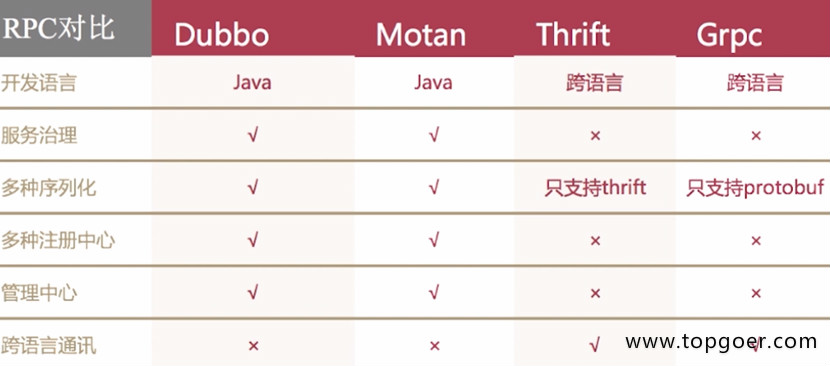

# RPC


## RPC简介

- 远程过程调用（Remote Procedure Call，RPC）是一个计算机通信协议
- 该协议允许运行于一台计算机的程序调用另一台计算机的子程序，而程序员无需额外地为这个交互作用编程
- 如果涉及的软件采用面向对象编程，那么远程过程调用亦可称作远程调用或远程方法调用


## 流行RPC框架的对比




## golang中如何实现RPC

- golang中实现RPC非常简单，官方提供了封装好的库，还有一些第三方的库
- golang官方的net/rpc库使用encoding/gob进行编解码，支持tcp和http数据传输方式，由于其他语言不支持gob编解码方式，所以golang的RPC只支持golang开发的服务器与客户端之间的交互

- 官方还提供了net/rpc/jsonrpc库实现RPC方法，jsonrpc采用JSON进行数据编解码，因而支持跨语言调用，目前jsonrpc库是基于tcp协议实现的，暂不支持http传输方式
- 例题：golang实现RPC程序，实现求矩形面积和周长


**服务端**

```go
package main

import (
    "log"
    "net/http"
    "net/rpc"
)

//    例题：golang实现RPC程序，实现求矩形面积和周长

type Params struct {
    Width, Height int
}

type Rect struct{}

// RPC服务端方法，求矩形面积
func (r *Rect) Area(p Params, ret *int) error {
    *ret = p.Height * p.Width
    return nil
}

// 周长
func (r *Rect) Perimeter(p Params, ret *int) error {
    *ret = (p.Height + p.Width) * 2
    return nil
}

// 主函数
func main() {
    // 1.注册服务
    rect := new(Rect)
    // 注册一个rect的服务
    rpc.Register(rect)
    // 2.服务处理绑定到http协议上
    rpc.HandleHTTP()
    // 3.监听服务
    err := http.ListenAndServe(":8000", nil)
    if err != nil {
        log.Panicln(err)
    }
}
```

**客户端**

```go
package main

import (
    "fmt"
    "log"
    "net/rpc"
)

// 传的参数
type Params struct {
    Width, Height int
}

// 主函数
func main() {
    // 1.连接远程rpc服务
    conn, err := rpc.DialHTTP("tcp", ":8000")
    if err != nil {
        log.Fatal(err)
    }
    // 2.调用方法
    // 面积
    ret := 0
    err2 := conn.Call("Rect.Area", Params{50, 100}, &ret)
    if err2 != nil {
        log.Fatal(err2)
    }
    fmt.Println("面积：", ret)
    // 周长
    err3 := conn.Call("Rect.Perimeter", Params{50, 100}, &ret)
    if err3 != nil {
        log.Fatal(err3)
    }
    fmt.Println("周长：", ret)
}
```

- golang写RPC程序，必须符合4个基本条件，不然RPC用不了
  - 结构体字段首字母要大写，可以别人调用
  - 函数名必须首字母大写
  - 函数第一参数是接收参数，第二个参数是返回给客户端的参数，必须是指针类型
  - 函数还必须有一个返回值error
- 练习：模仿前面例题，自己实现RPC程序，服务端接收2个参数，可以做乘法运算，也可以做商和余数的运算，客户端进行传参和访问，得到结果如下：

服务端代码：

```go
package main

import (
   "errors"
   "log"
   "net/http"
   "net/rpc"
)

// 结构体，用于注册的
type Arith struct{}

// 声明参数结构体
type ArithRequest struct {
   A, B int
}

// 返回给客户端的结果
type ArithResponse struct {
   // 乘积
   Pro int
   // 商
   Quo int
   // 余数
   Rem int
}

// 乘法
func (this *Arith) Multiply(req ArithRequest, res *ArithResponse) error {
   res.Pro = req.A * req.B
   return nil
}

// 商和余数
func (this *Arith) Divide(req ArithRequest, res *ArithResponse) error {
   if req.B == 0 {
      return errors.New("除数不能为0")
   }
   // 除
   res.Quo = req.A / req.B
   // 取模
   res.Rem = req.A % req.B
   return nil
}

// 主函数
func main() {
   // 1.注册服务
   rect := new(Arith)
   // 注册一个rect的服务
   rpc.Register(rect)
   // 2.服务处理绑定到http协议上
   rpc.HandleHTTP()
   // 3.监听服务
   err := http.ListenAndServe(":8000", nil)
   if err != nil {
      log.Fatal(err)
   }
}
```

客户端代码：

```go
package main

import (
   "fmt"
   "log"
   "net/rpc"
)

type ArithRequest struct {
   A, B int
}

// 返回给客户端的结果
type ArithResponse struct {
   // 乘积
   Pro int
   // 商
   Quo int
   // 余数
   Rem int
}

func main() {
   conn, err := rpc.DialHTTP("tcp", ":8000")
   if err != nil {
      log.Fatal(err)
   }
   req := ArithRequest{9, 2}
   var res ArithResponse
   err2 := conn.Call("Arith.Multiply", req, &res)
   if err2 != nil {
      log.Fatal(err2)
   }
   fmt.Printf("%d * %d = %d\n", req.A, req.B, res.Pro)
   err3 := conn.Call("Arith.Divide", req, &res)
   if err3 != nil {
      log.Fatal(err3)
   }
   fmt.Printf("%d / %d 商 %d，余数 = %d\n", req.A, req.B, res.Quo, res.Rem)
}
```

> > > 另外，net/rpc/jsonrpc库通过json格式编解码，支持跨语言调用

服务端代码：

```go
package main

import (
    "fmt"
    "log"
    "net"
    "net/rpc"
    "net/rpc/jsonrpc"
)

type Params struct {
    Width, Height int
}
type Rect struct {
}

func (r *Rect) Area(p Params, ret *int) error {
    *ret = p.Width * p.Height
    return nil
}
func (r *Rect) Perimeter(p Params, ret *int) error {
    *ret = (p.Height + p.Width) * 2
    return nil
}
func main() {
    rpc.Register(new(Rect))
    lis, err := net.Listen("tcp", ":8080")
    if err != nil {
        log.Panicln(err)
    }
    for {
        conn, err := lis.Accept()
        if err != nil {
            continue
        }
        go func(conn net.Conn) {
            fmt.Println("new client")
            jsonrpc.ServeConn(conn)
        }(conn)
    }
}
```

客户端代码：

```go
package main

import (
    "fmt"
    "log"
    "net/rpc/jsonrpc"
)

type Params struct {
    Width, Height int
}

func main() {
    conn, err := jsonrpc.Dial("tcp", ":8080")
    if err != nil {
        log.Panicln(err)
    }
    ret := 0
    err2 := conn.Call("Rect.Area", Params{50, 100}, &ret)
    if err2 != nil {
        log.Panicln(err2)
    }
    fmt.Println("面积：", ret)
    err3 := conn.Call("Rect.Perimeter", Params{50, 100}, &ret)
    if err3 != nil {
        log.Panicln(err3)
    }
    fmt.Println("周长：", ret)
}
```


## RPC调用流程

- 微服务架构下数据交互一般是对内 RPC，对外 REST
- 将业务按功能模块拆分到各个微服务，具有提高项目协作效率、降低模块耦合度、提高系统可用性等优点，但是开发门槛比较高，比如 RPC 框架的使用、后期的服务监控等工作
- 一般情况下，我们会将功能代码在本地直接调用，微服务架构下，我们需要将这个函数作为单独的服务运行，客户端通过网络调用


## 网络传输数据格式

- 两端要约定好数据包的格式
- 成熟的RPC框架会有自定义传输协议，这里网络传输格式定义如下，前面是固定长度消息头，后面是变长消息体


- 自己定义数据格式的读写

```go
package rpc

import (
    "encoding/binary"
    "io"
    "net"
)

// 测试网络中读写数据的情况

// 会话连接的结构体
type Session struct {
    conn net.Conn
}

// 构造方法
func NewSession(conn net.Conn) *Session {
    return &Session{conn: conn}
}

// 向连接中去写数据
func (s *Session) Write(data []byte) error {
    // 定义写数据的格式
    // 4字节头部 + 可变体的长度
    buf := make([]byte, 4+len(data))
    // 写入头部，记录数据长度
    binary.BigEndian.PutUint32(buf[:4], uint32(len(data)))
    // 将整个数据，放到4后边
    copy(buf[4:], data)
    _, err := s.conn.Write(buf)
    if err != nil {
        return err
    }
    return nil
}

// 从连接读数据
func (s *Session) Read() ([]byte, error) {
    // 读取头部记录的长度
    header := make([]byte, 4)
    // 按长度读取消息
    _, err := io.ReadFull(s.conn, header)
    if err != nil {
        return nil, err
    }
    // 读取数据
    dataLen := binary.BigEndian.Uint32(header)
    data := make([]byte, dataLen)
    _, err = io.ReadFull(s.conn, data)
    if err != nil {
        return nil, err
    }
    return data, nil
}
```

**测试类**

```go
package rpc

import (
    "fmt"
    "net"
    "sync"
    "testing"
)

func TestSession_ReadWriter(t *testing.T) {
    // 定义地址
    addr := "127.0.0.1:8000"
    my_data := "hello"
    // 等待组定义
    wg := sync.WaitGroup{}
    wg.Add(2)
    // 写数据的协程
    go func() {
        defer wg.Done()
        lis, err := net.Listen("tcp", addr)
        if err != nil {
            t.Fatal(err)
        }
        conn, _ := lis.Accept()
        s := Session{conn: conn}
        err = s.Write([]byte(my_data))
        if err != nil {
            t.Fatal(err)
        }
    }()

    // 读数据的协程
    go func() {
        defer wg.Done()
        conn, err := net.Dial("tcp", addr)
        if err != nil {
            t.Fatal(err)
        }
        s := Session{conn: conn}
        data, err := s.Read()
        if err != nil {
            t.Fatal(err)
        }
        // 最后一层校验
        if string(data) != my_data {
            t.Fatal(err)
        }
        fmt.Println(string(data))
    }()
    wg.Wait()
}
```

**编码解码**

```go
package rpc

import (
    "bytes"
    "encoding/gob"
)

// 定义RPC交互的数据结构
type RPCData struct {
    // 访问的函数
    Name string
    // 访问时的参数
    Args []interface{}
}

// 编码
func encode(data RPCData) ([]byte, error) {
    //得到字节数组的编码器
    var buf bytes.Buffer
    bufEnc := gob.NewEncoder(&buf)
    // 编码器对数据编码
    if err := bufEnc.Encode(data); err != nil {
        return nil, err
    }
    return buf.Bytes(), nil
}

// 解码
func decode(b []byte) (RPCData, error) {
    buf := bytes.NewBuffer(b)
    // 得到字节数组解码器
    bufDec := gob.NewDecoder(buf)
    // 解码器对数据节码
    var data RPCData
    if err := bufDec.Decode(&data); err != nil {
        return data, err
    }
    return data, nil
}
```


## 实现RPC服务端

- 服务端接收到的数据需要包括什么？
  - 调用的函数名、参数列表，还有一个返回值error类型
- 服务端需要解决的问题是什么？
  - Map维护客户端传来调用函数，服务端知道去调谁
- 服务端的核心功能有哪些？
  - 维护函数map
  - 客户端传来的东西进行解析
  - 函数的返回值打包，传给客户端

```go
package rpc

import (
    "fmt"
    "net"
    "reflect"
)

// 声明服务端
type Server struct {
    // 地址
    addr string
    // map 用于维护关系的
    funcs map[string]reflect.Value
}

// 构造方法
func NewServer(addr string) *Server {
    return &Server{addr: addr, funcs: make(map[string]reflect.Value)}
}

// 服务端需要一个注册Register
// 第一个参数函数名，第二个传入真正的函数
func (s *Server) Register(rpcName string, f interface{}) {
    // 维护一个map
    // 若map已经有键了
    if _, ok := s.funcs[rpcName]; ok {
        return
    }
    // 若map中没值，则将映射加入map，用于调用
    fVal := reflect.ValueOf(f)
    s.funcs[rpcName] = fVal
}

// 服务端等待调用的方法
func (s *Server) Run() {
    // 监听
    lis, err := net.Listen("tcp", s.addr)
    if err != nil {
        fmt.Printf("监听 %s err :%v", s.addr, err)
        return
    }
    for {
        // 服务端循环等待调用
        conn, err := lis.Accept()
        if err != nil {
            return
        }
        serSession := NewSession(conn)
        // 使用RPC方式读取数据
        b, err := serSession.Read()
        if err != nil {
            return
        }
        // 数据解码
        rpcData, err := decode(b)
        if err != nil {
            return
        }
        // 根据读到的name，得到要调用的函数
        f, ok := s.funcs[rpcData.Name]
        if !ok {
            fmt.Println("函数 %s 不存在", rpcData.Name)
            return
        }
        // 遍历解析客户端传来的参数,放切片里
        inArgs := make([]reflect.Value, 0, len(rpcData.Args))
        for _, arg := range rpcData.Args {
            inArgs = append(inArgs, reflect.ValueOf(arg))
        }
        // 反射调用方法
        // 返回Value类型，用于给客户端传递返回结果,out是所有的返回结果
        out := f.Call(inArgs)
        // 遍历out ，用于返回给客户端，存到一个切片里
        outArgs := make([]interface{}, 0, len(out))
        for _, o := range out {
            outArgs = append(outArgs, o.Interface())
        }
        // 数据编码，返回给客户端
        respRPCData := RPCData{rpcData.Name, outArgs}
        bytes, err := encode(respRPCData)
        if err != nil {
            return
        }
        // 将服务端编码后的数据，写出到客户端
        err = serSession.Write(bytes)
        if err != nil {
            return
        }
    }
}
```


## 实现RPC客户端

- 客户端只有函数原型，使用reflect.MakeFunc() 可以完成原型到函数的调用
- reflect.MakeFunc()是Client从函数原型到网络调用的关键

```go
package rpc

import (
    "net"
    "reflect"
)

// 声明服务端
type Client struct {
    conn net.Conn
}

// 构造方法
func NewClient(conn net.Conn) *Client {
    return &Client{conn: conn}
}

// 实现通用的RPC客户端
// 传入访问的函数名
// fPtr指向的是函数原型
//var select fun xx(User)
//cli.callRPC("selectUser",&select)
func (c *Client) callRPC(rpcName string, fPtr interface{}) {
    // 通过反射，获取fPtr未初始化的函数原型
    fn := reflect.ValueOf(fPtr).Elem()
    // 需要另一个函数，作用是对第一个函数参数操作
    f := func(args []reflect.Value) []reflect.Value {
        // 处理参数
        inArgs := make([]interface{}, 0, len(args))
        for _, arg := range args {
            inArgs = append(inArgs, arg.Interface())
        }
        // 连接
        cliSession := NewSession(c.conn)
        // 编码数据
        reqRPC := RPCData{Name: rpcName, Args: inArgs}
        b, err := encode(reqRPC)
        if err != nil {
            panic(err)
        }
        // 写数据
        err = cliSession.Write(b)
        if err != nil {
            panic(err)
        }
        // 服务端发过来返回值，此时应该读取和解析
        respBytes, err := cliSession.Read()
        if err != nil {
            panic(err)
        }
        // 解码
        respRPC, err := decode(respBytes)
        if err != nil {
            panic(err)
        }
        // 处理服务端返回的数据
        outArgs := make([]reflect.Value, 0, len(respRPC.Args))
        for i, arg := range respRPC.Args {
            // 必须进行nil转换
            if arg == nil {
                // reflect.Zero()会返回类型的零值的value
                // .out()会返回函数输出的参数类型
                outArgs = append(outArgs, reflect.Zero(fn.Type().Out(i)))
                continue
            }
            outArgs = append(outArgs, reflect.ValueOf(arg))
        }
        return outArgs
    }
    // 完成原型到函数调用的内部转换
    // 参数1是reflect.Type
    // 参数2 f是函数类型，是对于参数1 fn函数的操作
    // fn是定义，f是具体操作
    v := reflect.MakeFunc(fn.Type(), f)
    // 为函数fPtr赋值，过程
    fn.Set(v)
}
```


## 实现RPC通信测试

- 给服务端注册一个查询用户的方法，客户端使用RPC方式调用

```go
package rpc

import (
    "encoding/gob"
    "fmt"
    "net"
    "testing"
)

//    给服务端注册一个查询用户的方法，客户端使用RPC方式调用

// 定义用户对象
type User struct {
    Name string
    Age  int
}

// 用于测试用户查询的方法
func queryUser(uid int) (User, error) {
    user := make(map[int]User)
    // 假数据
    user[0] = User{"zs", 20}
    user[1] = User{"ls", 21}
    user[2] = User{"ww", 22}
    // 模拟查询用户
    if u, ok := user[uid]; ok {
        return u, nil
    }
    return User{}, fmt.Errorf("%d err", uid)
}

func TestRPC(t *testing.T) {
    // 编码中有一个字段是interface{}时，要注册一下
    gob.Register(User{})
    addr := "127.0.0.1:8000"
    // 创建服务端
    srv := NewServer(addr)
    // 将服务端方法，注册一下
    srv.Register("queryUser", queryUser)
    // 服务端等待调用
    go srv.Run()
    // 客户端获取连接
    conn, err := net.Dial("tcp", addr)
    if err != nil {
        fmt.Println("err")
    }
    // 创建客户端对象
    cli := NewClient(conn)
    // 需要声明函数原型
    var query func(int) (User, error)
    cli.callRPC("queryUser", &query)
    // 得到查询结果
    u, err := query(1)
    if err != nil {
        fmt.Println("err")
    }
    fmt.Println(u)
}
```