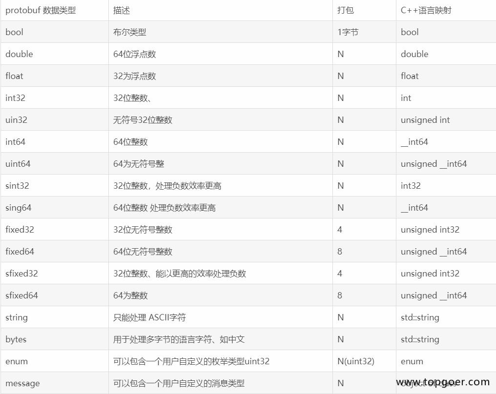

# Protobuf语法


## 基本规范

- 文件以.proto做为文件后缀，除结构定义外的语句以分号结尾

- 结构定义可以包含：message、service、enum

- rpc方法定义结尾的分号可有可无

- Message命名采用驼峰命名方式，字段命名采用小写字母加下划线分隔方式

  ```
    message SongServerRequest {
        required string song_name = 1;
    }
  ```

- Enums类型名采用驼峰命名方式，字段命名采用大写字母加下划线分隔方式

  ```
    enum Foo {
        FIRST_VALUE = 1;
        SECOND_VALUE = 2;
    }
  ```

- Service与rpc方法名统一采用驼峰式命名


## 字段规则

- 字段格式：`限定修饰符 | 数据类型 | 字段名称 | = | 字段编码值 | [字段默认值]`
- 限定修饰符包含 required\optional\repeated
  - Required: 表示是一个必须字段，必须相对于发送方，在发送消息之前必须设置该字段的值，对于接收方，必须能够识别该字段的意思。发送之前没有设置required字段或者无法识别required字段都会引发编解码异常，导致消息被丢弃
  - Optional：表示是一个可选字段，可选对于发送方，在发送消息时，可以有选择性的设置或者不设置该字段的值。对于接收方，如果能够识别可选字段就进行相应的处理，如果无法识别，则忽略该字段，消息中的其它字段正常处理。---因为optional字段的特性，很多接口在升级版本中都把后来添加的字段都统一的设置为optional字段，这样老的版本无需升级程序也可以正常的与新的软件进行通信，只不过新的字段无法识别而已，因为并不是每个节点都需要新的功能，因此可以做到按需升级和平滑过渡
  - Repeated：表示该字段可以包含0~N个元素。其特性和optional一样，但是每一次可以包含多个值。可以看作是在传递一个数组的值
- 数据类型
  - Protobuf定义了一套基本数据类型。几乎都可以映射到C++\Java等语言的基础数据类型 
  - N 表示打包的字节并不是固定。而是根据数据的大小或者长度
  - 关于 fixed32 和int32的区别。fixed32的打包效率比int32的效率高，但是使用的空间一般比int32多。因此一个属于时间效率高，一个属于空间效率高
- 字段名称
  - 字段名称的命名与C、C++、Java等语言的变量命名方式几乎是相同的
  - protobuf建议字段的命名采用以下划线分割的驼峰式。例如 first_name 而不是firstName
- 字段编码值
  - 有了该值，通信双方才能互相识别对方的字段，相同的编码值，其限定修饰符和数据类型必须相同，编码值的取值范围为 `1~2^32`（4294967296）
  - 其中 1~15的编码时间和空间效率都是最高的，编码值越大，其编码的时间和空间效率就越低，所以建议把经常要传递的值把其字段编码设置为1-15之间的值
  - 1900~2000编码值为Google protobuf 系统内部保留值，建议不要在自己的项目中使用
- 字段默认值
  - 当在传递数据时，对于required数据类型，如果用户没有设置值，则使用默认值传递到对端


## service如何定义

- 如果想要将消息类型用在RPC系统中，可以在.proto文件中定义一个RPC服务接口，protocol buffer编译器会根据所选择的不同语言生成服务接口代码
- 例如，想要定义一个RPC服务并具有一个方法，该方法接收SearchRequest并返回一个SearchResponse，此时可以在.proto文件中进行如下定义：

```
    service SearchService {
        rpc Search (SearchRequest) returns (SearchResponse) {}
    }
```

- 生成的接口代码作为客户端与服务端的约定，服务端必须实现定义的所有接口方法，客户端直接调用同名方法向服务端发起请求，比较麻烦的是，即便业务上不需要参数也必须指定一个请求消息，一般会定义一个空message

##  Message如何定义

- 一个message类型定义描述了一个请求或响应的消息格式，可以包含多种类型字段
- 例如定义一个搜索请求的消息格式，每个请求包含查询字符串、页码、每页数目
- 字段名用小写，转为go文件后自动变为大写，message就相当于结构体

```
    syntax = "proto3";

    message SearchRequest {
        string query = 1;            // 查询字符串
        int32  page_number = 2;     // 页码
        int32  result_per_page = 3;   // 每页条数
    }
```

- 首行声明使用的protobuf版本为proto3
- SearchRequest 定义了三个字段，每个字段声明以分号结尾，.proto文件支持双斜线 // 添加单行注释


## 添加更多Message类型

- 一个.proto文件中可以定义多个消息类型，一般用于同时定义多个相关的消息，例如在同一个.proto文件中同时定义搜索请求和响应消息

```
    syntax = "proto3";

    // SearchRequest 搜索请求
    message SearchRequest {
        string query = 1;            // 查询字符串
        int32  page_number = 2;     // 页码
        int32  result_per_page = 3;   // 每页条数
    }

    // SearchResponse 搜索响应
    message SearchResponse {
        ...
    }
```


## 如何使用其他Message

- message支持嵌套使用，作为另一message中的字段类型

```
    message SearchResponse {
        repeated Result results = 1;
    }

    message Result {
        string url = 1;
        string title = 2;
        repeated string snippets = 3;
    }
```


## Message嵌套的使用

- 支持嵌套消息，消息可以包含另一个消息作为其字段。也可以在消息内定义一个新的消息
- 内部声明的message类型名称只可在内部直接使用

```
    message SearchResponse {
        message Result {
            string url = 1;
            string title = 2;
            repeated string snippets = 3;
        }
        repeated Result results = 1;
    }
```

- 另外，还可以多层嵌套

```
    message Outer {                // Level 0
        message MiddleAA {        // Level 1
            message Inner {        // Level 2
                int64 ival = 1;
                bool  booly = 2;
            }
        }
        message MiddleBB {         // Level 1
            message Inner {         // Level 2
                int32 ival = 1;
                bool  booly = 2;
            }
        }
    }
```


## proto3的Map类型

- proto3支持map类型声明

```
    map<key_type, value_type> map_field = N;

    message Project {...}
    map<string, Project> projects = 1;
```

- 键、值类型可以是内置的类型，也可以是自定义message类型
- 字段不支持repeated属性


##  .proto文件编译

- 通过定义好的.proto文件生成Java, Python, C++, Go, Ruby, JavaNano, Objective-C, or C# 代码，需要安装编译器protoc
- 当使用protocol buffer编译器运行.proto文件时，编译器将生成所选语言的代码，用于使用在.proto文件中定义的消息类型、服务接口约定等。不同语言生成的代码格式不同：
  - C++: 每个.proto文件生成一个.h文件和一个.cc文件，每个消息类型对应一个类
  - Java: 生成一个.java文件，同样每个消息对应一个类，同时还有一个特殊的Builder类用于创建消息接口
  - Python: 姿势不太一样，每个.proto文件中的消息类型生成一个含有静态描述符的模块，该模块与一个元类metaclass在运行时创建需要的Python数据访问类
  - Go: 生成一个.pb.go文件，每个消息类型对应一个结构体
  - Ruby: 生成一个.rb文件的Ruby模块，包含所有消息类型
  - JavaNano: 类似Java，但不包含Builder类
  - Objective-C: 每个.proto文件生成一个pbobjc.h和一个pbobjc.m文件
  - C#: 生成.cs文件包含，每个消息类型对应一个类


## import导入定义

- 可以使用import语句导入使用其它描述文件中声明的类型
- protobuf 接口文件可以像C语言的h文件一个，分离为多个，在需要的时候通过 import导入需要对文件。其行为和C语言的#include或者java的import的行为大致相同，例如import "others.proto";
- protocol buffer编译器会在 -I / --proto_path参数指定的目录中查找导入的文件，如果没有指定该参数，默认在当前目录中查找


## 包的使用

- 在.proto文件中使用package声明包名，避免命名冲突

```
syntax = "proto3";
package foo.bar;
message Open {...}
```

- 在其他的消息格式定义中可以使用包名+消息名的方式来使用类型，如

```
message Foo {
    ...
    foo.bar.Open open = 1;
    ...
}
```

- 在不同的语言中，包名定义对编译后生成的代码的影响不同
  - C++ 中：对应C++命名空间，例如Open会在命名空间foo::bar中
  - Java 中：package会作为Java包名，除非指定了option jave_package选项
  - Python 中：package被忽略
  - Go 中：默认使用package名作为包名，除非指定了option go_package选项
  - JavaNano 中：同Java
  - C# 中：package会转换为驼峰式命名空间，如Foo.Bar,除非指定了option csharp_namespace选项