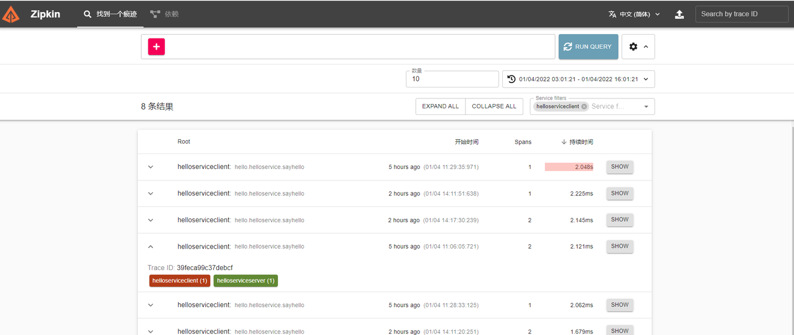
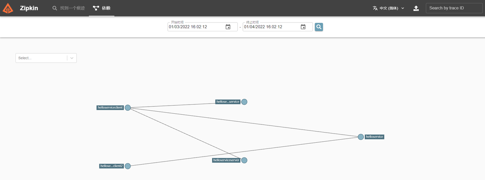
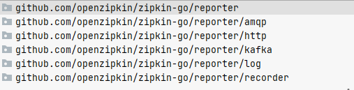
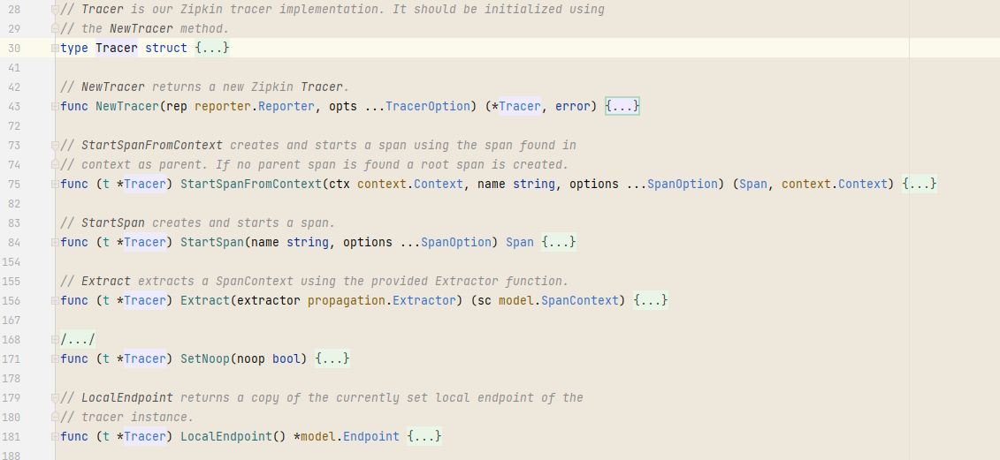
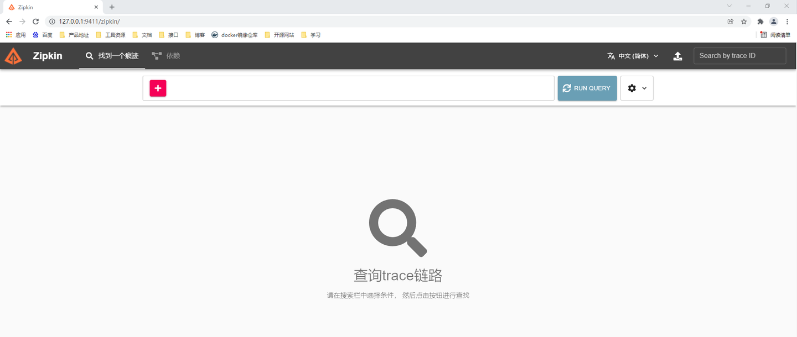

# grpc整合zipkin


## 一、zipkin介绍

Zipkin 是一个[分布式追踪系统](https://zhida.zhihu.com/search?content_id=188839766&content_type=Article&match_order=1&q=分布式追踪系统&zhida_source=entity)。它有助于收集对服务架构中的延迟问题进行故障排除所需的计时数据。功能包括收集和查找这些数据。

如果[日志文件](https://zhida.zhihu.com/search?content_id=188839766&content_type=Article&match_order=1&q=日志文件&zhida_source=entity)中有跟踪 ID，则可以直接跳转到它。否则，您可以根据服务、操作名称、标签和持续时间等属性进行查询。将为您总结一些有趣的数据，例如在服务中花费的时间百分比，以及操作是否失败。





### 1.1 Reporter 报告器

Reporter：将服务与服务之间的请求调用信息报告给zipkin后台，用于生成链路追踪和[依赖图](https://zhida.zhihu.com/search?content_id=188839766&content_type=Article&match_order=1&q=依赖图&zhida_source=entity)



**HTTP 报告器**

Zipkin 用户使用的最常见的 Reporter 类型，使用 JSON over HTTP 将请求调用信息封装为 Span 传输到 Zipkin 服务器。报告者持有一个[缓冲区](https://zhida.zhihu.com/search?content_id=188839766&content_type=Article&match_order=1&q=缓冲区&zhida_source=entity)并异步报告给后端。

```go
httpreport "github.com/openzipkin/zipkin-go/reporter/http"
```

**Log 报告器**

将服务调用信息Span打印到控制台

### **1.2 Endpoint**

只是一个标记信息，标记此grpc的服务名和地址信息，用于zipkin后台画图和分析

```go
// Endpoint holds the network context of a node in the service graph.
type Endpoint struct {
	ServiceName string
	IPv4        net.IP
	IPv6        net.IP
	Port        uint16
}
 
```

### 1.3 Tracer 追踪器

追踪器：主要是解析服务调用之间的上下文信息context，将链路信息封装为span等



## 二、zipkin安装

```go
docker pull openzipkin/zipkin:latest

docker run -itd -p 9410:9410 -p 9411:9411 --name zipkin openzipkin/zipkin:latest
```

**浏览器访问：**[http://127.0.0.1:9411/zipkin/](https://link.zhihu.com/?target=http%3A//127.0.0.1%3A9411/zipkin/)



## 三、grpc整合zipkin

```go
import (
	"github.com/openzipkin/zipkin-go"
	zipkingrpc "github.com/openzipkin/zipkin-go/middleware/grpc"
	"github.com/openzipkin/zipkin-go/reporter"
	httpreport "github.com/openzipkin/zipkin-go/reporter/http"
	"google.golang.org/grpc"
)
```

我们首先将创建[追踪器](https://zhida.zhihu.com/search?content_id=188839766&content_type=Article&match_order=3&q=追踪器&zhida_source=entity)的过程封装为一个方法 *NewZipkinTracer*

```go
// 创建一个zipkin追踪器
// url:http://localhost:9411/api/v2/spans
// serviceName:服务名，Endpoint标记
// hostPort：ip:port，Endpoint标记
func NewZipkinTracer(url,serviceName,hostPort string) (*zipkin.Tracer,reporter.Reporter,error) {

	// 初始化zipkin reporter
	// reporter可以有很多种，如：logReporter、httpReporter，这里我们只使用httpReporter将span报告给http服务，也就是zipkin的http后台
	r := httpreport.NewReporter(url)

	//创建一个endpoint，用来标识当前服务，服务名：服务地址和端口
	endpoint, err := zipkin.NewEndpoint(serviceName,hostPort)
	if err != nil {
		return nil,r,err
	}

	// 初始化追踪器 主要作用有解析span，解析上下文等
	tracer, err := zipkin.NewTracer(r,zipkin.WithLocalEndpoint(endpoint))
	if err != nil {
		return nil,r,err
	}

	return tracer,r,nil
}
```

### 3.1 [服务端](https://zhida.zhihu.com/search?content_id=188839766&content_type=Article&match_order=1&q=服务端&zhida_source=entity)

```go
package main

import (
	"github.com/openzipkin/zipkin-go"
	zipkingrpc "github.com/openzipkin/zipkin-go/middleware/grpc"
	"github.com/openzipkin/zipkin-go/reporter"
	httpreport "github.com/openzipkin/zipkin-go/reporter/http"
	"google.golang.org/grpc"
	"log"
	"net"
	"sgrpc/grpc/proto/hello"
	"sgrpc/grpc/server/service"
)

func main() {

	hostPort:= "127.0.0.1:8000"

	tracer, r,err := NewZipkinTracer("http://localhost:9411/api/v2/spans", "helloServiceServer", hostPort)
	defer r.Close()
	if err!=nil {
		log.Println(err)
		return
	}

	listener, err := net.Listen("tcp", hostPort)
	if err != nil {
		return
	}

	server := grpc.NewServer(grpc.StatsHandler(zipkingrpc.NewServerHandler(tracer)))

	hs := &service.HelloService{}
	hello.RegisterHelloServiceServer(server,hs)

	server.Serve(listener)


}


// 创建一个zipkin追踪器
// url:http://localhost:9411/api/v2/spans
// serviceName:服务名，Endpoint标记
// hostPort：ip:port，Endpoint标记
func NewZipkinTracer(url,serviceName,hostPort string) (*zipkin.Tracer,reporter.Reporter,error) {

	// 初始化zipkin reporter
	// reporter可以有很多种，如：logReporter、httpReporter，这里我们只使用httpReporter将span报告给http服务，也就是zipkin的http后台
	r := httpreport.NewReporter(url)

	//创建一个endpoint，用来标识当前服务，服务名：服务地址和端口
	endpoint, err := zipkin.NewEndpoint(serviceName,hostPort)
	if err != nil {
		return nil,r,err
	}

	// 初始化追踪器 主要作用有解析span，解析上下文等
	tracer, err := zipkin.NewTracer(r,zipkin.WithLocalEndpoint(endpoint))
	if err != nil {
		return nil,r,err
	}

	return tracer,r,nil
}
```

### 3.2 客户端

```go
package main

import (
	"context"
	"fmt"
	"github.com/openzipkin/zipkin-go"
	zipkingrpc "github.com/openzipkin/zipkin-go/middleware/grpc"
	"github.com/openzipkin/zipkin-go/reporter"
	httpreport "github.com/openzipkin/zipkin-go/reporter/http"
	"google.golang.org/grpc"
	"google.golang.org/grpc/credentials/insecure"
	"log"
	"sgrpc/grpc/proto/hello"
	"time"
)

func main() {

	tracer, r,err := NewZipkinTracer("http://localhost:9411/api/v2/spans", "helloServiceClient", "127.0.0.1:7000")
	defer r.Close()
	if err != nil {
		log.Println(err)
		return
	}

	clientConn, err := grpc.Dial("127.0.0.1:8000", grpc.WithStatsHandler(zipkingrpc.NewClientHandler(tracer)),grpc.WithTransportCredentials(insecure.NewCredentials()))
	if err != nil {
		fmt.Println(err)
		return
	}


	helloServiceClient := hello.NewHelloServiceClient(clientConn)

	ctx, cancelFunc := context.WithTimeout(context.Background(), time.Second*5)

	helloResponse, err := helloServiceClient.SayHello(ctx, &hello.HelloRequest{
		Name: "root",
		Age:  10,
	})

	cancelFunc()

	if err != nil {
		fmt.Println(err)
		return
	}
	fmt.Println(helloResponse)
}


// 创建一个zipkin追踪器
func NewZipkinTracer(url,serviceName,hostPort string) (*zipkin.Tracer,reporter.Reporter,error) {

	// 初始化zipkin reporter
	// reporter可以有很多种，如：logReporter、httpReporter，这里我们只使用httpReporter将span报告给http服务，也就是zipkin的http后台
	r := httpreport.NewReporter(url)

	//创建一个endpoint，用来标识当前服务，服务名：服务地址和端口
	endpoint, err := zipkin.NewEndpoint(serviceName,hostPort)
	if err != nil {
		return nil,r,err
	}

	// 初始化追踪器 主要作用有解析span，解析上下文等
	tracer, err := zipkin.NewTracer(r,zipkin.WithLocalEndpoint(endpoint))
	if err != nil {
		return nil,r,err
	}

	return tracer,r,nil
}
```

服务端zipkin和客户端zipkin都是通过grpc中的StatsHandler进行注册的，之前我们有讲过这个handler，不明白的可以参考：[w4ker：grpc中的UnknownServiceHandler和StatsHandler](https://zhuanlan.zhihu.com/p/451703696)

**扩展资料：**

[https://github.com/openzipkin/zipkin-go](https://link.zhihu.com/?target=https%3A//github.com/openzipkin/zipkin-go)

[https://github.com/openzipkin-contrib/zipkin-go-opentracing](https://link.zhihu.com/?target=https%3A//github.com/openzipkin-contrib/zipkin-go-opentracing)

[zipkintracer package - github.com/openzipkin-contrib/zipkin-go-opentracing - pkg.go.dev](https://link.zhihu.com/?target=https%3A//pkg.go.dev/github.com/openzipkin-contrib/zipkin-go-opentracing%23section-readme)