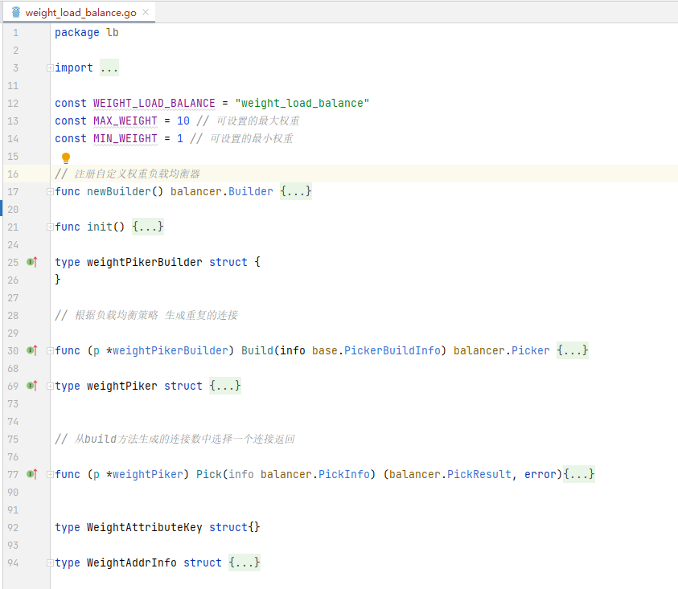

# grpc自定义负载均衡策略


## 概述

[w4ker：将你的grpc服务注册到etcd中](https://zhuanlan.zhihu.com/p/450777806) 上一篇文章我们讲了如何将grpc服务注册到etcd中，实现服务注册和服务发现，今天我们来讲讲grpc中如何实现自定义负载均衡策略


## 如何自定义负载均衡策略？

grpc中已经为我们实现了常用的负载均衡策略，如：round_robin负载均衡策略，我们可以在客户端使用它，像下面这样：

```go
// 使用roundrobin负载均衡策略
// grpc.WithBalancerName(roundrobin.Name)
conn, err := grpc.Dial("etcd:///",grpc.WithBalancerName(roundrobin.Name), grpc.WithTransportCredentials(insecure.NewCredentials()))
```

通过roundrobin.Name我们可以进入到roundrobin.go，查看它的具体实现，下图展示了roundrobin.go的主要代码实现，这里建议亲自查看一下它的源码，看看它方法的入参和返回值。


roundrobin.go主要实现逻辑总结：

- **1. 定义一个负载均衡名称**

> const Name = "round_robin"

- **2. 定义一个rrPickerBuilder，它只有一个方法：**

> func (*rrPickerBuilder) Build(info base.PickerBuildInfo) balancer.Picker{...}

rrPickerBuilder实际上是**PikcerBuilder接口的实现：**

**下面代码是PickerBuilder 接口**

```go
// PickerBuilder creates balancer.Picker.
type PickerBuilder interface {
	// Build returns a picker that will be used by gRPC to pick a SubConn.
	Build(info PickerBuildInfo) balancer.Picker
}
```

- **3. 定义一个rrPicker，它也只有一个方法：**

> func (p *rrPicker) Pick(balancer.PickInfo) (balancer.PickResult, error){...}

rrPicker实际上是**Picker接口的实现：**

```go
type Picker interface {
	Pick(info PickInfo) (PickResult, error)
}
```

- **4. 定义一个newBuild方法用来创建这个策略，定义[init方法](https://zhida.zhihu.com/search?content_id=188399404&content_type=Article&match_order=1&q=init方法&zhida_source=entity)用来注册创建的策略**

**主要方法作用简单说明：**

1. **Build方法：对连接进行使用前的处理，如果本地连接有变化，如调用**UpdateState(State) **会执行一次此方法，如：在Build中我们可以将某个连接复制多份，或者干脆不处理，直接返回**
2. **Pick方法：每次客户端请求服务前会调用Pick方法拿到一个连接，用这个连接去请求**


## **实现基于权重的负载均衡策略**

上面我们对roundrobin.go有了一个了解后，就可以开始自定义负载均衡策略：基于权重的负载均衡策略（weight_*load_*balance.go），代码结构预览如下：



关于WeightAttributeKey和WeightAddrInfo说明：

既然是基于权重的负载均衡策略，因此，我们在解析IP时需要获取[权重值](https://zhida.zhihu.com/search?content_id=188399404&content_type=Article&match_order=1&q=权重值&zhida_source=entity)，在获取IP时我们又需要将对应的权重设置到我们的Addr中，通过上一篇将grpc服务注册到etcd中我们知道可以调用UpdateState方法设置地址，因此我们可以在设置地址时增加一些属性，如：[权重](https://zhida.zhihu.com/search?content_id=188399404&content_type=Article&match_order=6&q=权重&zhida_source=entity)，下图中79、80、81表示模拟权重的设置。


我们可以在Build方法中获取

```go
// 根据负载均衡策略 生成重复的连接

func (p *weightPikerBuilder) Build(info base.PickerBuildInfo) balancer.Picker {

	log.Println("weightPikerBuilder build called...")

	// 没有可用的连接
	if len(info.ReadySCs) == 0 {
		return base.NewErrPicker(balancer.ErrNoSubConnAvailable)
	}


	// 此处有坑，为什么长度给0,而不是1???

	scs := make([]balancer.SubConn,0,len(info.ReadySCs))

	for subConn, subConnInfo := range info.ReadySCs {
		v := subConnInfo.Address.BalancerAttributes.Value(WeightAttributeKey{})
		w := v.(WeightAddrInfo).Weight

		// 限制可以设置的最大最小权重，防止设置过大创建连接数太多
		if w < MIN_WEIGHT  {
			w = MIN_WEIGHT
		}

		if w > MAX_WEIGHT {
			w = MAX_WEIGHT
		}

		// 根据权重 创建多个重复的连接 权重越高个数越多
		for i := 0; i < w; i++ {
			scs = append(scs, subConn)
		}

	}

	return &weightPiker{
		scs: scs,
	}
}
```

完整的代码实现：weight_*load_*balance.go

```go
package lb

import (
	"fmt"
	"google.golang.org/grpc/balancer"
	"google.golang.org/grpc/balancer/base"
	"log"
	"math/rand"
	"sync"
)

const WEIGHT_LOAD_BALANCE = "weight_load_balance"
const MAX_WEIGHT = 10 // 可设置的最大权重
const MIN_WEIGHT = 1 // 可设置的最小权重

// 注册自定义权重负载均衡器
func newBuilder() balancer.Builder {
	return base.NewBalancerBuilder(WEIGHT_LOAD_BALANCE, &weightPikerBuilder{}, base.Config{HealthCheck: true})
}

func init() {
	balancer.Register(newBuilder())
}

type weightPikerBuilder struct {
}

// 根据负载均衡策略 生成重复的连接

func (p *weightPikerBuilder) Build(info base.PickerBuildInfo) balancer.Picker {

	log.Println("weightPikerBuilder build called...")

	// 没有可用的连接
	if len(info.ReadySCs) == 0 {
		return base.NewErrPicker(balancer.ErrNoSubConnAvailable)
	}


	// 此处有坑，为什么长度给0,而不是1???

	scs := make([]balancer.SubConn,0,len(info.ReadySCs))

	for subConn, subConnInfo := range info.ReadySCs {
		v := subConnInfo.Address.BalancerAttributes.Value(WeightAttributeKey{})
		w := v.(WeightAddrInfo).Weight

		// 限制可以设置的最大最小权重，防止设置过大创建连接数太多
		if w < MIN_WEIGHT  {
			w = MIN_WEIGHT
		}

		if w > MAX_WEIGHT {
			w = MAX_WEIGHT
		}

		// 根据权重 创建多个重复的连接 权重越高个数越多
		for i := 0; i < w; i++ {
			scs = append(scs, subConn)
		}

	}

	return &weightPiker{
		scs: scs,
	}
}

type weightPiker struct {
	scs []balancer.SubConn
	mu   sync.Mutex
}


// 从build方法生成的连接数中选择一个连接返回

func (p *weightPiker) Pick(info balancer.PickInfo) (balancer.PickResult, error){

	// 随机选择一个返回，权重越大，生成的连接个数越多，因此，被选中的概率也越大
	log.Println("weightPiker Pick called...")
	p.mu.Lock()
	fmt.Println(p.scs)
	index := rand.Intn(len(p.scs))
	fmt.Println(index)
	fmt.Println(len(p.scs))
	sc := p.scs[index]
	p.mu.Unlock()
	return balancer.PickResult{SubConn: sc}, nil
}


type WeightAttributeKey struct{}

type WeightAddrInfo struct {
	Weight int
}
```

源码获取：[xiezengcheng/grpc-etcd](https://link.zhihu.com/?target=https%3A//gitee.com/xiezengcheng/grpc-etcd)

参考文章：[gRPC负载均衡（自定义负载均衡策略） - 烟花易冷人憔悴 - 博客园](https://link.zhihu.com/?target=https%3A//www.cnblogs.com/FireworksEasyCool/p/12924701.html)