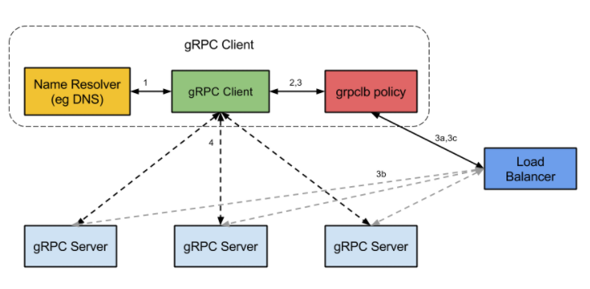

# 将你的grpc服务注册到etcd中


源码获取：[xiezengcheng/grpc-etcd](https://link.zhihu.com/?target=https%3A//gitee.com/xiezengcheng/grpc-etcd)

## 概述

grpc是一个高性能、通用的开源RPC框架，其基于[ProtoBuf](https://zhida.zhihu.com/search?content_id=188303128&content_type=Article&match_order=1&q=ProtoBuf&zhida_source=entity)(Protocol Buffers)序列化协议开发，且支持众多开发语言。但是，gRPC开源组件官方并未直接提供服务注册与发现的功能实现，但其设计文档已提供实现的思路，并在不同语言的gRPC代码API中已提供了命名解析和负载均衡接口供扩展。




## 一、服务端注册到etcd实现

**etcd客户端**

```go
go get go.etcd.io/etcd/client/v3
```

服务端的实现原理相对简单，主要步骤有：

1. 创建grpc服务端
2. 将grpc服务端的ip和port作为value，服务名（自己取，如：/ns/cloud-service-1）作为key，put到etcd中

由于服务端无法保证自身是一直可用的，可能会宕机，所以与etcd的租约是有时间期限的，租约一旦过期，服务端存储在etcd上的服务地址信息就会消失。

另一方面，如果服务端是正常运行的，etcd中的地址信息又必须存在，因此发送心跳检测，一旦发现etcd上没有自己的服务地址时，请求重新添加（续租）。

> etcd_register.go

```go
package register

import (
	"context"
	"go.etcd.io/etcd/client/v3"
	"log"
	"time"
)

type EtcdRegister struct {
	etcdCli *clientv3.Client // etcd连接
	leaseId clientv3.LeaseID // 租约ID
	ctx     context.Context
	cancel  context.CancelFunc
}

// 创建租约
// expire 有效期/秒
func (s *EtcdRegister) CreateLease(expire int64) error {

	res, err := s.etcdCli.Grant(s.ctx, expire)
	if err != nil {
		log.Printf("createLease failed,error %v \n", err)
		return err
	}

	s.leaseId = res.ID
	return nil
}

// 绑定租约
// 将租约和对应的KEY-VALUE绑定
func (s *EtcdRegister) BindLease(key string, value string) error {

	res, err := s.etcdCli.Put(s.ctx, key, value, clientv3.WithLease(s.leaseId))
	if err != nil {
		log.Printf("bindLease failed,error %v \n", err)
		return err
	}

	log.Printf("bindLease success %v \n", res)
	return nil
}

// 续租 发送心跳，表明服务正常
func (s *EtcdRegister) KeepAlive() (<-chan *clientv3.LeaseKeepAliveResponse, error) {

	resChan, err := s.etcdCli.KeepAlive(s.ctx, s.leaseId)
	if err != nil {
		log.Printf("keepAlive failed,error %v \n", resChan)
		return resChan, err
	}

	return resChan, nil
}

func (s *EtcdRegister) Watcher(key string, resChan <-chan *clientv3.LeaseKeepAliveResponse)  {

	for {
		select {
		case l := <- resChan:
			log.Printf("续约成功,val:%+v \n", l)
		case <- s.ctx.Done():
			log.Printf("续约关闭")
			return
		}
	}
}

func (s *EtcdRegister) Close() error {

	s.cancel()

	log.Printf("closed...\n")

	// 撤销租约
	s.etcdCli.Revoke(s.ctx, s.leaseId)

	return s.etcdCli.Close()
}

func NewEtcdRegister() (*EtcdRegister, error) {

	client, err := clientv3.New(clientv3.Config{
		Endpoints:   []string{"127.0.0.1:2379"},
		DialTimeout: 5 * time.Second,
	})

	if err != nil {
		log.Printf("new etcd client failed,error %v \n", err)
		return nil, err
	}

	ctx, cancelFunc := context.WithCancel(context.Background())

	svr := &EtcdRegister{
		etcdCli: client,
		ctx:     ctx,
		cancel: cancelFunc,
	}
	return svr, nil
}

// 注册服务
// expire 过期时间
func (svr *EtcdRegister) RegisterServer(serviceName, addr string, expire int64) (err error) {

	// 创建租约
	err = svr.CreateLease(expire)
	if err != nil {
		return  err
	}

	// 绑定租约
	err = svr.BindLease(serviceName, addr)
	if err != nil {
		return err
	}

	// 续租
	keepAliveChan, err := svr.KeepAlive()
	if err != nil {
		return err
	}

	// 监听续约
	go svr.Watcher(serviceName, keepAliveChan)

	return nil
}
```

封装好服务注册器后，我们需要在grpc服务中调用

下面代码表示，将一个grpc服务注册到etcd中

```go
package main

import (
	"google.golang.org/grpc"
	"log"
	"net"
	"sgrpc/etcd/register"
	"sgrpc/grpc/proto/hello"
	"sgrpc/grpc/server/service"
)

func main() {

	server := grpc.NewServer()

	helloService := new(service.HelloService)

	hello.RegisterHelloServiceServer(server,helloService)

	listen, err := net.Listen("tcp", "127.0.0.1:8001")
	if err != nil {
		log.Fatal(err)
	}

	// --------------------------------
	// 创建一个注册器
	etcdRegister, err := register.NewEtcdRegister()
	if err != nil {
		log.Println(err)
		return
	}

	defer etcdRegister.Close()

	serviceName := "order-service-1"

	addr := "127.0.0.1:8001"

	// 注册服务
	err = etcdRegister.RegisterServer("/etcd/"+serviceName, addr, 5)
	if err != nil {
		log.Printf("register error %v \n", err)
		return
	}

	// -------------------------------------------------
	server.Serve(listen)

}
```

到此，服务端的注册逻辑就已经全部实现，不太清楚的可以将代码跑起来看看。


## 二、客户端服务发现实现

grpc客户端为我们提供了实现服务发现和负载均衡的钩子，在说客户端如何通过ectd发现服务之前，我们先看看grpc中自带的一个dns负载均衡实现方式。

[grpc中的dns负载均衡_金庆的专栏-CSDN博客](https://link.zhihu.com/?target=https%3A//blog.csdn.net/jq0123/article/details/82179864)

```go
func main() {
	
	// 使用自带的DNS解析器和负载均衡实现方式
	conn, err := grpc.Dial("dns:///rng-headless:8001",grpc.WithBalancerName(roundrobin.Name), grpc.WithTransportCredentials(insecure.NewCredentials()))
	if err != nil {
		panic(err)
	}

	helloServiceClient := hello.NewHelloServiceClient(conn)

	for {
		time.Sleep(2 * time.Second)
		err = SayHello(helloServiceClient) // 一元
	}

}
```

**通过上述代码，先总结一下我们需要弄清楚的几件事：**

1. **grpc是如何将dns:///localhost:8001解析为正确的ip和port的？**
2. rng-headless指向了多个IP地址，grpc是如何监控这些IP是否可以正常访问的？
3. grpc.WithBalancerName(roundrobin.Name)指定负载均衡策略，那么grpc.Dial(...)中是如何实现的？

**看看下面这两篇文章，可以你能够得到1和2两个问题的答案**

- [小米出品--gRPC Name Resolver 原理及实践](https://link.zhihu.com/?target=https%3A//blog.csdn.net/RA681t58CJxsgCkJ31/article/details/104079070)
- [基于gRPC的注册发现与负载均衡的原理和实战 - kevwan的个人空间 - OSCHINA - 中文开源技术交流社区](https://link.zhihu.com/?target=https%3A//my.oschina.net/kevwan/blog/4773440)

问题3的答案，可以通过查看源码得到结果

1. 查看源码 roundrobin.go
2. 相信init方法
3. 看看conn

```go
type ClientConn struct {
	ctx    context.Context
	cancel context.CancelFunc

	target       string
	parsedTarget resolver.Target
	authority    string
	dopts        dialOptions
	csMgr        *connectivityStateManager

	balancerBuildOpts balancer.BuildOptions
	blockingpicker    *pickerWrapper

	safeConfigSelector iresolver.SafeConfigSelector

	mu              sync.RWMutex
	resolverWrapper *ccResolverWrapper
	sc              *ServiceConfig
	conns           map[*addrConn]struct{}
	// Keepalive parameter can be updated if a GoAway is received.
	mkp             keepalive.ClientParameters
	curBalancerName string
	balancerWrapper *ccBalancerWrapper
	retryThrottler  atomic.Value

	firstResolveEvent *grpcsync.Event

	channelzID int64 // channelz unique identification number
	czData     *channelzData

	lceMu               sync.Mutex // protects lastConnectionError
	lastConnectionError error
}
```

[gRPC负载均衡（自定义负载均衡策略） - 烟花易冷人憔悴 - 博客园](https://link.zhihu.com/?target=https%3A//www.cnblogs.com/FireworksEasyCool/p/12924701.html)

[w4ker：grpc自定义负载均衡策略](https://zhuanlan.zhihu.com/p/451211568)


### ETCD服务发现实现

客户端首先需要实现接口resolver.Resolver，其中方法Build()用于创建一个etcd解析器，grpc.Dial()会同步调用该方法，解析器需要根据key前缀监听etcd中服务地址列表的变化并更新本地列表watch。然后注册解析器，创建gRPC句柄，使用轮询负载均衡请求服务。

> etcd_*resolver_*builder.go

```go
package discover

import (
	"context"
	clientv3 "go.etcd.io/etcd/client/v3"
	"google.golang.org/grpc/resolver"
	"log"
	"time"
)

type etcdResolverBuilder struct {
	etcdClient *clientv3.Client
}

func NewEtcdResolverBuilder() *etcdResolverBuilder {

	// 创建etcd客户端连接
	etcdClient, err := clientv3.New(clientv3.Config{
		Endpoints:   []string{"127.0.0.1:2379"},
		DialTimeout: 5 * time.Second,
	})

	if err != nil {
		log.Println("client get etcd failed,error", err)
		panic(err)
	}

	return &etcdResolverBuilder{
		etcdClient: etcdClient,
	}
}


func (erb *etcdResolverBuilder) Build(target resolver.Target, cc resolver.ClientConn,
	opts resolver.BuildOptions) (resolver.Resolver, error) {

	// 获取指定前缀的etcd节点值
	// /ns->/ns/order-service-1   /ns/order-service-2
	prefix := "/"+target.URL.Scheme

	log.Println(prefix)

	// 获取 etcd 中服务保存的ip列表
	res, err := erb.etcdClient.Get(context.Background(), prefix, clientv3.WithPrefix())

	if err != nil {
		log.Println("Build etcd get addr failed; err:", err)
		return nil, err
	}

	ctx, cancelFunc := context.WithCancel(context.Background())

	es := &etcdResolver{
		cc: cc,
		etcdClient: erb.etcdClient,
		ctx: ctx,
		cancel: cancelFunc,
		scheme: target.URL.Scheme,
	}

	// 将获取到的ip和port保存到本地的map中
	log.Printf("etcd res:%+v\n", res)
	for _, kv := range res.Kvs {
		es.store(kv.Key, kv.Value)
	}

	// 更新拨号里的ip列表
	es.updateState()

	// 监听etcd中的服务是否变化

	go es.watcher()
	return es,nil
}

func (erb *etcdResolverBuilder) Scheme() string {
	return "etcd"
}
```

> etcd_resolver.go

```go
package discover

import (
	"context"
	"go.etcd.io/etcd/client/v3"
	"google.golang.org/grpc/resolver"
	"log"
	"sync"
)

type etcdResolver struct {
	ctx        context.Context
	cancel     context.CancelFunc
	cc         resolver.ClientConn
	etcdClient *clientv3.Client
	scheme     string
	ipPool     sync.Map
}

func (e *etcdResolver) ResolveNow(resolver.ResolveNowOptions) {
	log.Println("etcd resolver resolve now")
}

func (e *etcdResolver) Close() {
	log.Println("etcd resolver close")
	e.cancel()
}

func (e *etcdResolver) watcher() {

	watchChan := e.etcdClient.Watch(context.Background(),"/"+ e.scheme, clientv3.WithPrefix())

	for {
		select {
		case val := <-watchChan:
			for _, event := range val.Events {
				switch event.Type {
				case 0: // 0 是有数据增加
					e.store(event.Kv.Key, event.Kv.Value)
					log.Println("put:", string(event.Kv.Key))
					e.updateState()
				case 1: // 1是有数据减少
					log.Println("del:", string(event.Kv.Key))
					e.del(event.Kv.Key)
					e.updateState()
				}
			}
		case <-e.ctx.Done():
			return
		}

	}
}

func (e *etcdResolver) store(k, v []byte) {
	e.ipPool.Store(string(k), string(v))
}

func (s *etcdResolver) del(key []byte) {
	s.ipPool.Delete(string(key))
}

func (e *etcdResolver) updateState() {
	var addrList resolver.State
	e.ipPool.Range(func(k, v interface{}) bool {
		tA, ok := v.(string)
		if !ok {
			return false
		}
		log.Printf("conn.UpdateState key[%v];val[%v]\n", k, v)
		addrList.Addresses = append(addrList.Addresses, resolver.Address{Addr: tA})
		return true
	})

	e.cc.UpdateState(addrList)
}
```

我们现在可以在客户端中调用

```go
func main() {

	// 注册自定义ETCD解析器
	etcdResolverBuilder := discover.NewEtcdResolverBuilder()
	resolver.Register(etcdResolverBuilder)

	// 使用自带的DNS解析器和负载均衡实现方式
	conn, err := grpc.Dial("etcd:///",grpc.WithBalancerName(roundrobin.Name), grpc.WithTransportCredentials(insecure.NewCredentials()))
	if err != nil {
		panic(err)
	}

	helloServiceClient := hello.NewHelloServiceClient(conn)

	for {
		time.Sleep(2 * time.Second)
		err = SayHello(helloServiceClient) // 一元
		if err != nil {
			fmt.Println(err)
		}
	}

	/**
	2021/12/28 17:59:31 /etcd
	2021/12/28 17:59:31 etcd res:&{Header:cluster_id:11588568905070377092 member_id:128088275939295631 revision:254 raft_term:7  Kvs:[key:"/etcd/order-service-1" create_revision:254 mod_revision:254 version:1 value:"127.0.0.1:8001" lease:112447026244685706 ] More:false Count:1 XXX_NoUnkeyedLiteral:{} XXX_unrecognized:[] XXX_sizecache:0}
	2021/12/28 17:59:31 conn.UpdateState key[/etcd/order-service-1];val[127.0.0.1:8001]
	code:200 msg:"Hello! 8001一元RPC"
	code:200 msg:"Hello! 8001一元RPC"
	code:200 msg:"Hello! 8001一元RPC"
	 */

}
```

源码获取：[xiezengcheng/grpc-etcd](https://link.zhihu.com/?target=https%3A//gitee.com/xiezengcheng/grpc-etcd)