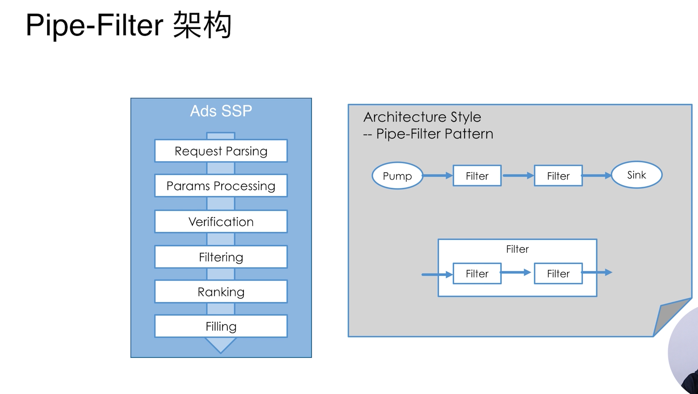
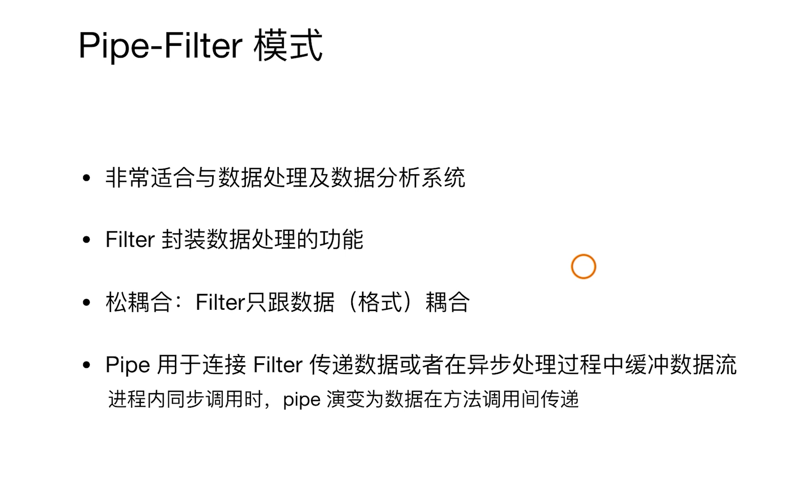
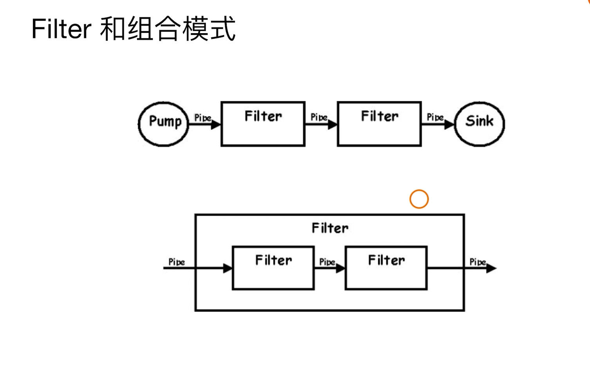
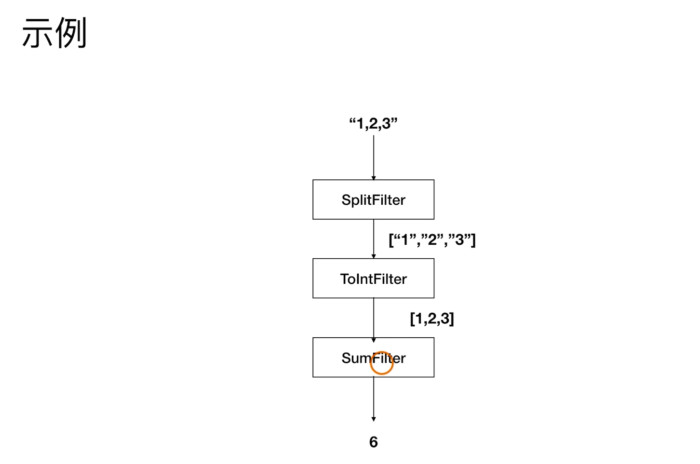
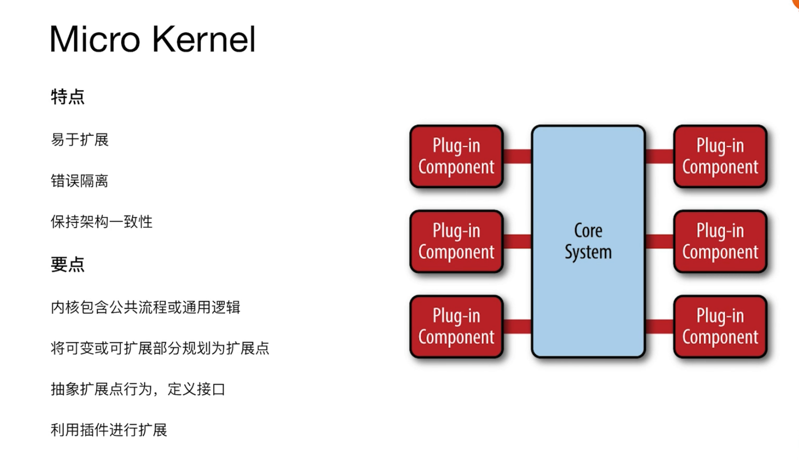
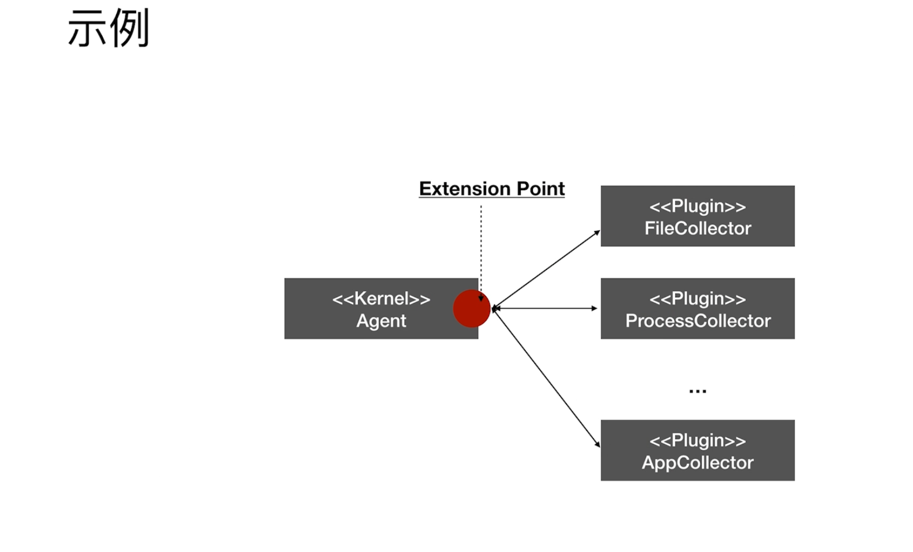

# 架构模式

## pipe-filter

### Pipe-Filter 架构

非常适合做数据处理，数据分析，我们公司是做移动互联，移动营销。我们来看一下广告请求的过程。

- 请求解析
- 参数处理
- 验证
- 过滤广告
- 选出来的广告进行排序
- 填充

每一个 step 我们可以抽象成一个 filter。每一个filter 就是对进来的数据加工转换，生成另外一种数据。

注意：是数据在**方法**调用间传递。

### Filter 和 组合模式

#### 示例

## micro-kernel framework

### Micro Kernel

#### 示例

Agent:收集文件信息，进程信息，等很多。未来可能还会扩展，也就是说它收集的内容会不断的扩展，但是它处理的逻辑相对稳定。

<plugin> ：扩展点

