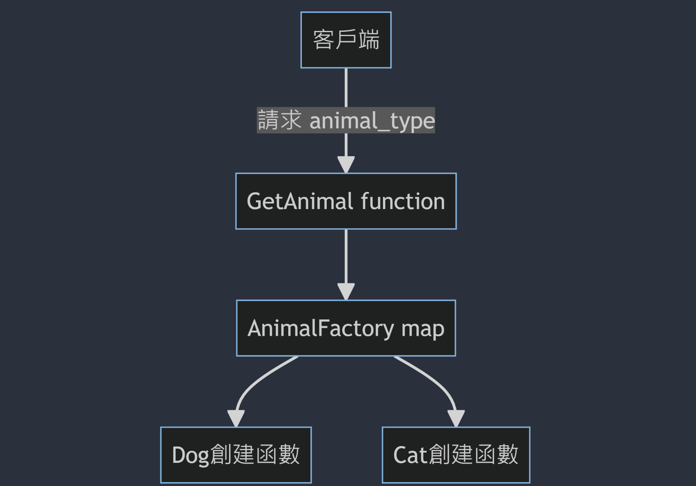
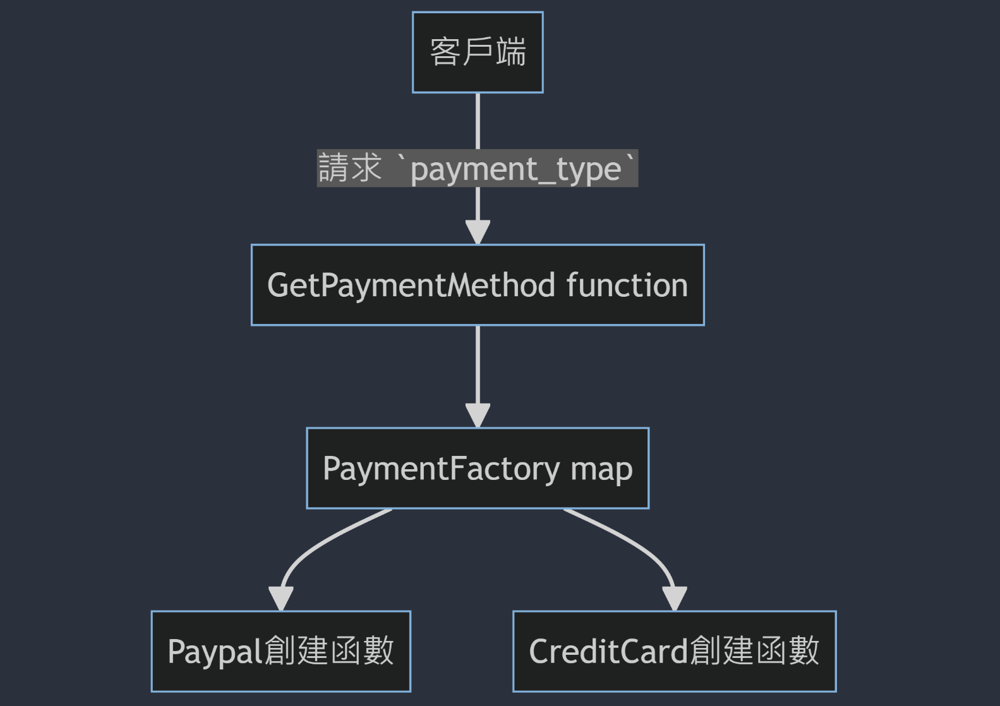

# 创建型模式

## 单例模式

### 为什么要用单例模式

单例模式是一种确保某个类只有一个实例，并提供一个全域的访问点来获取这个实例的设计模式。简单来说，它确保了在整个应用中，某个特定的类别只被实例化一次。

想像你有一个配置管理器或是连接池，你不希望这些资源在系统中被重复建立，否则可能导致资源浪费或不一致的行为。在这些场合，单例模式就派上用场了！


### 示例：配置管理器

在许多应用中，我们都需要一个管理器来持有和管理全局的配置。这些设定可能来自于一个配置文件或环境变数，而且我们不想在整个应用程序中多次加载或解析它。这时候，单例模式就非常适用了。

```go
type AppConfig struct {
    DatabaseURL string
    APIKey      string
    // ... 其他配置
}
```

```go
package config

import (
    "sync"
    "os"
)

type AppConfig struct {
    DatabaseURL string
    APIKey      string
    // ... 其他配置
}

var instance *AppConfig
var once sync.Once

func GetConfig() *AppConfig {
    once.Do(func() {
        instance = &AppConfig{
            DatabaseURL: os.Getenv("DATABASE_URL"),
            APIKey:      os.Getenv("API_KEY"),
            // ...加载其它配置
        }
    })
    return instance
}
```

这样，你就有了一个单例配置管理器，不需要在每次需要设定时重新加载或解析，而且可以确保整个应用程序中的配置是一致的。

此实例展示了单例模式在实务中的一个常见应用，当然还有其他情境也适合使用单例模式，如连接池、日志管理器等。


## 工厂模式

工厂模式背后的核心思想是将对象创建的逻辑与使用分离，这使得我们的应用能够更容易地扩展和维护。

**动物的叫声**
考虑一个需求：我们的系统中有多种动物，每种动物都有自己的叫声。

```go
type Animal interface {
    Speak() string
}

type Dog struct{}
func (d *Dog) Speak() string {
    return "Woof!"
}

type Cat struct{}
func (c *Cat) Speak() string {
    return "Meow!"
}
```

**支付系统接口**

考虑一个更实际的例子：在一个电子商务平台上，我们希望支援多种支付方式。
```go
type PaymentMethod interface {
    Pay(amount float64) string
}

type Paypal struct{}
func (p *Paypal) Pay(amount float64) string {
    return fmt.Sprintf("Paid %f via Paypal", amount)
}

type CreditCard struct{}
func (c *CreditCard) Pay(amount float64) string {
    return fmt.Sprintf("Paid %f using Credit Card", amount)
}
```

**工厂模式 + map**
 在传统的工厂模式中，我们可能会使用条件语句（如 if 或 switch）来确定要创建哪种类型的实例。但这种做法在每次新增新类型时，都需要修改工厂的代码。而使用 map 作为工厂可以很好地解决这个问题。

简单来说，map 允许我们将字符串（例如 dog 或 paypal）映射到具体的创建函数。这样，当需要新增类型时，只需扩展这个 map，而不必修改工厂的主要逻辑。





在上面这两个流程图中，当客户端调用 `GetAnimal` 或 `GetPaymentMethod` 时，函数内部会查找对应的 map 来获取创建函数，然后使用该函数来创建并返回相应的实例。

```go
// Animal Map
var AnimalFactory = map[string]func() Animal{
    "dog": func() Animal { return &Dog{} },
    "cat": func() Animal { return &Cat{} },
}

// Payment Map
var PaymentFactory = map[string]func() PaymentMethod{
    "paypal":     func() PaymentMethod { return &Paypal{} },
    "creditcard": func() PaymentMethod { return &CreditCard{} },
}

// Animal Factory
func GetAnimal(t string) Animal {
    if factory, ok := AnimalFactory[t]; ok {
        return factory()
    }
    return nil
}

// Payment Factory
func GetPaymentMethod(method string) PaymentMethod {
    if factory, ok := PaymentFactory[method]; ok {
        return factory()
    }
    return nil
}


func main() {
    animal := GetAnimal("dog")
    fmt.Println(animal.Speak()) // Woof!

    payment := GetPaymentMethod("paypal")
    fmt.Println(payment.Pay(100.5)) // Paid 100.5 via Paypal
}
```


# **结构模式**

## 装饰器模式

**深入一点：装饰者模式究竟是啥？**
装饰者模式是一种结构型模式，它允许你动态地、一层一层地新增职责到物件上。你可以想像成给咖啡加料，今天想加牛奶，明天加糖，后天加摩卡，所有的组合都可以！

**代码**

```go
type Beverage interface {
	Description() string
	Cost() float64
}

type Coffee struct{}

func (c *Coffee) Description() string {
	return "基本咖啡"
}

func (c *Coffee) Cost() float64 {
	return 5.0
}

type MilkDecorator struct {
	beverage Beverage
}

func (m *MilkDecorator) Description() string {
	return m.beverage.Description() + " + 牛奶"
}

func (m *MilkDecorator) Cost() float64 {
	return m.beverage.Cost() + 1.5
}
```

这边你可以看到，MilkDecorator是如何把牛奶加入咖啡的。现在，我们来看如何用回调函数扩展这个功能：
```go
type ExtraFeature func(Beverage) Beverage

func WithCaramel(b Beverage) Beverage {
	return &CaramelDecorator{beverage: b}
}

type CaramelDecorator struct {
	beverage Beverage
}

func (c *CaramelDecorator) Description() string {
	return c.beverage.Description() + " + 焦糖"
}

func (c *CaramelDecorator) Cost() float64 {
	return c.beverage.Cost() + 2.0
}

func main() {
	coffee := &Coffee{}
	fmt.Println(coffee.Description(), "$", coffee.Cost())

	// 使用裝飾者加牛奶
	milkCoffee := &MilkDecorator{beverage: coffee}
	fmt.Println(milkCoffee.Description(), "$", milkCoffee.Cost())

	// 使用回調函數加焦糖
	caramelCoffee := WithCaramel(coffee)
	fmt.Println(caramelCoffee.Description(), "$", caramelCoffee.Cost())
}
```

看到了吗？现在，只要透过回调函数，就能轻松地把焦糖功能加到咖啡上！


### 总结

装饰者模式就像乐高，一块一块地组装，同时确保每一块都有其功能。在程序中，这意味着我们不会修改原有的代码，但仍然可以轻松地新增新功能。这也像是我们生活中的习惯，一层一层地叠加，构建出丰富多彩的人生。所以，下次写代码时，不妨想想装饰者模式，看看它能为你带来哪些惊喜！


## 适配器模式

在程式设计中，有时我们会碰到两个不兼容的接口需要互相合作。这时候，适配器模式就像是个转接头，帮忙接上两端，让一切都能顺畅运作。

**示例**

>想像你有个旧系统，资料是储存在一个简单的文档里。现在，有一个新的API 可以让你存取云端储存，但这新API 和旧系统的方法名称不同。怎么办？

```go
// 旧的文档存储系统
type OldStorage struct{}

func (o *OldStorage) SaveToFile(data string) {
	fmt.Println("Saving data to file:", data)
}

// 新的云端 API
type CloudAPI struct{}

func (c *CloudAPI) UploadToCloud(data string) {
	fmt.Println("Uploading data to cloud:", data)
}

// 适配器
type CloudAdapter struct {
	cloud *CloudAPI
}

func (ca *CloudAdapter) SaveToFile(data string) {
	ca.cloud.UploadToCloud(data)
}

func TestDemo1(t *testing.T) {
	oldStorage := &OldStorage{}
	oldStorage.SaveToFile("Hello from old system!")

	adapter := &CloudAdapter{cloud: &CloudAPI{}}
	adapter.SaveToFile("Hello from new system via adapter!")
}
```


# 行为模式

## 策略

### 付款策略

假设你的平台上提供多种付款方式，例如信用卡、PayPal和比特币。每一种付款方式都有自己的交易手续费策略。使用策略模式，我们可以方便地为每种付款方式实现不同的计费策略。

首先，我们定义策略接口：
```go
type PaymentStrategy interface {
    TransactionFee(amount float64) float64
}
```

然后，为每种付款方式实现该策略：
```go
type CreditCard struct{}

func (c *CreditCard) TransactionFee(amount float64) float64 {
	return 0.03 * amount // 假设 3% 的手续费
}

type PayPal struct{}

func (p *PayPal) TransactionFee(amount float64) float64 {
	return 0.04 * amount // 假设 4% 的手续费
}

type Bitcoin struct{}

func (b *Bitcoin) TransactionFee(amount float64) float64 {
	return 0.01 * amount // 假设 1% 的手续费
}
```


### 使用map选择策略

```go
strategies := map[string]PaymentStrategy{
    "CreditCard": &CreditCard{},
    "PayPal":     &PayPal{},
    "Bitcoin":    &Bitcoin{},
}

userChoice := "CreditCard"
strategy := strategies[userChoice]
strategy.TransactionFee(4.1)
```

这种方法使得新增新策略变得非常容易，只需扩展strategies这个map即可。


## 观察者模式

很简单，观察者模式就像是一个明星（被观察者）和他的粉丝（观察者）。每当明星有什么新动态，粉丝都会第一时间知道。


### 示例

**股票市场的分析师**

> 想像你是一名股票市场的分析师。你关注的股票一旦价格变动，你会马上得知，这样你就能及时做出决策了。

**电商的价格提醒**

> 你有没有在某些购物网站上关注过某商品，希望它降价时得到通知？这就是观察者模式的实务运用之一！

**代码**

假设我们要模拟股票市场的情境。首先，我们有一群分析师等着接收股票的价格更新通知。当股票价格变动，他们都会马上知道！
 ```go
 // Observer 接口：所有关注股票价格的分析师都要实现这个接口
 type Observer interface {
 	Notify(stockPrice float32)
 }
 
 // StockMarket 被观察者，在股票价格变动时，会通知所有注册的分析师
 type StockMarket struct {
 	observers  []Observer
 	stockPrice float32
 }
 
 func (s *StockMarket) Register(observer Observer) {
 	s.observers = append(s.observers, observer)
 }
 
 func (s *StockMarket) SetPrice(price float32) {
 	s.stockPrice = price
 	s.notifyAll()
 }
 
 func (s *StockMarket) notifyAll() {
 	for _, observer := range s.observers {
 		observer.Notify(s.stockPrice)
 	}
 }
 
 // Analyst 实现了 Observer 接口，代表一个股票市场的分析师
 type Analyst struct {
 	name string
 }
 
 func (a *Analyst) Notify(stockPrice float32) {
 	fmt.Printf("%s 得到了新的股价：$%f\n", a.name, stockPrice)
 }
 
 func main() {
 	stockMarket := &StockMarket{}
 
 	alice := &Analyst{name: "Alice"}
 	bob := &Analyst{name: "Bob"}
 
 	stockMarket.Register(alice)
 	stockMarket.Register(bob)
 
 	stockMarket.SetPrice(120.0) // 当价格改变时，Alice 和 Bob 都会被通知
 	stockMarket.SetPrice(125.5) // 再次改变价格，Alice 和 Bob 都会得到通知
 }
 ```

这段代码模拟了一个股票市场（StockMarket），当它的股价发生变化时，所有注册过的分析师（Analyst，他们是观察者）都会收到通知。在 main 函数中，我们模拟了股价的变化，并观察到注册的分析师是如何收到通知的。


### 总结：

 观察者模式其实就是为了让事情保持最新状态，确保你不会错过任何重要的信息。就像你不想错过你最喜欢的 YouTuber 的新视频，或者你关注已久的那双鞋终于降价了！在软件设计中，观察者模式可以帮助我们保持代码整洁、结构清晰，并且便于扩展。下次当你收到某个通知时，也许你就会想到，它的背后可能正是观察者模式在发挥作用呢！


## 命令模式

你有没有用过智能家居遥控器，按一下开灯、再按一下关电视？那么，你可能已经用过命令模式了！

**命令模式到底是啥？**
想像命令模式就像是你的遥控器上的一堆按钮。每个按钮都是一个命令，当你按下去，某些事情就会发生。你不必知道背后的具体工作原理，只需要知道按这个就能开灯，按那个就能关电视。
 **代码**

```go
// Command 是命令的接口
type Command interface {
	Execute()
}

// 开灯 Command
type LightOnCommand struct {
	Light *Light
}

func (l *LightOnCommand) Execute() {
	l.Light.TurnOn()
}

// 关灯 Command
type LightOffCommand struct {
	Light *Light
}

func (l *LightOffCommand) Execute() {
	l.Light.TurnOff()
}

// 灯
type Light struct{}

// 开灯
func (l *Light) TurnOn() {
	fmt.Println("燈亮了！")
}

// 关灯
func (l *Light) TurnOff() {
	fmt.Println("燈熄了！")
}

// Remote 遙控器
type Remote struct {
	Command Command
}

func (r *Remote) PressButton() {
	r.Command.Execute()
}

func main() {
	light := &Light{}
	lightOn := &LightOnCommand{Light: light}
	lightOff := &LightOffCommand{Light: light}

	remote := &Remote{}

	remote.Command = lightOn
	remote.PressButton()

	remote.Command = lightOff
	remote.PressButton()
}
```

这个程式码展示了一个简单的灯和遥控器。你可以按遥控器的按钮来开灯或关灯，不必知道它背后是怎么工作的。


## 模板方法

今天我们来谈谈模板方法模式（Template Method）。它有点像给你一份面包的食谱，告诉你该怎么混合、发酵和烘焙，但具体的材料和调味料，就交给你自己去选择和调整。它定义了一个算法的步骤，但留下了一些具体的实现让子类去完成。

让我们深入探讨一下：
 模板方法模式的核心是一个方法，这个方法将算法定义为一系列的步骤，其中一些步骤是由子类来具体实现的。这样，你可以改变算法的具体实现，而不改变算法结构。

**代码**

```go
// 定义工作流程的接口
type Workflow interface {
	Start()
	Execute()
	End()
}

// 模板方法：作为独立函数实现运行流程
func RunWorkflow(w Workflow) {
	w.Start()
	w.Execute()
	w.End()
}

// 第一個具体的工作流程
type ReportWorkflow struct{}

func (r *ReportWorkflow) Start() {
	fmt.Println("工作流程开始")
}

func (r *ReportWorkflow) Execute() {
	fmt.Println("执行报告生成流程")
}

func (r *ReportWorkflow) End() {
	fmt.Println("工作流程结束")
}

// 第二个具体的工作流程
type AuditWorkflow struct{}

func (a *AuditWorkflow) Start() {
	fmt.Println("工作流程开始")
}

func (a *AuditWorkflow) Execute() {
	fmt.Println("执行审核流程")
}

func (a *AuditWorkflow) End() {
	fmt.Println("工作流程结束")
}

func main() {
	report := &ReportWorkflow{}
	RunWorkflow(report)

	audit := &AuditWorkflow{}
	RunWorkflow(audit)
}
```

运行这个程序，你会看到每个工作流程都会 **开始、执行 和 结束**，但 **执行** 的部分是根据具体的工作流程来定义的。


## 状态模式

状态模式允许一个对象在其内部状态改变时改变其行为。对象似乎改变了它的类。换句话说，状态模式能帮助你避免过多的 if-else 或 switch 语句。

**音乐播放器**

>想像你正在开发一个简单的音乐播放器，它有三种状态：播放、暫停和停止。每当用户按下按钮，播放器的状态就会改变。

```go
// State 介面定義了處理狀態的方法。
type State interface {
	Handle(context *MusicPlayerContext)
}

// PlayState 表示播放狀態。
type PlayState struct{}

func (p *PlayState) Handle(context *MusicPlayerContext) {
	fmt.Println("正在播放音樂")
	context.SetState(&PauseState{})
}

// PauseState 表示暫停狀態。
type PauseState struct{}

func (p *PauseState) Handle(context *MusicPlayerContext) {
	fmt.Println("音樂已暫停")
	context.SetState(&StopState{})
}

// StopState 表示停止狀態。
type StopState struct{}

func (s *StopState) Handle(context *MusicPlayerContext) {
	fmt.Println("音樂已停止")
	context.SetState(&PlayState{})
}

// MusicPlayerContext 包含當前的狀態。
type MusicPlayerContext struct {
	state State
}

func (m *MusicPlayerContext) SetState(state State) {
	m.state = state
}

func (m *MusicPlayerContext) PressPlayButton() {
	m.state.Handle(m)
}

func main() {
	player := &MusicPlayerContext{state: &StopState{}}
	player.PressPlayButton()  // 音樂已停止
	player.PressPlayButton()  // 正在播放音樂
	player.PressPlayButton()  // 音樂已暫停
}
```

透过上述例子，你可以看到播放器是如何在不同状态之间转换的。

**游戏角色**

>如果你正在开发一个游戏，角色可能会有：正常、受傷和死亡等状态。在受傷状态下，角色的移动速度可能会减慢；在死亡状态下，角色可能不能移动。通过使用状态模式，你可以轻松管理角色在不同状态下的行为。

```go
// CharacterState 是一個介面，定義了不同角色狀態的 Move 方法。
type CharacterState interface {
	Move()
}

// HealthyState 表示角色健康狀態。
type HealthyState struct{}

func (h *HealthyState) Move() {
	fmt.Println("角色快速移動！") // 角色快速移動！
}

// InjuredState 表示角色受傷狀態。
type InjuredState struct{}

func (i *InjuredState) Move() {
	fmt.Println("角色移動得有點慢...") // 角色移動得有點慢...
}

// DeadState 表示角色死亡狀態。
type DeadState struct{}

func (d *DeadState) Move() {
	fmt.Println("角色不能移動，他已經...RIP。") // 角色不能移動，他已經...RIP。
}

// GameCharacter 表示帶有特定狀態的遊戲角色。
type GameCharacter struct {
	state CharacterState
}

func (g *GameCharacter) SetState(state CharacterState) {
	g.state = state
}

func (g *GameCharacter) Move() {
	g.state.Move()
}

func main() {
	hero := &GameCharacter{state: &HealthyState{}}
	hero.Move() // 角色快速移動！

	hero.SetState(&InjuredState{})
	hero.Move() // 角色移動得有點慢...

	hero.SetState(&DeadState{})
	hero.Move() // 角色不能移動，他已經...RIP。
}
```

从上面的例子你可以看到，每当角色状态改变，他的移动方式也随之改变。
